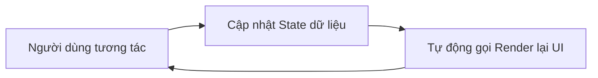

# Buổi 5: Mảng & Object nâng cao - Tư duy State

**Loại buổi**: Lý thuyết  
**Thời lượng**: 120 phút  
**Dự án**: ZenTask (To-Do App) - Quản lý trạng thái dữ liệu một cách tối ưu

---

## 🎯 Mục tiêu học tập

Sau buổi học này, bạn sẽ có thể:

- ✅ Sử dụng thành thạo các phương thức duyệt mảng nâng cao của ES6 (`map`, `filter`, `find`, `findIndex`, `reduce`, `some`, `every`)
- ✅ Hiểu rõ khái niệm **State** (Trạng thái dữ liệu) và tầm quan trọng của nó trong ứng dụng web
- ✅ Áp dụng tư duy **State-driven UI** và luồng dữ liệu một chiều (Unidirectional Data Flow)
- ✅ Giải thích được khái niệm **Immutability** (Bất biến) và cách sao chép đối tượng/mảng an toàn bằng Spread Operator (`...`)

---

## 🧠 Nội dung chính

### 1. Các phương thức duyệt mảng nâng cao (ES6 Array Methods)

Trong lập trình JavaScript hiện đại, thay vì sử dụng vòng lặp `for` truyền thống, ta sử dụng các phương thức có sẵn của Array để code ngắn gọn, rõ ràng và ít lỗi hơn.

#### 1.1. `map()`
Duyệt qua các phần tử và **trả về một mảng mới** với các giá trị đã được biến đổi.
```javascript
const numbers = [1, 2, 3];
const doubles = numbers.map(x => x * 2); // [2, 4, 6]
```

#### 1.2. `filter()`
Lọc các phần tử thỏa mãn điều kiện và **trả về một mảng mới**.
```javascript
const tasks = [{id: 1, hoanThanh: true}, {id: 2, hoanThanh: false}];
const pendingTasks = tasks.filter(task => !task.hoanThanh); // [{id: 2, hoanThanh: false}]
```

#### 1.3. `find()` và `findIndex()`
* `find()`: Trả về **phần tử đầu tiên** tìm thấy thỏa mãn điều kiện. Nếu không có, trả về `undefined`.
* `findIndex()`: Trả về **chỉ số (index) đầu tiên** của phần tử thỏa mãn điều kiện. Nếu không có, trả về `-1`.
```javascript
const tasks = [{id: 101, name: 'A'}, {id: 102, name: 'B'}];
const found = tasks.find(t => t.id === 102); // {id: 102, name: 'B'}
const index = tasks.findIndex(t => t.id === 102); // 1
```

#### 1.4. `some()` và `every()`
* `some()`: Trả về `true` nếu **ít nhất một** phần tử thỏa mãn điều kiện.
* `every()`: Trả về `true` chỉ khi **tất cả** phần tử thỏa mãn điều kiện.
```javascript
const tasks = [{hoanThanh: true}, {hoanThanh: false}];
const hasCompleted = tasks.some(t => t.hoanThanh); // true
const allCompleted = tasks.every(t => t.hoanThanh); // false
```

#### 1.5. `reduce()`
Tích lũy các phần tử của mảng thành một giá trị duy nhất (số, chuỗi, object, hoặc mảng mới).
```javascript
const prices = [100, 200, 300];
const total = prices.reduce((sum, price) => sum + price, 0); // 600
```

---

### 2. Khái niệm State & Tư duy State-driven UI

#### 2.1. State là gì?
**State (Trạng thái)** là nguồn dữ liệu duy nhất nắm giữ thông tin hiện tại của ứng dụng. Trong ZenTask, mảng `danhSachCongViec` chính là State.

#### 2.2. Tư duy cũ (Direct UI Manipulation)
Tìm đến thẻ HTML -> Sửa trực tiếp chữ, class, thuộc tính trên thẻ đó.
* **Hạn chế**: Khi giao diện phức tạp, code sẽ rất rối vì phải quản lý hàng trăm dòng cập nhật giao diện phân tán khắp nơi. Rất dễ bị lệch pha giữa dữ liệu và hiển thị.

#### 2.3. Tư duy hiện đại (State-driven UI / State -> Render)
1. Giao diện (UI) chỉ là **sự phản ánh** của dữ liệu (State).
2. Khi có sự kiện (ví dụ: click xóa), ta **không** sửa HTML trực tiếp. Ta chỉ **cập nhật dữ liệu trong State**.
3. Sau khi State thay đổi, ta gọi một hàm render (ví dụ: `renderList()`) để vẽ lại giao diện hoàn toàn dựa trên State mới.



*Đây là tư duy cốt lõi của các thư viện lớn như React, Vue, Angular.*

---

### 3. Tính Bất Biến (Immutability) & Sao chép dữ liệu

#### 3.1. Tại sao không nên chỉnh sửa trực tiếp (Mutate)?
Trong JS, Object và Array được truyền dưới dạng **tham chiếu (reference)**. Nếu bạn gán mảng này cho mảng kia hoặc chỉnh sửa trực tiếp, bạn có thể vô tình làm thay đổi dữ liệu ở nơi khác mà không biết.

```javascript
// ❌ CÁCH LÀM XẤU (Mutate trực tiếp)
const tasks = [{id: 1, name: 'Học'}];
const myTask = tasks[0];
myTask.name = 'Chơi'; // Thay đổi trực tiếp thuộc tính của object gốc trong mảng!
```

#### 3.2. Sử dụng Spread Operator (`...`) để sao chép an toàn
Để giữ cho State ổn định và dễ theo dõi, ta nên tạo bản sao mới của mảng hoặc đối tượng trước khi thực hiện thay đổi.

* **Sao chép mảng**:
```javascript
const listCu = [1, 2, 3];
const listMoi = [...listCu, 4]; // [1, 2, 3, 4] - Tạo mảng mới hoàn toàn
```

* **Sao chép và cập nhật đối tượng**:
```javascript
const taskGoc = { id: 1, ten: 'Học', hoanThanh: false };

// Tạo đối tượng mới, ghi đè thuộc tính hoanThanh
const taskCapNhat = {
    ...taskGoc,
    hoanThanh: true
};
```

---

## 💻 Ví dụ minh họa: Áp dụng các phương thức mảng vào ZenTask

Dưới đây là cách viết code cực sạch cho các logic nghiệp vụ của To-Do App bằng cách áp dụng phương thức mảng ES6:

```javascript
// Giả lập State
let state = {
    todos: [
        { id: 1, ten: 'Học JS', uuTien: 'high', hoanThanh: false },
        { id: 2, ten: 'Làm bài tập', uuTien: 'medium', hoanThanh: true }
    ]
};

// 1. Tìm công việc có ID là 2
const targetTodo = state.todos.find(item => item.id === 2);
console.log('Tìm thấy:', targetTodo);

// 2. Kiểm tra xem có công việc nào ưu tiên cao chưa làm không
const coUuTienCaoChuaLam = state.todos.some(item => item.uuTien === 'high' && !item.hoanThanh);
console.log('Có task gấp?', coUuTienCaoChuaLam); // true

// 3. Đếm số lượng công việc đã hoàn thành sử dụng reduce
const soLuongHoanThanh = state.todos.reduce((count, item) => item.hoanThanh ? count + 1 : count, 0);
console.log('Số việc đã hoàn thành:', soLuongHoanThanh); // 1
```

---


## 📝 Bài tập về nhà

1. Viết một đoạn code sử dụng phương thức `filter` để lấy ra tất cả công việc có độ ưu tiên thấp (`low`) từ một mảng công việc cho trước.
2. Viết một đoạn code sử dụng phương thức `reduce` để tính tổng số giờ dự kiến hoàn thành của tất cả các công việc (giả sử mỗi đối tượng công việc có thêm thuộc tính `soGioDuKien: number`).
3. Sử dụng Spread Operator để viết một hàm `themThuocTinh(object, key, value)`. Hàm này trả về một object mới đã được bổ sung thuộc tính mà không sửa đổi object ban đầu.

<details>
<summary><b>💡 Gợi ý / Hướng dẫn thực hành từng bước</b></summary>

### Yêu cầu 1: Lọc công việc ưu tiên thấp (`low`) bằng `.filter()`
* Sử dụng mảng công việc ban đầu, gọi hàm `.filter()` để lọc phần tử có `uuTien === 'low'`:
  ```javascript
  const congViecUuTienThap = danhSachCongViec.filter(cv => cv.uuTien === 'low');
  console.log("Danh sách công việc ưu tiên thấp:", congViecUuTienThap);
  ```

### Yêu cầu 2: Tính tổng giờ dự kiến bằng `.reduce()`
* Định nghĩa thêm thuộc tính `soGioDuKien` cho các đối tượng trong mảng.
* Sử dụng `.reduce()` để cộng dồn giá trị:
  ```javascript
  // Giả sử mảng đã bổ sung thuộc tính:
  const danhSachCoGio = [
      { id: 1, ten: "Học JS", soGioDuKien: 3 },
      { id: 2, ten: "Làm bài tập", soGioDuKien: 2 },
      { id: 3, ten: "Đọc sách", soGioDuKien: 1 }
  ];
  
  // Tính tổng giờ dự kiến
  const tongGio = danhSachCoGio.reduce((accumulator, currentValue) => {
      return accumulator + currentValue.soGioDuKien;
  }, 0); // Bắt đầu tích lũy từ 0
  
  console.log("Tổng số giờ dự kiến hoàn thành:", tongGio); // Kết quả: 6
  ```

### Yêu cầu 3: Hàm `themThuocTinh` sử dụng Spread Operator
* Khi muốn sao chép toàn bộ thuộc tính cũ và chèn thêm thuộc tính động (sử dụng dấu ngoặc vuông `[key]` để nhận giá trị động truyền vào):
  ```javascript
  function themThuocTinh(object, key, value) {
      // Dùng Spread Operator (...) để tạo object mới
      return {
          ...object,
          [key]: value
      };
  }

  // Ví dụ test:
  const targetObj = { id: 1, ten: "Task A" };
  const updatedObj = themThuocTinh(targetObj, "hoanThanh", true);

  console.log("Đối tượng ban đầu:", targetObj); // { id: 1, ten: 'Task A' }
  console.log("Đối tượng mới:", updatedObj); // { id: 1, ten: 'Task A', hoanThanh: true }
  ```

</details>

---

## 🔗 Tài liệu tham khảo

- [JavaScript.info: Array methods](https://javascript.info/array-methods)
- [MDN: Spread syntax (...)](https://developer.mozilla.org/en-US/docs/Web/JavaScript/Reference/Operators/Spread_syntax)
- [FreeCodeCamp: State-driven UI patterns](https://www.freecodecamp.org/news/state-driven-ui-javascript/)
