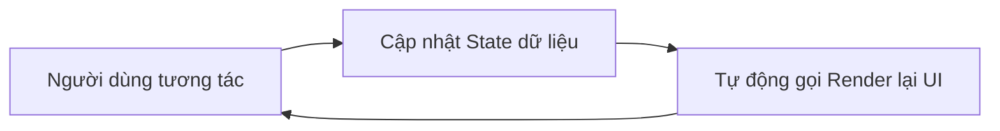

# Buổi 5: Mảng & Object nâng cao - Tư duy State
- **Dự án**: ZenTask (To-Do App) - Quản lý trạng thái dữ liệu một cách tối ưu

---

## 🎯 Mục tiêu buổi học

> **Thầy mong muốn sau buổi học này, các em sẽ đạt được:**

> **Thầy mong muốn sau buổi học này, các em sẽ đạt được:**
Sau buổi học này, các em sẽ có thể:
1. ✅ Sử dụng thành thạo các phương thức duyệt mảng nâng cao của ES6 (`map`, `filter`, `find`, `findIndex`, `reduce`, `some`, `every`)
2. ✅ Hiểu rõ khái niệm **State** (Trạng thái dữ liệu) và tầm quan trọng của nó trong ứng dụng web
3. ✅ Áp dụng tư duy **State-driven UI** và luồng dữ liệu một chiều (Unidirectional Data Flow)
4. ✅ Giải thích được khái niệm **Immutability** (Bất biến) và cách sao chép đối tượng/mảng an toàn bằng Spread Operator (`...`)

## 🧠 Nội dung chính

### 1. Các phương thức duyệt mảng nâng cao (ES6 Array Methods)

Trong lập trình JavaScript hiện đại, thay vì sử dụng vòng lặp `for` truyền thống, ta sử dụng các phương thức có sẵn của Array để code ngắn gọn, rõ ràng và ít lỗi hơn.

#### 1.1. `map()`
Duyệt qua các phần tử và **trả về một mảng mới** với các giá trị đã được biến đổi.
```javascript
const numbers = [1, 2, 3];
const doubles = numbers.map(x => x * 2); // [2, 4, 6]
```

#### 1.2. `filter()`
Lọc các phần tử thỏa mãn điều kiện và **trả về một mảng mới**.
```javascript
const tasks = [{id: 1, hoanThanh: true}, {id: 2, hoanThanh: false}];
const pendingTasks = tasks.filter(task => !task.hoanThanh); // [{id: 2, hoanThanh: false}]
```

#### 1.3. `find()` và `findIndex()`
* `find()`: Trả về **phần tử đầu tiên** tìm thấy thỏa mãn điều kiện. Nếu không có, trả về `undefined`.
* `findIndex()`: Trả về **chỉ số (index) đầu tiên** của phần tử thỏa mãn điều kiện. Nếu không có, trả về `-1`.
```javascript
const tasks = [{id: 101, name: 'A'}, {id: 102, name: 'B'}];
const found = tasks.find(t => t.id === 102); // {id: 102, name: 'B'}
const index = tasks.findIndex(t => t.id === 102); // 1
```

#### 1.4. `some()` và `every()`
* `some()`: Trả về `true` nếu **ít nhất một** phần tử thỏa mãn điều kiện.
* `every()`: Trả về `true` chỉ khi **tất cả** phần tử thỏa mãn điều kiện.
```javascript
const tasks = [{hoanThanh: true}, {hoanThanh: false}];
const hasCompleted = tasks.some(t => t.hoanThanh); // true
const allCompleted = tasks.every(t => t.hoanThanh); // false
```

#### 1.5. `reduce()`
Tích lũy các phần tử của mảng thành một giá trị duy nhất (số, chuỗi, object, hoặc mảng mới).
```javascript
const prices = [100, 200, 300];
const total = prices.reduce((sum, price) => sum + price, 0); // 600
```

---

### 2. Khái niệm State & Tư duy State-driven UI

#### 2.1. State là gì?
**State (Trạng thái)** là nguồn dữ liệu duy nhất nắm giữ thông tin hiện tại của ứng dụng. Trong ZenTask, mảng `danhSachCongViec` chính là State.

#### 2.2. So sánh trực quan hai tư duy lập trình giao diện

##### Tư duy cũ: Direct UI Manipulation (Thao tác DOM trực tiếp)
Tìm đến thẻ HTML -> Sửa trực tiếp chữ, class, thuộc tính trên thẻ đó khi có sự kiện xảy ra.
* **Hạn chế**: Khi giao diện phức tạp, code sẽ rất rối vì phải quản lý hàng trăm dòng cập nhật giao diện phân tán khắp nơi. Rất dễ bị lệch pha giữa dữ liệu và hiển thị.

##### Tư duy hiện đại: State-driven UI (State -> Render)
1. Giao diện (UI) chỉ là **sự phản ánh** của dữ liệu (State).
2. Khi có sự kiện (ví dụ: click xóa), ta **không** sửa HTML trực tiếp. Ta chỉ **cập nhật dữ liệu trong State**.
3. Sau khi State thay đổi, ta gọi một hàm render (ví dụ: `renderList()`) để vẽ lại giao diện hoàn toàn dựa trên State mới.



*Đây là tư duy cốt lõi của các thư viện lớn như React, Vue, Angular.*

---

### 3. Tính Bất Biến (Immutability) & Sao chép dữ liệu

#### 3.1. Tại sao không nên chỉnh sửa trực tiếp (Mutate)?
Trong JS, Object và Array được truyền dưới dạng **tham chiếu (reference)**. Nếu các em gán mảng này cho mảng kia hoặc chỉnh sửa trực tiếp, các em có thể vô tình làm thay đổi dữ liệu ở nơi khác mà không biết.

```javascript
// ❌ CÁCH LÀM XẤU (Mutate trực tiếp)
const tasks = [{id: 1, name: 'Học'}];
const myTask = tasks[0];
myTask.name = 'Chơi'; // Thay đổi trực tiếp thuộc tính của object gốc trong mảng!
```

#### 3.2. Sử dụng Spread Operator (`...`) để sao chép an toàn
Để giữ cho State ổn định và dễ theo dõi, ta nên tạo bản sao mới của mảng hoặc đối tượng trước khi thực hiện thay đổi.

* **Sao chép mảng**:

::: code-group

```javascript [main.js]
const listCu = [1, 2, 3];
const listMoi = [...listCu, 4]; // [1, 2, 3, 4] - Tạo mảng mới hoàn toàn
```

```javascript [main.js]
const taskGoc = { id: 1, ten: 'Học', hoanThanh: false };

// Tạo đối tượng mới, ghi đè thuộc tính hoanThanh
const taskCapNhat = {
    ...taskGoc,
    hoanThanh: true
};
```

:::

---

## 💻 Thực hành Lab 1: So sánh Side-by-Side (Trực quan hóa tư duy State)

Để hiểu rõ sự khác biệt giữa cách làm truyền thống và tư duy State-driven UI, hãy cùng thực hiện viết mã cho một ứng dụng **Bộ đếm (Counter)** đơn giản.

### Cách 1: Thao tác DOM trực tiếp (Dễ lỗi khi ứng dụng phình to)
Mỗi khi bấm nút, ta tìm đến phần tử chứa số trên giao diện, lấy giá trị chữ ra, ép kiểu thành số, cộng thêm 1, rồi ghi đè ngược lại vào DOM.
```html
<div class="counter-box">
  <span id="number-display">0</span>
  <button id="btn-inc">Tăng</button>
</div>

<script>
  const display = document.getElementById('number-display');
  const btn = document.getElementById('btn-inc');

  btn.addEventListener('click', () => {
    // ❌ Đọc và thao tác trực tiếp trên DOM
    let currentVal = parseInt(display.textContent);
    display.textContent = currentVal + 1;
  });
</script>
```

### Cách 2: State-driven UI (Chuẩn kiến trúc phần mềm)
Ta lưu trữ giá trị số vào một biến dữ liệu đại diện cho State (`state.count`). Khi nhấn nút, ta chỉ tăng giá trị của biến này lên, sau đó kích hoạt hàm `render()` để đồng bộ hóa giá trị từ State ra màn hình.
```html
<div class="counter-box">
  <span id="number-display-state">0</span>
  <button id="btn-inc-state">Tăng</button>
</div>

<script>
  // 1. Định nghĩa State (Dữ liệu)
  let state = {
    count: 0
  };

  const displayState = document.getElementById('number-display-state');
  const btnState = document.getElementById('btn-inc-state');

  // 2. Định nghĩa hàm Render (Giao diện phản ánh Dữ liệu)
  function render() {
    displayState.textContent = state.count;
  }

  // 3. Sự kiện chỉ làm nhiệm vụ thay đổi Dữ liệu rồi gọi Render
  btnState.addEventListener('click', () => {
    state.count += 1; // Chỉ thay đổi dữ liệu
    render();        // Đồng bộ giao diện
  });

  // Khởi động render lần đầu
  render();
</script>
```

---

## 💻 Thực hành Lab 2: Xây dựng Bộ lọc Trạng thái Todo (State Filter Lab)

Các em các em các em hãy tạo một tệp `index.html` và viết mã JavaScript áp dụng tư duy State để thực hiện **Lọc công việc** động theo trạng thái.

### Mã nguồn Khung (Skeleton Code) - Hãy tự code phần JavaScript:

```html
<!DOCTYPE html>
<html lang="en">
<head>
  <meta charset="UTF-8">
  <title>State Filter Lab</title>
  <style>
    body { font-family: sans-serif; background: #0f172a; color: white; padding: 20px; }
    .filter-btn { padding: 8px 16px; margin-right: 8px; background: #334155; color: white; border: none; cursor: pointer; border-radius: 4px; }
    .filter-btn.active { background: #6366f1; }
    .todo-item { padding: 10px; margin: 8px 0; background: #1e293b; border-radius: 4px; display: flex; justify-content: space-between; }
    .todo-item.completed { text-decoration: line-through; opacity: 0.5; }
    .summary { margin-top: 15px; font-weight: bold; color: #a5b4fc; }
  </style>
</head>
<body>

  <h2>Bộ lọc công việc ZenTask</h2>
  
  <!-- Các nút lọc -->
  <div>
    <button class="filter-btn active" data-filter="all">Tất cả</button>
    <button class="filter-btn" data-filter="pending">Chưa làm</button>
    <button class="filter-btn" data-filter="completed">Đã xong</button>
  </div>

  <!-- Danh sách công việc -->
  <div id="todo-list-container" style="margin-top: 15px;"></div>

  <!-- Thống kê -->
  <div id="summary-info" class="summary"></div>

  <script>
    // 1. Khởi tạo State của ứng dụng
    let state = {
      todos: [
        { id: 1, title: "Học cú pháp ES6+ cơ bản", completed: true },
        { id: 2, title: "Luyện tập các phương thức duyệt mảng", completed: false },
        { id: 3, title: "Tìm hiểu kiến trúc State-driven UI", completed: false },
        { id: 4, title: "Xây dựng cấu trúc dự án ZenTask", completed: true }
      ],
      currentFilter: "all" // Có thể nhận giá trị: "all", "pending", "completed"
    };

    const listContainer = document.getElementById('todo-list-container');
    const summaryInfo = document.getElementById('summary-info');
    const filterButtons = document.querySelectorAll('.filter-btn');

    // 2. Hàm render đồng bộ giao diện
    function render() {
      // BƯỚC A: Sử dụng phương thức mảng .filter() để lọc danh sách theo state.currentFilter
      let filteredTodos = state.todos.filter(todo => {
        if (state.currentFilter === 'completed') return todo.completed;
        if (state.currentFilter === 'pending') return !todo.completed;
        return true; // "all"
      });

      // BƯỚC B: Sử dụng .map() để tạo chuỗi mã HTML hiển thị danh sách công việc đã lọc
      listContainer.innerHTML = filteredTodos.map(todo => `
        <div class="todo-item ${todo.completed ? 'completed' : ''}">
          <span>${todo.title}</span>
          <span>${todo.completed ? '✅ Đã xong' : '⏳ Chưa làm'}</span>
        </div>
      `).join('');

      // BƯỚC C: Sử dụng .reduce() để đếm số lượng công việc CHƯA hoàn thành (pending)
      let pendingCount = state.todos.reduce((count, todo) => {
        return !todo.completed ? count + 1 : count;
      }, 0);

      summaryInfo.textContent = `Còn ${pendingCount} công việc chưa hoàn thành.`;
    }

    // 3. Lắng nghe sự kiện click trên các nút lọc để thay đổi State
    filterButtons.forEach(btn => {
      btn.addEventListener('click', (e) => {
        // Cập nhật lớp active cho nút đang chọn
        filterButtons.forEach(b => b.classList.remove('active'));
        btn.classList.add('active');

        // Cập nhật giá trị filter trong State
        state.currentFilter = btn.getAttribute('data-filter');

        // Render lại giao diện
        render();
      });
    });

    // Khởi chạy render lần đầu
    render();
  </script>
</body>
</html>
```

<details>
<summary><b>💡 Nhấn vào xem phân tích giải thích cách giải quyết bài Lab 2</b></summary>

* **Cơ chế lọc**: Hàm `render` sử dụng phương thức `state.todos.filter` để lọc danh sách ngay trên RAM mỗi khi có lệnh vẽ lại, giúp dữ liệu hiển thị hoàn toàn chính xác.
* **Cơ chế đếm thống kê**: Sử dụng `reduce` duyệt qua toàn bộ `state.todos` gốc để đếm số lượng công việc có thuộc tính `completed === false`. Con số thống kê này luôn phản ánh đúng thực tế vì nó được tính trực tiếp từ dữ liệu State.
</details>

---

## 🧩 Bài tập về nhà

1. **Bài tập 1: Lọc dữ liệu nâng cao**  
   Cho một mảng các đối tượng khóa học sau:
   ```javascript
   const courses = [
     { name: "JavaScript Cơ bản", price: 0, category: "frontend" },
     { name: "ReactJS", price: 150, category: "frontend" },
     { name: "Node.js & MongoDB", price: 200, category: "backend" },
     { name: "WordPress", price: 0, category: "cms" }
   ];
   ```
   Các em các em các em hãy viết đoạn mã sử dụng phương thức `filter` để lấy ra danh sách các khóa học miễn phí (`price === 0`) thuộc danh mục `frontend`.

2. **Bài tập 2: Tính tổng học phí bằng Reduce**  
   Từ mảng `courses` ở trên, hãy sử dụng phương thức `reduce` để tính tổng số tiền học phí của tất cả các khóa học có trả phí (`price > 0`).

3. **Bài tập 3: Cập nhật State bất biến (Immutability)**  
   Các em các em các em hãy viết một hàm `updateTodoStatus(todosArray, idToUpdate)` nhận vào mảng Todo hiện tại và ID cần cập nhật. Hàm phải trả về một mảng mới đã được chuyển đổi trạng thái `completed` (từ `true` thành `false` hoặc ngược lại) của công việc được chỉ định mà **không chỉnh sửa trực tiếp mảng hoặc đối tượng ban đầu** (áp dụng Spread Operator).

---

## 🧪 Quiz/Checkpoint

Dưới đây là 5 câu hỏi trắc nghiệm kiểm tra nhanh kiến thức của các em trong buổi học này:

### Câu hỏi 1: Lợi thế lớn nhất của tư duy State-driven UI là gì?
A. Làm giao diện chạy nhanh hơn đáng kể  
B. Dữ liệu luôn đồng bộ với giao diện hiển thị, mã nguồn dễ bảo trì khi dự án phình to  
C. Không cần viết mã CSS nữa  
D. Loại bỏ hoàn toàn ngôn ngữ JavaScript  

<details>
<summary><b>👉 Xem Đáp án giải thích</b></summary>

**Đáp án đúng**: `B` (Mọi thay đổi giao diện đều quy về việc thay đổi dữ liệu State tập trung, giảm thiểu việc DOM bị lệch pha dữ liệu)
</details>

### Câu hỏi 2: Phương thức nào của Array trả về phần tử ĐẦU TIÊN khớp với điều kiện lọc?
A. map  
B. filter  
C. find  
D. reduce  

<details>
<summary><b>👉 Xem Đáp án giải thích</b></summary>

**Đáp án đúng**: `C` (find trả về phần tử đầu tiên thỏa mãn điều kiện, nếu không có trả về undefined)
</details>

### Câu hỏi 3: Cách nào dùng Spread Operator để thêm phần tử 4 vào cuối mảng arr = [1, 2, 3] một cách bất biến?
A. arr.push(4)  
B. const newArr = [...arr, 4]  
C. const newArr = arr.concat(4)  
D. Cả B và C  

<details>
<summary><b>👉 Xem Đáp án giải thích</b></summary>

**Đáp án đúng**: `D` (Cả Spread Operator `[...arr, 4]` và `.concat` đều tạo ra một mảng mới hoàn toàn mà không làm biến đổi mảng gốc)
</details>

### Câu hỏi 4: Khái niệm Immutability (Bất biến) trong State Management nghĩa là gì?
A. Không bao giờ được phép thay đổi giá trị của bất kỳ biến nào  
B. Không chỉnh sửa trực tiếp (mutate) vùng nhớ của dữ liệu cũ, mà tạo ra bản sao mới chứa các thay đổi  
C. Chỉ sử dụng hằng số const  
D. Không dùng được với mảng  

<details>
<summary><b>👉 Xem Đáp án giải thích</b></summary>

**Đáp án đúng**: `B` (Giúp tránh lỗi tham chiếu chéo ngoài ý muốn của các đối tượng phức tạp trong bộ nhớ RAM)
</details>

### Câu hỏi 5: Phương thức reduce() nhận vào mấy đối số quan trọng?
A. 1 đối số (hàm callback)  
B. 2 đối số (hàm callback và giá trị khởi tạo accumulator)  
C. 3 đối số  
D. Không nhận đối số  

<details>
<summary><b>👉 Xem Đáp án giải thích</b></summary>

**Đáp án đúng**: `B` (Hàm callback và giá trị tích lũy ban đầu - ví dụ: `0` hoặc `[]`)
</details>

---

## 🔗 Tài liệu tham khảo

- [JavaScript.info: Array methods](https://javascript.info/array-methods)
- [MDN: Spread syntax (...)](https://developer.mozilla.org/en-US/docs/Web/JavaScript/Reference/Operators/Spread_syntax)
- [FreeCodeCamp: State-driven UI patterns](https://www.freecodecamp.org/news/state-driven-ui-javascript/)
