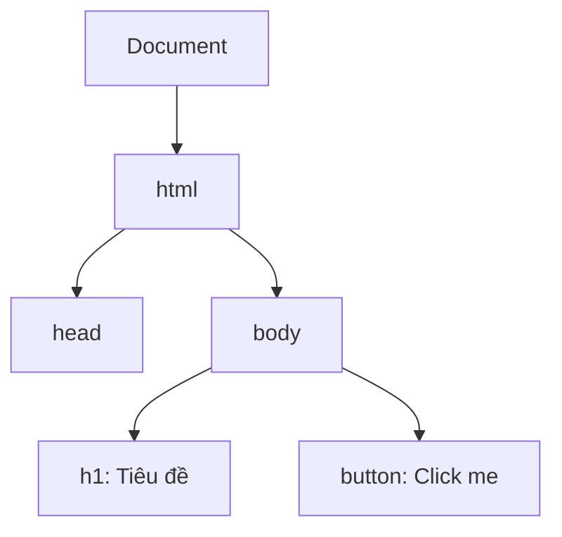

# Buổi 15: DOM & Sự kiện cơ bản

Xin chào các em! 👋

Hôm nay thầy trò mình sẽ học cách làm cho trang web "sống động" bằng cách kết nối mã JavaScript với giao diện HTML thông qua **DOM (Document Object Model)**.

## 🎯 Mục tiêu buổi học
> **Thầy mong muốn sau buổi học này, các em sẽ đạt được:**
1. ✅ Hiểu cấu trúc cây DOM là gì.
2. ✅ Biết cách lấy một phần tử HTML bằng `document.getElementById()`.
3. ✅ Thay đổi nội dung hiển thị của phần tử HTML bằng thuộc tính `innerText` hoặc `innerHTML`.
4. ✅ Lắng nghe và xử lý sự kiện click chuột cơ bản (`addEventListener`).

---

## 📖 Lý thuyết cốt lõi

### 1. Cây DOM là gì?
Khi tải một trang web, trình duyệt sẽ tự động biên dịch toàn bộ cấu trúc HTML thành một cây đối tượng các nút (Nodes). JavaScript có khả năng truy cập, thay đổi cấu trúc hoặc nội dung các nút này.



### 2. Thao tác DOM cơ bản
* Lấy thẻ HTML: `let btn = document.getElementById("my-btn");`
* Bắt sự kiện click:
```javascript
btn.addEventListener("click", function() {
  console.log("Nút đã được click!");
});
```

---

## 💻 Ví dụ minh họa & Thực hành

### Ví dụ: Click nút thay đổi tiêu đề
```html
<h1 id="title">Tiêu đề ban đầu</h1>
<button id="btn-change">Thay đổi tiêu đề</button>

<script>
  let titleEl = document.getElementById("title");
  let buttonEl = document.getElementById("btn-change");
  
  buttonEl.addEventListener("click", function() {
    titleEl.innerText = "Chào mừng các em đến với DOM!";
    titleEl.style.color = "blue"; // Đổi màu chữ sang xanh
  });
</script>
```

### Bài tập thực hành
Các em hãy viết code HTML/JS tạo ra:
1. Một thẻ `h1` hiển thị số 0.
2. Một nút bấm có nhãn "Tăng số".
3. Khi click vào nút bấm, số hiển thị trong thẻ `h1` sẽ tăng lên 1 đơn vị.

---

## 🧪 Câu hỏi ôn tập
::: details 1. Điểm khác biệt giữa `innerText` và `innerHTML` là gì?
- `innerText` chỉ gán hoặc lấy ra nội dung văn bản thuần túy (text).
- `innerHTML` gán hoặc lấy ra mã HTML (trình duyệt sẽ tự biên dịch các thẻ HTML bên trong).
:::
