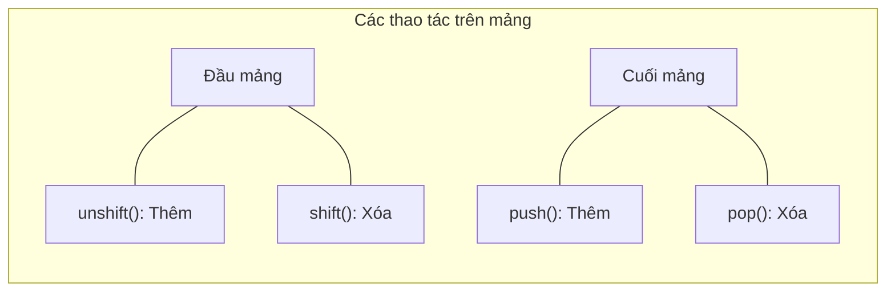

# Buổi 9: Mảng (Array) cơ bản

Xin chào các em! 👋

Hôm nay thầy trò mình sẽ tìm hiểu một cấu trúc dữ liệu cực kỳ quan trọng giúp quản lý danh sách nhiều phần tử cùng lúc — đó là **Mảng (Array)**.

## 🎯 Mục tiêu buổi học
> **Thầy mong muốn sau buổi học này, các em sẽ đạt được:**
1. ✅ Hiểu khái niệm mảng và cách khai báo mảng trong JavaScript.
2. ✅ Truy xuất và thay đổi các phần tử của mảng qua chỉ số (index).
3. ✅ Sử dụng thành thạo các hàm tiện ích của mảng: `push`, `pop`, `shift`, `unshift`, `length`.

---

## 📖 Lý thuyết cốt lõi

### 1. Mảng là gì?
Mảng là một biến đặc biệt có thể chứa nhiều giá trị cùng một lúc. Các giá trị trong mảng được sắp xếp theo thứ tự và bắt đầu bằng chỉ số (index) là **0**.

```javascript
let fruits = ["Táo", "Chuối", "Cam"];
console.log(fruits[0]); // "Táo"
```

### 2. Các phương thức thao tác mảng phổ biến

::: code-group
```javascript [Thêm phần tử (push / unshift)]
let students = ["Nam", "Hoa"];

// push(): Thêm vào CUỐI mảng
students.push("Lan"); // ["Nam", "Hoa", "Lan"]

// unshift(): Thêm vào ĐẦU mảng
students.unshift("Tuấn"); // ["Tuấn", "Nam", "Hoa", "Lan"]
```

```javascript [Xóa phần tử (pop / shift)]
let students = ["Tuấn", "Nam", "Hoa", "Lan"];

// pop(): Xóa ở CUỐI mảng, trả về phần tử bị xóa
let last = students.pop(); // last = "Lan", mảng còn ["Tuấn", "Nam", "Hoa"]

// shift(): Xóa ở ĐẦU mảng, trả về phần tử bị xóa
let first = students.shift(); // first = "Tuấn", mảng còn ["Nam", "Hoa"]
```
:::



---

## 💻 Ví dụ minh họa & Thực hành

### Ví dụ: Quản lý danh sách hoa quả
```javascript
let myCart = ["Sách", "Bút"];

// Thêm sản phẩm mới vào giỏ hàng
myCart.push("Thước kẻ"); 
console.log(myCart); // ["Sách", "Bút", "Thước kẻ"]

// Xóa sản phẩm cuối cùng
myCart.pop();
console.log(myCart); // ["Sách", "Bút"]
```

### Bài tập thực hành
Các em hãy viết chương trình:
1. Tạo một mảng chứa tên 5 người bạn của mình.
2. Sử dụng vòng lặp `for` để duyệt qua mảng và in từng tên ra console kèm câu chào (Ví dụ: "Xin chào Nam!").
3. Thêm một người bạn mới vào đầu danh sách và in lại toàn bộ danh sách ra console.

---

## 🧪 Câu hỏi ôn tập
::: details 1. Chỉ số (index) của phần tử cuối cùng trong mảng luôn bằng bao nhiêu?
Luôn bằng `mảng.length - 1`. Vì mảng bắt đầu đánh chỉ số từ 0.
:::

::: details 2. Phân biệt `push()` và `unshift()`?
Cả hai đều dùng để thêm phần tử mới vào mảng. Tuy nhiên, `push()` thêm vào cuối mảng, còn `unshift()` thêm vào đầu mảng.
:::
