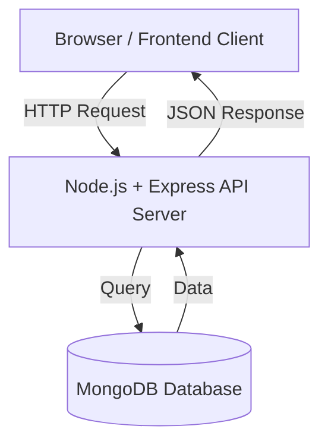

# Giới thiệu về khóa học Node.js API cho Ecommerce

> **Bài trước:** Không có (Đây là bài đầu tiên)  
> **Bài tiếp theo:** [Lesson 2: Request, Response & Middleware](./lesson-2.md)

### Sơ đồ hoạt động


Chào mừng các em đến với khóa học Node.js/Express xây dựng API cho ứng dụng thương mại điện tử! 👨‍🏫

Khóa học này sẽ giúp các em:

-   Hiểu rõ cách xây dựng API backend cho ứng dụng ecommerce.
-   Thành thạo các bước thiết lập môi trường, khởi tạo dự án backend hiện đại.
-   Làm quen với các công cụ phổ biến như Babel, dotenv, pnpm, Postman...
-   Xây dựng các API quan trọng như quản lý sản phẩm, người dùng, giỏ hàng, đơn hàng.
-   Tích hợp các tính năng bảo mật như xác thực JWT, mã hóa mật khẩu.
-   Tối ưu hiệu năng và tổ chức code khoa học, dễ mở rộng.

## Giới thiệu Node.js

### Node.js là gì?

Node.js là một nền tảng (runtime) giúp chạy JavaScript ở phía server, không chỉ trong trình duyệt. Nhờ Node.js, các em có thể dùng JavaScript để xây dựng các ứng dụng web, API, real-time chat, và nhiều loại ứng dụng khác. Node.js ra đời năm 2009 bởi Ryan Dahl, nhằm giải quyết bài toán hiệu năng và xử lý nhiều kết nối cùng lúc mà các nền tảng truyền thống gặp khó khăn.

### Tại sao nên học và sử dụng Node.js?

-   **Dùng chung ngôn ngữ**: Node.js cho phép sử dụng JavaScript ở cả frontend và backend, giúp học nhanh và làm việc hiệu quả hơn.
-   **Xử lý bất đồng bộ (asynchronous)**: Đây là một điểm mạnh của Node.js, giúp xử lý nhiều yêu cầu đồng thời mà không làm chậm hệ thống.
-   **Hệ sinh thái phong phú**: Với npm (Node Package Manager), Node.js có hàng triệu thư viện hỗ trợ, giúp tăng tốc độ phát triển ứng dụng.
-   **Được các công ty lớn sử dụng**: Netflix, LinkedIn, Uber, và nhiều công ty khác đã áp dụng Node.js để xây dựng hệ thống của họ.
-   **Dễ học**: Nếu đã biết JavaScript, việc học Node.js sẽ rất dễ dàng. Ngoài ra, nhu cầu tuyển dụng Node.js rất cao với mức lương hấp dẫn.

### So sánh Node.js với PHP

| Tiêu chí          | Node.js                       | PHP                           |
| ----------------- | ----------------------------- | ----------------------------- |
| Ngôn ngữ          | JavaScript                    | PHP                           |
| Kiểu xử lý        | Bất đồng bộ (asynchronous)    | Đa phần đồng bộ (synchronous) |
| Hiệu năng         | Cao với ứng dụng real-time    | Tốt cho web truyền thống      |
| Hệ sinh thái      | npm (rất lớn, hiện đại)       | Composer (lớn, truyền thống)  |
| Học tập           | Dễ nếu đã biết JS             | Dễ bắt đầu cho web            |
| Ứng dụng phổ biến | API, chat, game, microservice | Website, CMS (WordPress...)   |

> Tóm lại, Node.js rất phù hợp cho các ứng dụng hiện đại, cần tốc độ và khả năng mở rộng, còn PHP vẫn mạnh ở mảng web truyền thống, blog, CMS.

### Khi nào nên chọn Node.js?

-   Khi xây dựng API cho ứng dụng ecommerce, cần xử lý nhiều yêu cầu đồng thời.
-   Khi muốn tích hợp các tính năng real-time như thông báo đơn hàng, chat hỗ trợ khách hàng.
-   Khi cần tốc độ phát triển nhanh, nhiều thư viện hỗ trợ.
-   Khi muốn xây dựng hệ thống có khả năng mở rộng và hiệu năng cao.

## Chuẩn bị cho khóa học Node.js

### Kiến thức cần có

Để học Node.js hiệu quả, các em nên có kiến thức cơ bản về:

-   **JavaScript ES6+**: Hiểu các khái niệm như `let`, `const`, `arrow function`, `async/await`.
-   **Networking và HTTP**: Hiểu cách giao tiếp giữa client và server qua giao thức HTTP.
-   **Cơ sở dữ liệu**: Biết cách làm việc với cơ sở dữ liệu như MongoDB hoặc MySQL.

## Thiết lập môi trường

### 1. Cài đặt Node.js

Node.js là nền tảng giúp chạy JavaScript phía server. Nếu máy chưa có, hãy vào [https://nodejs.org/en](https://nodejs.org/en) để tải về và cài đặt.

### 2. Cài đặt pnpm

Thầy khuyên dùng `pnpm` thay cho `npm` vì tốc độ cài đặt nhanh và tiết kiệm bộ nhớ hơn. Cài đặt bằng lệnh:

```bash
npm i -g pnpm
```

### 3. Khởi tạo dự án Node.js

-   Tạo một thư mục mới cho dự án, ví dụ: `WD20104`. Tên gì cũng được, miễn các em dễ nhớ.
-   Mở terminal, di chuyển vào thư mục đó và khởi tạo dự án:

    ```bash
    npm init -y
    ```

    Lệnh này sẽ tạo file `package.json` – nơi lưu thông tin dự án và các thư viện sẽ cài đặt sau này.

-   Cài các thư viện cần thiết:
    ```bash
    pnpm i express mongoose cors bcryptjs jsonwebtoken dotenv morgan
    ```
    Mỗi thư viện đều có vai trò riêng:
    -   `express`: Giúp xây dựng web/API nhanh chóng.
    -   `mongoose`: Để kết nối và làm việc với MongoDB.
    -   `cors`: Cho phép truy cập API từ nhiều nguồn khác nhau.
    -   `bcryptjs`: Dùng để mã hóa mật khẩu.
    -   `jsonwebtoken`: Phục vụ xác thực người dùng qua token.
    -   `dotenv`: Giúp quản lý các biến môi trường, bảo mật thông tin nhạy cảm.
    -   `morgan`: Hỗ trợ ghi log các request, rất tiện khi debug.

### 4. Cài đặt Babel cho dự án

Để code hiện đại hơn, các em cần Babel – công cụ chuyển đổi mã JavaScript mới về dạng mà Node.js hiểu được.  
Cài đặt các gói cần thiết:

```bash
pnpm i -D @babel/core @babel/node @babel/preset-env nodemon
```

-   `@babel/core`, `@babel/node`, `@babel/preset-env`: Bộ công cụ Babel.
-   `nodemon`: Giúp tự động restart server khi code thay đổi.

Sau đó, tạo file `.babelrc` ở thư mục gốc với nội dung:

```json
{
    "presets": ["@babel/preset-env"]
}
```

Nhờ vậy, các em có thể dùng cú pháp import/export, async/await... mà không lo Node.js chưa hỗ trợ.

### 5. Cấu hình package.json

Thêm script để chạy dự án:

```json
"scripts": {
  "dev": "nodemon --exec babel-node src/app.js"
}
```

Script này giúp các em chỉ cần chạy `pnpm run dev` là server sẽ tự động khởi động bằng Babel, đồng thời nodemon sẽ theo dõi mọi thay đổi trong mã nguồn và tự động restart server.

### 6. Thiết lập cấu trúc thư mục

```
src/
├── app.js                  # Tệp chính khởi chạy ứng dụng
├── routers/                # Chứa các file định nghĩa route
│   ├── index.js            # Router chính, tập hợp các router con
│   └── posts.js            # Router cho bài viết
├── note/                   # Thư mục lưu ghi chú hoặc tài liệu
├── .babelrc                # Cấu hình Babel
├── .env                    # Lưu thông tin biến môi trường
└── .gitignore              # Định nghĩa các file/thư mục cần bỏ qua khi đẩy lên Git
```

### 6.1. Cấu hình biến môi trường

Tạo file `.env` với nội dung:

```env
PORT=3000
```

Nhờ vậy, khi muốn đổi port, các em chỉ cần sửa file này mà không phải động vào code.

### 6.2. Cấu hình `.gitignore`

Tạo file `.gitignore` ở thư mục gốc để bỏ qua các file/thư mục không cần thiết khi đẩy lên Git. Nội dung file có thể như sau:

```
node_modules/
.env
dist/
```

-   `node_modules/`: Thư mục chứa các thư viện cài đặt, không cần đẩy lên Git vì có thể cài lại bằng `pnpm install`.
-   `.env`: File chứa thông tin nhạy cảm như biến môi trường, không nên công khai.
-   `dist/`: Thư mục chứa mã nguồn đã build (nếu có), thường được tạo lại khi build dự án.

Nhờ `.gitignore`, các em có thể giữ repo sạch sẽ và bảo mật thông tin nhạy cảm.

### 6.3. Cài đặt Git và đẩy dự án lên GitHub

#### 1. Cài đặt Git

Nếu máy chưa có Git, hãy tải về và cài đặt từ [https://git-scm.com/](https://git-scm.com/).  
Sau khi cài đặt, kiểm tra bằng lệnh:

```bash
git --version
```

Nếu thấy phiên bản Git hiện ra, nghĩa là Git đã được cài đặt thành công.

#### 2. Khởi tạo Git trong dự án

Di chuyển vào thư mục dự án và chạy lệnh:

```bash
git init
```

Lệnh này sẽ khởi tạo một repository Git trong thư mục hiện tại.

#### 3. Tạo repository trên GitHub

-   Truy cập [https://github.com/](https://github.com/) và đăng nhập.
-   Nhấn nút **New Repository** để tạo một repository mới.
-   Điền tên repository, ví dụ: `nodejs-ecommerce-api`.
-   Nhấn **Create Repository**.

#### 4. Kết nối dự án với GitHub

Thêm URL của repository GitHub vào dự án:

```bash
git remote add origin https://github.com/<username>/nodejs-ecommerce-api.git
```

Thay `<username>` bằng tên tài khoản GitHub của các em.

#### 5. Đẩy dự án lên GitHub

Thêm tất cả các file vào Git:

```bash
git add .
```

Commit các thay đổi:

```bash
git commit -m "Initial commit"
```

Đẩy dự án lên GitHub:

```bash
git branch -M main
git push -u origin main
```

Sau khi hoàn tất, các em có thể kiểm tra repository trên GitHub để xem các file đã được đẩy lên.

### 7. Viết mã nguồn khởi tạo app

::: code-group

```javascript [src/app.js]
import express from "express";
import dotenv from "dotenv";

dotenv.config();
const app = express();
const port = process.env.PORT || 3000;

app.listen(port, () => {
    console.log(`Server is running on port ${port}`);
});
```

:::

### 8. Chạy thử dự án

Chạy lệnh:

```bash
pnpm run dev
```

Nếu thấy dòng "Server is running on port ..." hiện ra, nghĩa là server đã hoạt động.

### 9. Router là gì?

Router trong Express là một công cụ giúp các em nhóm các endpoint API liên quan lại với nhau. Nó giống như một "nhánh" trong cây route của ứng dụng, giúp tổ chức code khoa học hơn.

#### Tạo router cơ bản

Để tạo một router, các em sử dụng `Router()` từ thư viện Express. Ví dụ:

::: code-group

```javascript{3,5,9} [src/routers/posts.js]
import { Router } from "express";

const postsRouter = Router();

postsRouter.get("/", (req, res) => {
    res.json({ message: "Danh sách bài viết" });
});

postsRouter.post("/", (req, res) => {
    res.json({ message: "Thêm bài viết mới" });
});

export default postsRouter;
```

:::
Trong ví dụ trên:

-   `Router()` tạo một đối tượng router mới.
-   `postsRouter.get()` định nghĩa một endpoint với phương thức HTTP GET.
-   `postsRouter.post()` định nghĩa một endpoint với phương thức HTTP POST.
-   `res.json()` gửi phản hồi dạng JSON về cho client.

#### Tích hợp router vào ứng dụng

Sau khi tạo router, các em cần tích hợp nó vào ứng dụng chính bằng `app.use()`:

::: code-group

```javascript{2,6} [src/app.js]
import express from "express";
import postsRouter from "./routers/posts";

const app = express();
const port = process.env.PORT || 3000;

app.use("/api/posts", postsRouter);

app.listen(port, () => {
    console.log(`Server is running on port ${port}`);
});
```

:::
Trong ví dụ trên:

-   `app.use("/api/posts", postsRouter)` gắn router `postsRouter` vào đường dẫn `/api/posts`.
-   Khi client gửi yêu cầu đến `/api/posts`, router `postsRouter` sẽ xử lý.

#### Lợi ích của việc sử dụng router

-   **Tổ chức code tốt hơn**: Bạn có thể chia các endpoint theo chức năng (ví dụ: bài viết, người dùng, đơn hàng).
-   **Dễ bảo trì**: Khi cần sửa đổi hoặc thêm endpoint, các em chỉ cần làm việc với file router tương ứng.
-   **Khả năng mở rộng**: Dễ dàng thêm các router mới mà không làm phức tạp ứng dụng chính.

#### Ví dụ thực tế

Giả sử các em đang xây dựng một ứng dụng ecommerce. Bạn có thể tạo các router như sau:

-   `productsRouter`: Quản lý các endpoint liên quan đến sản phẩm.
-   `usersRouter`: Quản lý các endpoint liên quan đến người dùng.
-   `ordersRouter`: Quản lý các endpoint liên quan đến đơn hàng.

Nhờ việc sử dụng router, ứng dụng của các em sẽ trở nên khoa học và dễ quản lý hơn.

## Kiểm tra API với Postman

1. Mở Postman (hoặc Insomnia, hoặc bất cứ công cụ nào các em thích).
2. Tạo một request mới với phương thức **GET**.
3. Nhập URL: `http://localhost:3000/api/posts`
4. Nhấn **Send**.
5. Nếu thành công, các em sẽ thấy kết quả:
    ```json
    {
        "message": "Danh sách bài viết"
    }
    ```

## Bài tập thực hành

### Bài tập 1: Tạo Router cho Users

Tạo một router mới cho quản lý người dùng với 3 endpoint cơ bản:

**Yêu cầu:**

1. Tạo file `src/routers/users.js`
2. Tạo router với 3 endpoint:
    - `GET /api/users` - Trả về danh sách người dùng (tạm thời trả về mảng rỗng)
    - `GET /api/users/:id` - Trả về thông tin một người dùng (tạm thời trả về thông báo)
    - `POST /api/users` - Tạo người dùng mới (tạm thời trả về dữ liệu nhận được)

**Gợi ý:**

::: code-group

```javascript [src/routers/users.js]
// src/routers/users.js
import { Router } from "express";

const usersRouter = Router();

usersRouter.get("/", (req, res) => {
    res.json([]);
});

usersRouter.get("/:id", (req, res) => {
    res.json({ message: `Thông tin người dùng ID: ${req.params.id}` });
});

usersRouter.post("/", (req, res) => {
    res.json({ message: "Tạo người dùng mới", data: req.body });
});

export default usersRouter;
```

```javascript [main.js]
import usersRouter from "./routers/users";
app.use("/api/users", usersRouter);
```

:::

4. Test bằng Postman:
    - `GET http://localhost:3000/api/users`
    - `GET http://localhost:3000/api/users/123`
    - `POST http://localhost:3000/api/users` (với body JSON: `{"name": "Test"}`)

### Bài tập 2: Tìm hiểu về Error Handling

Thêm error handling cơ bản vào router posts:

-   Nếu có lỗi xảy ra, trả về status 500 và thông báo lỗi

## Use Case thực tế: E-commerce API

Trong thực tế, một API e-commerce thường có các module sau:

-   **Products API**: Quản lý sản phẩm (thêm, sửa, xóa, tìm kiếm)
-   **Users API**: Quản lý người dùng (đăng ký, đăng nhập, profile)
-   **Orders API**: Quản lý đơn hàng (tạo đơn, xem lịch sử)
-   **Cart API**: Quản lý giỏ hàng (thêm, xóa, cập nhật)

Với kiến thức từ bài này, các em đã có nền tảng để xây dựng từng module trên!

## Kết luận

Qua bài này, các em không chỉ biết cách tạo một dự án Node.js/Express mà còn hiểu rõ ý nghĩa của từng bước.  
Hãy luôn tự hỏi "vì sao mình làm như vậy", vì hiểu bản chất sẽ giúp các em tiến xa hơn rất nhiều!

**Bài tiếp theo:** [Lesson 2: Request/Response và Middleware](./lesson-2.md) - Học cách làm việc với request/response và middleware trong Express

Nếu có thắc mắc, đừng ngại hỏi thầy hoặc các các em nhé!  
Chúc các em học tốt! 🚀  
— **Thầy Đạt 🧡**
