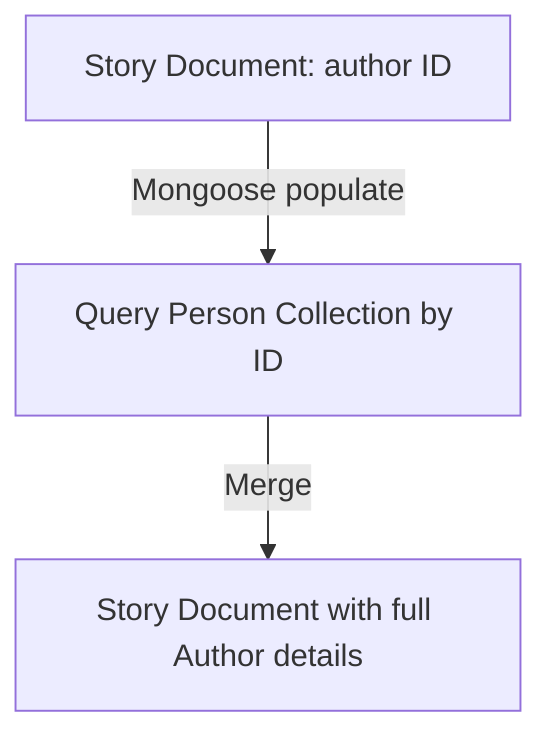

# Bài 11: Hiểu Về Populate Trong MongoDB

> **Bài trước:** [Lesson 10: Thiết Kế Schema MongoDB](./lesson-10.md)  
> **Bài tiếp theo:** [Lesson 12: Xây dựng API Giỏ hàng (Cart)](./lesson-12.md)

### Sơ đồ hoạt động




## Khái Niệm

`populate` là một tính năng của Mongoose giúp bạn tự động thay thế các đường dẫn được chỉ định trong document bằng các document từ collection khác. Điều này rất hữu ích khi làm việc với các mối quan hệ giữa các collection.


## Tại Sao Cần Populate?

Khi sử dụng tham chiếu giữa các collection, bạn thường cần truy xuất dữ liệu từ nhiều collection để hiển thị thông tin đầy đủ. `populate` giúp bạn làm điều này một cách dễ dàng mà không cần viết nhiều truy vấn phức tạp.


## Ví Dụ Trực Quan

### 1. Thiết Kế Schema

Giả sử bạn có hai collection: **Person** và **Story**.

#### Collection Person:
```json
{
  "_id": "ObjectId('PERSON001')",
  "name": "Ian Fleming",
  "age": 50,
  "stories": ["ObjectId('STORY001')"]
}
```

#### Collection Story:
```json
{
  "_id": "ObjectId('STORY001')",
  "title": "Casino Royale",
  "author": "ObjectId('PERSON001')",
  "fans": ["ObjectId('PERSON002'), ObjectId('PERSON003')"]
}
```


### 2. Định Nghĩa Schema Trong Mongoose

::: code-group
```javascript [src/models/Person.js]
import mongoose from 'mongoose';
const { Schema } = mongoose;

const personSchema = new Schema({
  name: String,
  age: Number,
  stories: [{ type: Schema.Types.ObjectId, ref: 'Story' }]
});

const Person = mongoose.model('Person', personSchema);
export default Person;
```

```javascript [src/models/Story.js]
import mongoose from 'mongoose';
const { Schema } = mongoose;

const storySchema = new Schema({
  title: String,
  author: { type: Schema.Types.ObjectId, ref: 'Person' },
  fans: [{ type: Schema.Types.ObjectId, ref: 'Person' }]
});

const Story = mongoose.model('Story', storySchema);
export default Story;
```
:::


### 3. Sử Dụng Populate

#### Truy xuất thông tin tác giả của một câu chuyện:
```javascript
import Story from './models/Story.js';

const getStoryWithAuthor = async (storyId) => {
  const story = await Story.findById(storyId).populate('author');
  console.log(`The author is ${story.author.name}`);
};

getStoryWithAuthor('STORY001');
```

#### Truy xuất danh sách người hâm mộ của một câu chuyện:
```javascript
import Story from './models/Story.js';

const getStoryWithFans = async (storyId) => {
  const story = await Story.findById(storyId).populate('fans');
  story.fans.forEach(fan => console.log(`Fan: ${fan.name}`));
};

getStoryWithFans('STORY001');
```


### 4. Kết Quả

Khi sử dụng `populate`, kết quả sẽ tự động bao gồm thông tin từ collection liên quan:

```json
{
  "_id": "ObjectId('STORY001')",
  "title": "Casino Royale",
  "author": {
    "_id": "ObjectId('PERSON001')",
    "name": "Ian Fleming",
    "age": 50
  },
  "fans": [
    { "_id": "ObjectId('PERSON002')", "name": "Sean" },
    { "_id": "ObjectId('PERSON003')", "name": "George" }
  ]
}
```


## Các Tính Năng Nâng Cao

### Chọn Trường
Bạn có thể chỉ định các trường cần truy xuất từ collection liên quan:
```javascript
import Story from './models/Story.js';

const story = await Story.findById('STORY001').populate('author', 'name age');
console.log(`Author: ${story.author.name}, Age: ${story.author.age}`);
```

### Populate Nhiều Đường Dẫn
Bạn có thể populate nhiều đường dẫn cùng lúc:
```javascript
import Story from './models/Story.js';

const story = await Story.findById('STORY001')
  .populate('author')
  .populate('fans');
```

### Điều Kiện Truy Vấn
Bạn có thể thêm điều kiện truy vấn khi populate:
```javascript
import Story from './models/Story.js';

const story = await Story.findById('STORY001').populate({
  path: 'fans',
  match: { age: { $gte: 21 } },
  select: 'name -_id'
});
```


## Lưu Ý

- **Hiệu suất**: `populate` có thể làm chậm truy vấn nếu dữ liệu liên quan quá lớn. Hãy sử dụng nó một cách hợp lý. Tránh populate quá nhiều documents cùng lúc (ví dụ: populate 1000+ documents).
- **Không Có Document Liên Quan**: Nếu không có document liên quan, giá trị sẽ là `null` hoặc `[]`.
- **Nested Populate**: Bạn có thể populate nhiều cấp bằng cách sử dụng nested populate (ví dụ: `.populate('author').populate('author.friends')`), nhưng cần cẩn thận về performance.


## Tóm Lại

`populate` là một công cụ mạnh mẽ giúp bạn làm việc với dữ liệu liên quan trong MongoDB một cách dễ dàng. Hãy sử dụng nó khi bạn cần truy xuất thông tin từ nhiều collection mà không muốn viết nhiều truy vấn phức tạp.

Chúc các bạn học tốt và áp dụng thành công nhé!


# Bài Tập: Sử Dụng Populate Trong Dự Án Bán Hàng

## Mô Tả Bài Tập

Bạn sẽ thiết kế một hệ thống quản lý đơn hàng cho một website bán hàng. Hệ thống bao gồm các bảng:
- **User**: Lưu thông tin khách hàng.
- **Product**: Lưu thông tin sản phẩm.
- **Order**: Lưu thông tin đơn hàng, bao gồm khách hàng và danh sách sản phẩm.


## Yêu Cầu

1. Tạo schema cho **User**, **Product**, và **Order**.
2. Sử dụng `populate` để truy xuất thông tin khách hàng và danh sách sản phẩm trong đơn hàng.
3. Viết code để thêm dữ liệu mẫu và truy xuất thông tin đơn hàng.


## Hướng Dẫn

### 1. Định Nghĩa Schema

::: code-group
```javascript [src/models/User.js]
import mongoose from 'mongoose';
const { Schema } = mongoose;

const userSchema = new Schema({
  name: String,
  email: String,
});

const User = mongoose.model('User', userSchema);
export default User;
```

```javascript [src/models/Product.js]
import mongoose from 'mongoose';
const { Schema } = mongoose;

const productSchema = new Schema({
  name: String,
  price: Number,
});

const Product = mongoose.model('Product', productSchema);
export default Product;
```

```javascript [src/models/Order.js]
import mongoose from 'mongoose';
const { Schema } = mongoose;

const orderSchema = new Schema({
  user: { type: Schema.Types.ObjectId, ref: 'User' },
  products: [{ type: Schema.Types.ObjectId, ref: 'Product' }],
  total: Number,
});

const Order = mongoose.model('Order', orderSchema);
export default Order;
```
:::


### 2. Thêm Dữ Liệu Mẫu

```javascript
// filepath: src/scripts/addSampleData.js
import mongoose from 'mongoose';
import dotenv from 'dotenv';
import User from '../models/User.js';
import Product from '../models/Product.js';
import Order from '../models/Order.js';

dotenv.config();

const addSampleData = async () => {
  try {
    await mongoose.connect(process.env.MONGO_URI);

    const user = await User.create({ name: 'Nguyễn Văn A', email: 'nguyenvana@example.com' });
    const product1 = await Product.create({ name: 'Laptop', price: 1500 });
    const product2 = await Product.create({ name: 'Mouse', price: 50 });

    const order = await Order.create({
      user: user._id,
      products: [product1._id, product2._id],
      total: 1550,
    });

    console.log('Sample data added successfully!');
    await mongoose.disconnect();
  } catch (error) {
    console.error('Error adding sample data:', error);
    process.exit(1);
  }
};

addSampleData();
```


### 3. Truy Xuất Thông Tin Đơn Hàng

```javascript
// filepath: src/scripts/getOrderDetails.js
import mongoose from 'mongoose';
import dotenv from 'dotenv';
import Order from '../models/Order.js';

dotenv.config();

const getOrderDetails = async (orderId) => {
  try {
    await mongoose.connect(process.env.MONGO_URI);

    const order = await Order.findById(orderId)
      .populate('user', 'name email')
      .populate('products', 'name price');

    if (!order) {
      console.log('Order not found');
      return;
    }

    console.log('Order Details:');
    console.log(`Customer: ${order.user.name} (${order.user.email})`);
    console.log('Products:');
    order.products.forEach(product => {
      console.log(`- ${product.name}: $${product.price}`);
    });
    console.log(`Total: $${order.total}`);

    await mongoose.disconnect();
  } catch (error) {
    console.error('Error fetching order details:', error);
    process.exit(1);
  }
};

// Sử dụng: getOrderDetails('ORDER_ID'); // Thay 'ORDER_ID' bằng ID thực tế
```


## Kết Quả Mong Đợi

Khi chạy script truy xuất thông tin đơn hàng, bạn sẽ nhận được kết quả như sau:

```
Order Details:
Customer: Nguyễn Văn A (nguyenvana@example.com)
Products:
- Laptop: $1500
- Mouse: $50
Total: $1550
```


## Bài Tập Thêm

1. Thêm tính năng lọc đơn hàng theo khách hàng.
2. Sử dụng `populate` để chỉ truy xuất các trường cần thiết từ **User** và **Product**.
3. Viết code để cập nhật danh sách sản phẩm trong một đơn hàng.

## Use Case thực tế: Khi Nào Dùng Populate?

**Nên dùng Populate:**
- Hiển thị thông tin user khi xem order details
- Hiển thị thông tin product trong order items
- Hiển thị author của blog post
- Relationship 1-1 hoặc 1-nhiều (nhỏ)

**Không nên dùng Populate:**
- Khi cần populate quá nhiều documents (1000+) → Dùng aggregation pipeline
- Khi dữ liệu thường xuyên thay đổi → Nên embed hoặc query riêng
- Khi chỉ cần một vài trường → Dùng select để giảm dữ liệu

**Ví dụ thực tế:** 
- Amazon: Hiển thị product info trong order → Populate tốt
- Facebook: Hiển thị tất cả friends (có thể hàng ngàn) → Không populate, dùng pagination và query riêng

Nếu có thắc mắc, đừng ngại hỏi thầy hoặc các bạn nhé!  
Chúc các em học tốt! 🚀
— **Thầy Đạt 🧡**