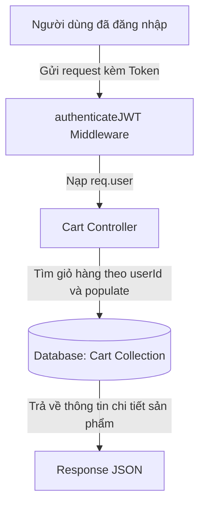

# Bài 12: Xây dựng API Giỏ hàng (Cart)

> **Bài trước:** [Lesson 11: Hiểu Về Populate Trong MongoDB](./lesson-11.md)  
> **Bài tiếp theo:** [Lesson 13: API Đơn hàng & Checkout (Orders)](./lesson-13.md)

**Loại buổi**: Thực hành  
**Thời lượng**: 120 phút  
**Dự án**: Vanguard Store E-Commerce API  

---

## 🎯 Mục tiêu học tập
- Thiết kế Schema cho Giỏ hàng (Cart) liên kết với Model User và Model Product.
- Áp dụng kỹ thuật `populate` đã học ở Bài 11 để lấy thông tin sản phẩm đầy đủ từ Giỏ hàng.
- Lập trình các API: thêm sản phẩm vào giỏ, cập nhật số lượng, và lấy thông tin giỏ hàng của người dùng hiện tại.

---

## 📖 Lý thuyết cốt lõi

### 1. Tại sao cần API Giỏ hàng?
Trong một ứng dụng thương mại điện tử (E-Commerce), giỏ hàng là nơi lưu trữ tạm thời các sản phẩm mà người dùng muốn mua trước khi tiến hành thanh toán (checkout).
- Giỏ hàng cần gắn liền với từng tài khoản người dùng (`userId`).
- Giỏ hàng chứa danh sách các sản phẩm và số lượng tương ứng của từng sản phẩm.

### 2. Thiết kế Schema Giỏ hàng với Mongoose
Để liên kết dữ liệu, chúng ta sử dụng `Schema.Types.ObjectId` và thuộc tính `ref` tham chiếu đến các model `User` và `Product` như đã học ở bài 10 & 11:
```javascript
const cartSchema = new mongoose.Schema({
    userId: { type: mongoose.Schema.Types.ObjectId, ref: 'User', required: true },
    items: [
        {
            productId: { type: mongoose.Schema.Types.ObjectId, ref: 'Product', required: true },
            quantity: { type: Number, required: true, min: 1, default: 1 }
        }
    ]
}, { timestamps: true });
```

### 📊 Sơ đồ luồng hoạt động của API Giỏ hàng:


---

## 💻 Ví dụ thực tiễn
Dưới đây là mã nguồn Controller xử lý việc thêm sản phẩm vào giỏ hàng (`src/controllers/cart.controller.js`). Nó sẽ kiểm tra xem sản phẩm đã tồn tại trong giỏ chưa: nếu đã có thì cộng dồn số lượng, nếu chưa có thì thêm mới vào mảng `items`:

```javascript
import Cart from '../models/Cart.js';

export const addToCart = async (req, res, next) => {
    try {
        const { productId, quantity } = req.body;
        const userId = req.user.id; // Lấy từ middleware authenticateJWT

        // 1. Tìm giỏ hàng của user
        let cart = await Cart.findOne({ userId });

        if (!cart) {
            // Nếu chưa có giỏ hàng, tạo mới
            cart = new Cart({
                userId,
                items: [{ productId, quantity: Number(quantity) }]
            });
        } else {
            // Nếu đã có, kiểm tra sản phẩm đã tồn tại trong giỏ chưa
            const itemIndex = cart.items.findIndex(item => item.productId.toString() === productId);

            if (itemIndex > -1) {
                // Đã tồn tại, cộng dồn số lượng
                cart.items[itemIndex].quantity += Number(quantity);
            } else {
                // Chưa tồn tại, thêm mới vào mảng
                cart.items.push({ productId, quantity: Number(quantity) });
            }
        }

        await cart.save();
        
        // Trả về dữ liệu giỏ hàng đã được populate thông tin sản phẩm
        const populatedCart = await cart.populate('items.productId', 'name price image');
        res.status(200).json(populatedCart);
    } catch (error) {
        next(error);
    }
};
```

---

## 🛠️ Bài tập thực hành (Lab)
Hãy viết API lấy thông tin giỏ hàng của người dùng hiện tại `GET /api/cart`. API này phải bắt buộc người dùng đã đăng nhập (sử dụng middleware `authenticateJWT`) và tự động populate đầy đủ tên và giá của sản phẩm.

<details class="details custom-block">
  <summary>🔑 Xem gợi ý giải pháp (Code mẫu)</summary>

```javascript
// src/controllers/cart.controller.js
export const getCart = async (req, res, next) => {
    try {
        const userId = req.user.id;
        const cart = await Cart.findOne({ userId }).populate('items.productId', 'name price image');
        
        if (!cart) {
            return res.status(200).json({ userId, items: [] });
        }
        
        res.status(200).json(cart);
    } catch (error) {
        next(error);
    }
};
```
</details>

---

## ❓ Trắc nghiệm nhanh
**1. Tại sao chúng ta cần sử dụng hàm `.populate()` khi lấy thông tin giỏ hàng?**
- A. Để tự động cộng tiền giỏ hàng.
- B. Để Mongoose tự động thay thế `productId` (dạng ObjectId) bằng thông tin chi tiết của sản phẩm (như tên, giá, ảnh) từ bảng Products.
- C. Để mã hóa giỏ hàng an toàn.
<details class="details custom-block">
  <summary>Xem giải đáp</summary>

  *Đáp án đúng: **B**.*
</details>

