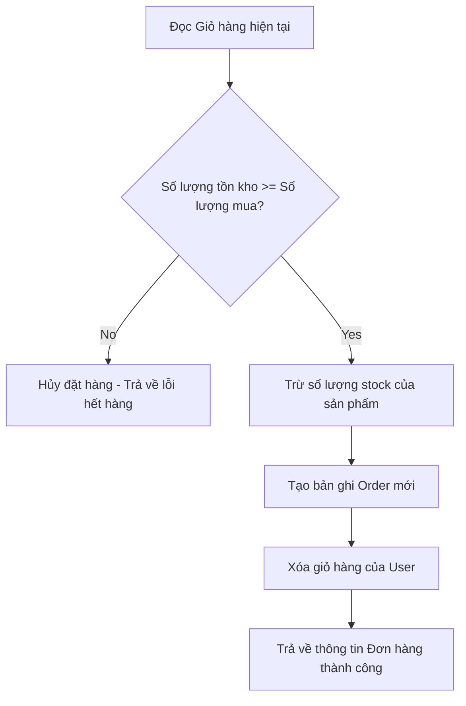

# Bài 13: API Đơn hàng & Checkout (Orders)

> **Bài trước:** [Lesson 12: Xây dựng API Giỏ hàng (Cart)](./lesson-12.md)  
> **Bài tiếp theo:** [Lesson 14: Testing với Jest & Supertest](./lesson-14.md)
**Dự án**: Vanguard Store E-Commerce API  

---

## 🎯 Mục tiêu học tập
- Thiết kế Schema cho Đơn hàng (Order) lưu trữ hóa đơn thanh toán của người dùng.
- Lập trình logic chốt đơn hàng (Checkout): kiểm tra lượng hàng tồn kho (stock) của từng sản phẩm, tự động trừ kho và xóa sạch giỏ hàng khi thành công.

---

## 📖 Lý thuyết cốt lõi

### 1. Quy trình xử lý Checkout (Đặt hàng)
Đặt hàng là một quy trình đòi hỏi độ chính xác cao về mặt dữ liệu. Luồng xử lý bao gồm:
1. Tìm giỏ hàng hiện tại của người dùng.
2. Kiểm tra tồn kho của từng sản phẩm trong giỏ:
   - Nếu `số lượng mua > số lượng tồn`, báo lỗi ngay lập tức và dừng quy trình.
3. Trừ số lượng tồn kho (`stock`) tương ứng của từng sản phẩm.
4. Tạo bản ghi đơn hàng mới trong bảng `orders`, lưu lại giá của sản phẩm tại thời điểm mua (tránh việc thay đổi giá sau này làm sai lệch doanh thu cũ).
5. Xóa sạch giỏ hàng của người dùng.

### 📊 Sơ đồ chốt đơn hàng:


---

## 💻 Ví dụ thực tiễn
Dưới đây là cấu trúc Order Schema (`src/models/Order.js`):

```javascript
import mongoose from 'mongoose';

const orderSchema = new mongoose.Schema({
    userId: { type: mongoose.Schema.Types.ObjectId, ref: 'User', required: true },
    items: [
        {
            productId: { type: mongoose.Schema.Types.ObjectId, ref: 'Product', required: true },
            quantity: { type: Number, required: true },
            price: { type: Number, required: true } // Lưu giá bán tại thời điểm chốt đơn
        }
    ],
    totalAmount: { type: Number, required: true },
    status: { type: String, default: 'pending', enum: ['pending', 'processing', 'completed', 'cancelled'] }
}, { timestamps: true });

export default mongoose.model('Order', orderSchema);
```

---

## 🛠️ Bài tập thực hành (Lab)
Các em các em hãy viết controller `createOrder` thực hiện việc chốt đơn hàng từ giỏ hàng hiện tại, kiểm tra và trừ tồn kho, tính tổng số tiền và lưu đơn hàng vào database.

<details class="details custom-block">
  <summary>🔑 Xem gợi ý giải pháp (Code mẫu)</summary>

```javascript
// src/controllers/order.controller.js
import Cart from '../models/Cart.js';
import Order from '../models/Order.js';
import Product from '../models/Product.js';

export const createOrder = async (req, res, next) => {
    try {
        const userId = req.user.id;
        
        // 1. Lấy giỏ hàng
        const cart = await Cart.findOne({ userId }).populate('items.productId');
        if (!cart || cart.items.length === 0) {
            return res.status(400).json({ message: 'Giỏ hàng của các em đang trống!' });
        }

        let total = 0;
        const orderItems = [];

        // 2. Kiểm tra tồn kho và tính tiền
        for (const item of cart.items) {
            const product = item.productId;
            if (product.stock < item.quantity) {
                return res.status(400).json({ message: `Sản phẩm ${product.name} không đủ hàng tồn kho (Còn lại: ${product.stock})` });
            }
            
            // Trừ số lượng tồn kho
            product.stock -= item.quantity;
            await product.save();

            total += product.price * item.quantity;
            orderItems.push({
                productId: product._id,
                quantity: item.quantity,
                price: product.price
            });
        }

        // 3. Tạo đơn hàng mới
        const order = new Order({
            userId,
            items: orderItems,
            totalAmount: total
        });
        await order.save();

        // 4. Xóa giỏ hàng
        await Cart.findOneAndDelete({ userId });

        res.status(201).json(order);
    } catch (error) {
        next(error);
    }
};
```
</details>

---

## ❓ Trắc nghiệm nhanh
**1. Tại sao thầy trò mình cần lưu trực tiếp trường `price` vào mảng `items` của đơn hàng thay vì dùng populate lấy từ bảng Products?**
- A. Để code chạy nhanh hơn.
- B. Để lưu lại chính xác giá sản phẩm tại thời điểm mua, tránh việc giá sản phẩm thay đổi sau này làm sai lệch doanh thu lịch sử của đơn hàng.
- C. Tránh trùng lặp ID.
<details class="details custom-block">
  <summary>Xem giải đáp</summary>

  *Đáp án đúng: **B**.*
</details>
