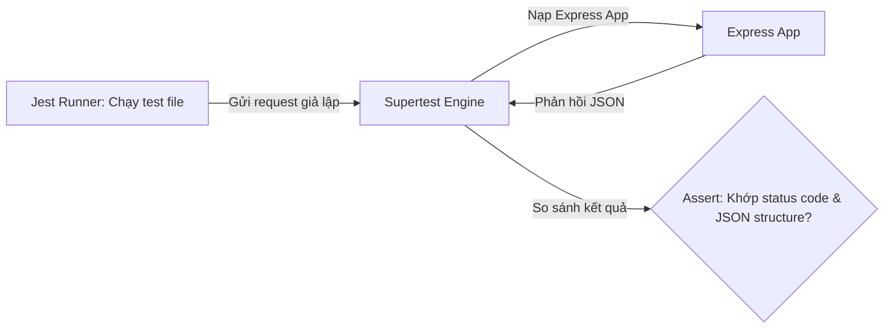

# Bài 14: Testing với Jest & Supertest

> **Bài trước:** [Lesson 13: API Đơn hàng & Checkout (Orders)](./lesson-13.md)  
> **Bài tiếp theo:** [Lesson 15: Deploy Production & CORS](./lesson-15.md)
**Dự án**: Vanguard Store E-Commerce API  

---

## 🎯 Mục tiêu học tập
- Thiết lập thành công Jest và Supertest làm công cụ kiểm thử tự động cho dự án API.
- Viết các test case kiểm tra đăng nhập/đăng ký và kiểm tra API sản phẩm.

---

## 📖 Lý thuyết cốt lõi

### 1. Tại sao cần kiểm thử tự động (Automation Testing)?
Khi dự án lớn lên, mỗi lần sửa đổi hoặc thêm tính năng mới có thể vô tình làm hỏng các tính năng cũ đang chạy bình thường. Viết test tự động giúp thầy trò mình phát hiện lỗi ngay lập tức.
- **Jest**: Thư viện quản lý các ca kiểm thử (test cases), cung cấp các hàm so sánh kết quả (`expect`, `toBe`).
- **Supertest**: Thư viện giả lập gửi các HTTP request (GET, POST...) trực tiếp đến cấu trúc ứng dụng Express mà không cần chạy máy chủ thực tế (không cần listen cổng mạng).

### 📊 Sơ đồ luồng kiểm thử Integration:


---

## 💻 Ví dụ thực tiễn
Dưới đây là một file kiểm thử tích hợp `tests/auth.test.js` kiểm tra API đăng nhập trả về mã lỗi 401 khi sai mật khẩu:

```javascript
import request from 'supertest';
import app from '../src/app.js'; // Export app từ src/app.js nhưng không chạy app.listen

describe('Kiểm thử API Đăng nhập (POST /api/auth/login)', () => {
    it('Trả về 401 Unauthorized nếu nhập sai mật khẩu', async () => {
        const res = await request(app)
            .post('/api/auth/login')
            .send({
                email: 'testuser@gmail.com',
                password: 'wrongpassword'
            });
            
        expect(res.statusCode).toEqual(401);
        expect(res.body).toHaveProperty('message');
        expect(res.body.message).toBe('Sai mật khẩu!');
    });
});
```

---

## 🛠️ Bài tập thực hành (Lab)
Các em các em hãy viết một đoạn kiểm thử kiểm tra API lấy danh sách sản phẩm `GET /api/products` phải trả về status code 200 và kết quả trả về phải là một mảng dữ liệu.

<details class="details custom-block">
  <summary>🔑 Xem gợi ý giải pháp (Code mẫu)</summary>

```javascript
// tests/product.test.js
import request from 'supertest';
import app from '../src/app.js';

describe('Kiểm thử API Sản phẩm', () => {
    it('GET /api/products - trả về 200 và mảng sản phẩm', async () => {
        const res = await request(app).get('/api/products');
        
        expect(res.statusCode).toEqual(200);
        expect(res.body).toHaveProperty('data');
        expect(Array.isArray(res.body.data)).toBe(true);
    });
});
```
</details>

---

## ❓ Trắc nghiệm nhanh
**1. Tại sao Supertest được ưa chuộng hơn Axios khi kiểm thử API Node.js?**
- A. Supertest chạy nhanh hơn.
- B. Supertest cho phép kiểm thử trực tiếp bằng cách nạp cấu hình app Express mà không cần chạy lệnh `app.listen(port)` để mở cổng mạng thực tế, tránh chiếm dụng cổng của hệ thống.
- C. Supertest tự động sinh database ảo.
<details class="details custom-block">
  <summary>Xem giải đáp</summary>

  *Đáp án đúng: **B**.*
</details>
