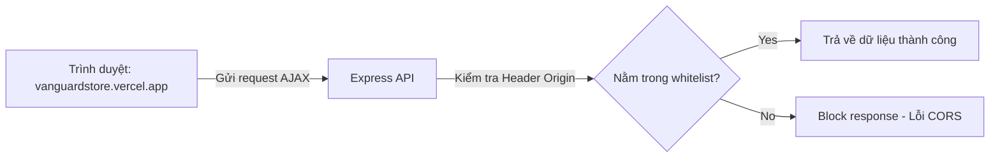

# Bài 15: Deploy Production & CORS

> **Bài trước:** [Lesson 14: Testing với Jest & Supertest](./lesson-14.md)  
> **Bài tiếp theo:** Không có (Đây là bài cuối cùng)

**Loại buổi**: Lý thuyết  
**Thời lượng**: 120 phút  
**Dự án**: Vanguard Store E-Commerce API  

---

## 🎯 Mục tiêu học tập
- Cấu hình phân chia tài nguyên CORS (Cross-Origin Resource Sharing) để cho phép Frontend ngoài kết nối API.
- Cấu hình scripts khởi động và triển khai hoàn chỉnh mã nguồn API lên Render/Vercel.

---

## 📖 Lý thuyết cốt lõi

### 1. Hiểu về CORS và cách cấu hình
Theo cơ chế bảo mật của trình duyệt, mã Javascript của một ứng dụng Frontend chạy ở domain A (ví dụ: `vanguardstore.vercel.app`) không được tự ý gọi API đến domain B (ví dụ: `vanguard-api.onrender.com`).
Chúng ta sử dụng thư viện `cors` của Express để cấp phép an toàn cho các domain cụ thể:
```javascript
import cors from 'cors';

const corsOptions = {
    origin: 'https://vanguardstore.vercel.app', // Tên miền Frontend duy nhất được phép truy cập
    optionsSuccessStatus: 200
};
app.use(cors(corsOptions));
```

### 2. Quản lý biến môi trường khi Deploy
Tuyệt đối **không bao giờ** được đẩy tệp tin `.env` chứa mật khẩu database, khoá bí mật JWT lên GitHub công khai. Khi deploy lên các dịch vụ Cloud:
- Thêm `.env` vào file `.gitignore`.
- Định nghĩa các biến môi trường trực tiếp trên giao diện Dashboard quản trị của nhà cung cấp Cloud (Render Environment Variables).

### 📊 Sơ đồ an toàn CORS:


---

## 💻 Ví dụ thực tiễn
Cấu hình hoàn chỉnh phần scripts khởi chạy của file `package.json` để Render hiểu câu lệnh biên dịch và khởi chạy:

```json
{
  "name": "vanguard-store-api",
  "version": "1.0.0",
  "scripts": {
    "build": "babel src -d dist",
    "start": "node dist/app.js",
    "dev": "nodemon --exec babel-node src/app.js"
  }
}
```
*Ghi chú*:
- Lệnh **Build Command** trên Render: `pnpm run build` (Biên dịch thư mục `src` sang `dist`).
- Lệnh **Start Command** trên Render: `pnpm run start` (Chạy code đã biên dịch trong thư mục `dist` để đạt hiệu năng tối đa).

---

## 🛠️ Bài tập thực hành (Lab)
1. Thêm cấu hình scripts `build` và `start` vào file `package.json` của bạn.
2. Đăng ký một tài khoản trên nền tảng [Render](https://render.com/), liên kết dự án Github và thiết lập biến môi trường `MONGO_URI` cùng `JWT_SECRET`.

<details class="details custom-block">
  <summary>🔑 Xem gợi ý giải pháp (Code mẫu)</summary>

Đảm bảo cấu hình biến môi trường trong file `src/app.js` sử dụng đúng biến môi trường hệ thống:
```javascript
// Sử dụng PORT do Render tự động cấp phát hoặc mặc định 5000 ở local
const PORT = process.env.PORT || 5000;
app.listen(PORT, () => {
    console.log(`Server is running on port ${PORT}`);
});
```
Khi điền trên Dashboard Render:
- Nhấn **New Web Service**.
- Chọn Repository dự án của bạn.
- Điền **Build Command**: `pnpm install && pnpm run build`.
- Điền **Start Command**: `pnpm run start`.
- Tại mục **Advanced** > **Add Environment Variable**, thêm:
  - `MONGO_URI` = Chuỗi kết nối MongoDB Atlas của bạn.
  - `JWT_SECRET` = Chuỗi mật mã bí mật ký nhận JWT.
</details>

---

## ❓ Trắc nghiệm nhanh
**1. Tại sao chúng ta cần chạy lệnh Build biên dịch code trước khi chạy server trên môi trường Production?**
- A. Để code ngắn hơn.
- B. Để biên dịch mã ES6/Modern JS (chứa import/export) thành mã CommonJS thuần mà Node.js có thể chạy trực tiếp với hiệu năng tối ưu nhất.
- C. Để tự động sửa lỗi code.
<details class="details custom-block">
  <summary>Xem giải đáp</summary>

  *Đáp án đúng: **B**.*
</details>

