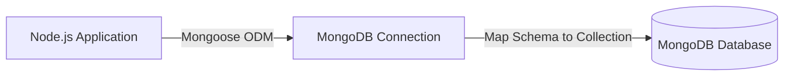

# Giới thiệu MongoDB và các khái niệm cơ bản

> **Bài trước:** [Lesson 3: CRUD với dữ liệu giả lập (In-memory)](./lesson-3.md)  
> **Bài tiếp theo:** [Lesson 5: Xây dựng CRUD với MongoDB](./lesson-5.md)

### Sơ đồ kết nối Mongoose



## Mục tiêu

-   Hiểu MongoDB là gì và tại sao nên sử dụng.
-   Phân biệt cơ bản giữa cơ sở dữ liệu NoSQL và SQL.
-   Làm quen với các khái niệm quan trọng trong MongoDB.
-   Chuẩn bị môi trường để làm việc với MongoDB.

## Giới thiệu MongoDB

### MongoDB là gì?

MongoDB là một cơ sở dữ liệu NoSQL mã nguồn mở, được thiết kế để lưu trữ dữ liệu dưới dạng JSON-like (BSON). Nó được sử dụng rộng rãi trong các ứng dụng hiện đại nhờ khả năng mở rộng linh hoạt và hiệu năng cao.

### Tại sao nên sử dụng MongoDB?

-   **Linh hoạt:** Không cần định nghĩa trước schema, dễ dàng thay đổi cấu trúc dữ liệu.
-   **Hiệu năng cao:** Phù hợp với các ứng dụng cần xử lý dữ liệu lớn và tốc độ cao.
-   **Mở rộng dễ dàng:** Hỗ trợ sharding (chia nhỏ dữ liệu) để mở rộng theo chiều ngang.
-   **Dữ liệu dạng JSON-like:** Dễ dàng tích hợp với các ứng dụng JavaScript/Node.js.
-   **Cộng đồng lớn:** Được hỗ trợ bởi cộng đồng và có nhiều tài liệu hướng dẫn.

### Khi nào nên chọn NoSQL?

-   Khi cần lưu trữ dữ liệu phi cấu trúc hoặc bán cấu trúc.
-   Khi cần mở rộng hệ thống dễ dàng theo chiều ngang.
-   Khi cần xử lý dữ liệu lớn hoặc real-time.
-   Khi không cần mối quan hệ phức tạp giữa các dữ liệu.

### Sự khác nhau giữa NoSQL và SQL

| Tiêu chí              | SQL (Cơ sở dữ liệu quan hệ)            | NoSQL (Cơ sở dữ liệu phi quan hệ)       |
| --------------------- | -------------------------------------- | --------------------------------------- |
| **Cấu trúc dữ liệu**  | Bảng (table), hàng (row), cột (column) | Collection, document (JSON-like)        |
| **Schema**            | Cố định, cần định nghĩa trước          | Linh hoạt, không cần định nghĩa trước   |
| **Ngôn ngữ truy vấn** | SQL (Structured Query Language)        | Không có chuẩn cố định, thường dùng API |
| **Mối quan hệ**       | Hỗ trợ quan hệ giữa các bảng           | Không hỗ trợ hoặc hạn chế quan hệ       |
| **Khả năng mở rộng**  | Theo chiều dọc (vertical scaling)      | Theo chiều ngang (horizontal scaling)   |
| **Ứng dụng phổ biến** | Hệ thống tài chính, ERP, CRM           | Ứng dụng web, IoT, big data, real-time  |

### Các khái niệm cơ bản trong MongoDB

#### Database (Cơ sở dữ liệu)

-   Là nơi lưu trữ các collection.
-   Một MongoDB server có thể chứa nhiều database.

#### Collection (Bộ sưu tập)

-   Tương tự như bảng (table) trong SQL.
-   Chứa các document, không yêu cầu schema cố định.

#### Document (Tài liệu)

-   Tương tự như một hàng (row) trong SQL.
-   Dữ liệu được lưu trữ dưới dạng JSON-like (BSON).

##### Ví dụ document:

```json
{
    "_id": "64b7f3e2e4b0f5a9c8d9e1f2",
    "title": "Bài viết 1",
    "content": "Nội dung bài viết 1",
    "tags": ["Node.js", "MongoDB"]
}
```

#### `_id` (Định danh duy nhất)

-   Mỗi document trong MongoDB đều có một trường `_id` duy nhất.
-   Nếu không cung cấp `_id`, MongoDB sẽ tự động tạo.

#### BSON (Binary JSON)

-   Là định dạng nhị phân của JSON, được MongoDB sử dụng để lưu trữ dữ liệu.
-   Hỗ trợ nhiều kiểu dữ liệu hơn JSON, như `Date`, `ObjectId`.

## Cài đặt MongoDB

### Cài đặt MongoDB Community Edition

1. Truy cập [https://www.mongodb.com/try/download/community](https://www.mongodb.com/try/download/community) để tải MongoDB Community Edition.
2. Cài đặt theo hướng dẫn trên trang web.
3. Kiểm tra cài đặt bằng lệnh:
    ```bash
    mongod --version
    ```

### Sử dụng MongoDB Atlas (Cloud)

1. Truy cập [https://www.mongodb.com/cloud/atlas](https://www.mongodb.com/cloud/atlas) và tạo tài khoản.
2. Tạo một cluster miễn phí.
3. Kết nối cluster với ứng dụng bằng URI (ví dụ: `mongodb+srv://<username>:<password>@cluster0.mongodb.net/<dbname>?retryWrites=true&w=majority`).

### Cài đặt MongoDB Compass (GUI)

-   MongoDB Compass là công cụ GUI giúp quản lý và truy vấn dữ liệu MongoDB dễ dàng.
-   Tải về tại [https://www.mongodb.com/products/compass](https://www.mongodb.com/products/compass).

## Giới thiệu về Mongoose

### Mongoose là gì?

Mongoose là một thư viện Node.js giúp làm việc với MongoDB dễ dàng hơn. Nó cung cấp một lớp trừu tượng (abstraction layer) để tương tác với MongoDB, cho phép bạn định nghĩa schema, thực hiện các thao tác CRUD, và quản lý dữ liệu một cách hiệu quả.

### Tại sao sử dụng Mongoose?

#### Định nghĩa schema

Schema giúp bạn định nghĩa cấu trúc dữ liệu rõ ràng, kiểm soát các trường dữ liệu và kiểu dữ liệu.

##### Ví dụ:

```javascript
// filepath: src/models/Post.js
const postSchema = new mongoose.Schema({
    title: { type: String, required: true },
    content: { type: String, required: true },
});
const Post = mongoose.model("Post", postSchema);
```

#### Validation

Mongoose hỗ trợ kiểm tra dữ liệu trước khi lưu vào cơ sở dữ liệu, đảm bảo dữ liệu luôn hợp lệ.

##### Ví dụ:

```javascript
const postSchema = new mongoose.Schema({
    title: { type: String, required: [true, "Tiêu đề là bắt buộc"] },
    content: { type: String, minlength: [10, "Nội dung phải có ít nhất 10 ký tự"] },
});
```

#### Query mạnh mẽ

Mongoose cung cấp các phương thức truy vấn linh hoạt như `find`, `findById`, `findOne`, và hỗ trợ các bộ lọc phức tạp.

##### Ví dụ:

```javascript
const posts = await Post.find({ title: /Node.js/i }); // Tìm bài viết có tiêu đề chứa "Node.js"
```

#### Middleware

Middleware trong Mongoose cho phép bạn thực hiện các logic trước hoặc sau khi thao tác với dữ liệu, như mã hóa mật khẩu trước khi lưu.

##### Ví dụ:

```javascript
postSchema.pre("save", function (next) {
    console.log("Trước khi lưu bài viết");
    next();
});
```

## Cài đặt Mongoose và kết nối DB

### Cài đặt Mongoose

Cài đặt Mongoose bằng lệnh:

```bash
pnpm i mongoose
```

### Kết nối Mongoose với MongoDB

:::code-group

```javascript [src/database/index.js]
import mongoose from "mongoose";

const connectDB = async () => {
    try {
        await mongoose.connect(process.env.MONGO_URI);
        console.log("Kết nối MongoDB thành công!");
    } catch (err) {
        console.error("Lỗi kết nối MongoDB:", err.message);
        process.exit(1);
    }
};

export default connectDB;
```

:::

### Sử dụng kết nối trong ứng dụng chính

:::code-group

```javascript [src/app.js]
import express from "express";
import dotenv from "dotenv";
import connectDB from "./database";

dotenv.config();
connectDB();

const app = express();
app.use(express.json());

app.listen(process.env.PORT, () => {
    console.log(`Server is running on port ${process.env.PORT}`);
});
```

:::

## Thực hành

### Yêu cầu

1. **Tạo model cho bài viết**

    - Định nghĩa schema cho bài viết với các trường: `title` (String, bắt buộc), `content` (String, bắt buộc).
    - Sử dụng Mongoose để tạo model từ schema.

2. **Tách logic xử lý CRUD vào controller**

    - Tạo các hàm xử lý trong controller:
        - Lấy danh sách bài viết (`GET /api/posts`).
        - Lấy chi tiết bài viết theo `id` (`GET /api/posts/:id`).
        - Thêm bài viết mới (`POST /api/posts`).
        - Cập nhật bài viết theo `id` (`PUT /api/posts/:id`).
        - Xóa bài viết theo `id` (`DELETE /api/posts/:id`).

3. **Tạo router cho bài viết**

    - Định nghĩa các endpoint CRUD trong file router.
    - Sử dụng các hàm từ controller để xử lý logic.

4. **Tích hợp router vào ứng dụng chính**

    - Import router vào file `routers/index.js` và cấu hình đường dẫn `/posts`.
    - Sử dụng router trong ứng dụng chính (`src/app.js`).

5. **Kiểm tra API**
    - Sử dụng Postman hoặc công cụ tương tự để kiểm tra các endpoint CRUD.

### Tạo model cho bài viết

:::code-group

```javascript [src/models/post.model.js]
import mongoose from "mongoose";

const postSchema = new mongoose.Schema(
    {
        title: { type: String, required: true },
        content: { type: String, required: true },
    },
    { timestamps: true, versionKey: false }
);

const Post = mongoose.model("Post", postSchema);

export default Post;
```

:::

### Error Handling Pattern

Trước khi viết controller, chúng ta cần hiểu cách xử lý lỗi một cách nhất quán. Có 3 loại lỗi chính:

1. **Validation Error**: Lỗi do dữ liệu đầu vào không hợp lệ (400 Bad Request)
2. **Not Found Error**: Không tìm thấy resource (404 Not Found)
3. **Server Error**: Lỗi từ database hoặc server (500 Internal Server Error)

### Tách Controller để quản lý logic

:::code-group

```javascript [src/controllers/post.controller.js]
import Post from "../models/post.model";

// Helper function để xử lý lỗi Mongoose
const handleMongooseError = (err, res) => {
    // Lỗi validation từ Mongoose
    if (err.name === "ValidationError") {
        const errors = Object.values(err.errors).map((e) => e.message);
        return res.status(400).json({
            error: "Lỗi validation",
            details: errors,
        });
    }

    // Lỗi duplicate key (unique constraint)
    if (err.code === 11000) {
        return res.status(400).json({
            error: "Dữ liệu đã tồn tại",
            message: "Giá trị này đã được sử dụng",
        });
    }

    // Lỗi CastError (ObjectId không hợp lệ)
    if (err.name === "CastError") {
        return res.status(400).json({
            error: "ID không hợp lệ",
            message: "Định dạng ID không đúng",
        });
    }

    // Lỗi server khác
    return res.status(500).json({
        error: "Lỗi server",
        message: err.message,
    });
};

// Lấy danh sách bài viết
export const getPosts = async (req, res) => {
    try {
        const posts = await Post.find();
        return res.json(posts);
    } catch (err) {
        return handleMongooseError(err, res);
    }
};

// Lấy chi tiết bài viết
export const getPostById = async (req, res) => {
    try {
        const post = await Post.findById(req.params.id);
        if (!post) {
            return res.status(404).json({
                error: "Không tìm thấy bài viết",
                message: `Bài viết với ID ${req.params.id} không tồn tại`,
            });
        }
        return res.json(post);
    } catch (err) {
        // Xử lý lỗi CastError khi ID không hợp lệ
        if (err.name === "CastError") {
            return res.status(400).json({
                error: "ID không hợp lệ",
                message: "Định dạng ID không đúng",
            });
        }
        return handleMongooseError(err, res);
    }
};

// Thêm bài viết mới
export const createPost = async (req, res) => {
    try {
        const newPost = await Post.create(req.body);
        return res.status(201).json(newPost);
    } catch (err) {
        return handleMongooseError(err, res);
    }
};

// Cập nhật bài viết
export const updatePost = async (req, res) => {
    try {
        const post = await Post.findByIdAndUpdate(req.params.id, req.body, {
            new: true,
            runValidators: true,
        });
        if (!post) {
            return res.status(404).json({
                error: "Không tìm thấy bài viết",
                message: `Bài viết với ID ${req.params.id} không tồn tại`,
            });
        }
        return res.json(post);
    } catch (err) {
        return handleMongooseError(err, res);
    }
};

// Xóa bài viết
export const deletePost = async (req, res) => {
    try {
        const post = await Post.findByIdAndDelete(req.params.id);
        if (!post) {
            return res.status(404).json({
                error: "Không tìm thấy bài viết",
                message: `Bài viết với ID ${req.params.id} không tồn tại`,
            });
        }
        return res.json({ success: true, message: "Bài viết đã được xóa" });
    } catch (err) {
        return handleMongooseError(err, res);
    }
};
```

:::

### Sử dụng Controller trong Router

:::code-group

```javascript [src/routers/post.router.js]
import { Router } from "express";
import {
    getPosts,
    getPostById,
    createPost,
    updatePost,
    deletePost,
} from "../controllers/post.controller";

const routePost = Router();

// Lấy danh sách bài viết
routePost.get("/", getPosts);

// Lấy chi tiết bài viết
routePost.get("/:id", getPostById);

// Thêm bài viết mới
routePost.post("/", createPost);

// Cập nhật bài viết
routePost.put("/:id", updatePost);

// Xóa bài viết
routePost.delete("/:id", deletePost);

export default routePost;
```

:::

### Import router vào file `routers/index.js`

:::code-group

```javascript [src/routers/index.js]
import { Router } from "express";
import routePost from "./post.router";

const router = Router();

// Sử dụng router cho bài viết
router.use("/posts", routePost);

export default router;
```

:::

## Bài tập thực hành

### Bài tập: Tạo Model Category

Tạo model `Category` với các trường sau:

-   `name` (String, required, unique)
-   `slug` (String, unique, lowercase)
-   `description` (String)
-   `image` (String, URL)

**Yêu cầu:**

1. Tạo file `src/models/category.model.js`
2. Định nghĩa schema với Mongoose
3. Tạo controller với các hàm: `getCategories`, `getCategoryById`, `createCategory`, `updateCategory`, `deleteCategory`
4. Tạo router và tích hợp vào `src/routers/index.js`

**Gợi ý:**

```javascript
// src/models/category.model.js
import mongoose from "mongoose";

const categorySchema = new mongoose.Schema(
    {
        name: { type: String, required: true, unique: true },
        slug: { type: String, unique: true, lowercase: true },
        description: String,
        image: String,
    },
    { timestamps: true, versionKey: false }
);

const Category = mongoose.model("Category", categorySchema);
export default Category;
```

## Use Case thực tế: Database Selection

**Khi nào chọn MongoDB:**

-   Ứng dụng e-commerce với nhiều sản phẩm đa dạng
-   Real-time applications (chat, notifications)
-   Content management systems (blog, CMS)
-   IoT applications với dữ liệu sensor

**Khi nào chọn SQL (MySQL/PostgreSQL):**

-   Hệ thống tài chính cần ACID compliance
-   Applications với relationships phức tạp
-   Reporting và analytics cần JOIN operations

## Kết luận

-   MongoDB là một cơ sở dữ liệu NoSQL mạnh mẽ, phù hợp với các ứng dụng hiện đại.
-   Mongoose giúp đơn giản hóa việc làm việc với MongoDB trong Node.js, cung cấp các tính năng mạnh mẽ như schema, validation, và middleware.
-   Hiểu rõ sự khác biệt giữa NoSQL và SQL giúp bạn chọn công cụ phù hợp với dự án.
-   Làm quen với các khái niệm cơ bản trong MongoDB và Mongoose là bước đầu để xây dựng ứng dụng hiệu quả.

**Bài tiếp theo:** [Lesson 5: Xây dựng CRUD API sản phẩm](./lesson-5.md) - Áp dụng kiến thức MongoDB vào dự án thực tế

Nếu có thắc mắc, đừng ngại hỏi thầy hoặc các bạn nhé!  
Chúc các em học tốt! 🚀  
— **Thầy Đạt 🧡**
