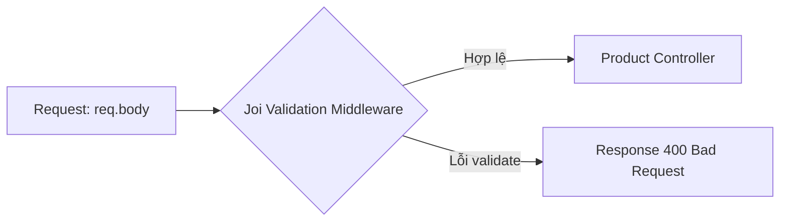

# Middleware validate dữ liệu đầu vào trong Express

> **Bài trước:** [Lesson 5: Xây dựng CRUD API sản phẩm](./lesson-5.md)  
> **Bài tiếp theo:** [Lesson 7: Authentication và Authorization](./lesson-7.md)

### Sơ đồ hoạt động




Chào các em! 👋 Hôm nay chúng ta sẽ cùng nhau tìm hiểu cách viết middleware để validate dữ liệu đầu vào trong Express. Đây là một kỹ năng rất quan trọng khi xây dựng API, giúp đảm bảo dữ liệu gửi lên từ client luôn hợp lệ và giảm thiểu lỗi trong ứng dụng.

## Mục tiêu

-   Hiểu cách viết middleware để validate dữ liệu đầu vào.
-   So sánh Joi với validate từ model và các thư viện khác.
-   Thực hành áp dụng middleware cho các thao tác `create` và `put`.

## 1. Joi là gì?

Joi là một thư viện JavaScript mạnh mẽ, giúp chúng ta kiểm tra dữ liệu đầu vào một cách dễ dàng và rõ ràng. Nó cho phép định nghĩa các quy tắc (schema) để kiểm tra dữ liệu và trả về lỗi nếu dữ liệu không hợp lệ.

### Tính năng nổi bật của Joi:

-   **Định nghĩa schema rõ ràng:** Dễ dàng định nghĩa các quy tắc kiểm tra dữ liệu.
-   **Hỗ trợ nhiều kiểu dữ liệu:** String, Number, Boolean, Array, Object, Date, v.v.
-   **Tùy chỉnh thông báo lỗi:** Có thể định nghĩa thông báo lỗi cụ thể cho từng quy tắc.
-   **Tích hợp tốt với Express:** Dễ dàng sử dụng trong middleware để kiểm tra dữ liệu từ request.
-   **Hỗ trợ validate nâng cao:** Bao gồm validate điều kiện, validate lồng nhau (nested objects), và validate mảng.

### Ví dụ cơ bản:
:::code-group
```javascript
import Joi from "joi"; // Import thư viện Joi để sử dụng cho việc validate

// Định nghĩa schema để validate dữ liệu
const schema = Joi.object({
    name: Joi.string().required().max(100), // Trường "name" phải là chuỗi, bắt buộc và tối đa 100 ký tự
    age: Joi.number().integer().min(0).max(120), // Trường "age" phải là số nguyên, từ 0 đến 120
});

// Dữ liệu cần kiểm tra
const data = { name: "Ken", age: 25 };

// Thực hiện validate dữ liệu dựa trên schema
const { error, value } = schema.validate(data);

// Kiểm tra kết quả validate
if (error) {
    console.log("Dữ liệu không hợp lệ:", error.details); // Nếu có lỗi, in chi tiết lỗi ra console
} else {
    console.log("Dữ liệu hợp lệ:", value); // Nếu dữ liệu hợp lệ, in dữ liệu đã được validate
}
```
:::

Các em thấy không, Joi giúp chúng ta kiểm tra dữ liệu rất dễ dàng và rõ ràng. Bây giờ, chúng ta sẽ áp dụng Joi vào thực tế nhé!

## 2. So sánh Joi với validate từ model và các thư viện khác

### Validate từ model (ví dụ: Mongoose)

Mongoose cũng hỗ trợ validate dữ liệu, nhưng nó chỉ hoạt động khi lưu dữ liệu vào MongoDB. Điều này có thể không đủ linh hoạt nếu chúng ta muốn kiểm tra dữ liệu trước khi xử lý logic.

| Tiêu chí                      | Joi                          | Mongoose Validate    | Express-Validator   |
| ----------------------------- | ---------------------------- | -------------------- | ------------------- |
| **Độc lập với database**      | ✅                           | ❌                   | ✅                  |
| **Định nghĩa schema rõ ràng** | ✅                           | ✅                   | ❌ (dựa trên chuỗi) |
| **Tùy chỉnh thông báo lỗi**   | ✅                           | Hạn chế              | ✅                  |
| **Hỗ trợ validate nâng cao**  | ✅ (nested, điều kiện, v.v.) | Hạn chế              | ✅                  |
| **Dễ tích hợp với Express**   | ✅                           | ❌ (chỉ trong model) | ✅                  |

## 3. Thực hành

### Yêu cầu

1. **Thiết lập cấu trúc thư mục**

    - Tạo thư mục `middleware` và `validation` trong `src`.
    - Tạo file `validateRequest.js` (middleware) và `product.validation.js` (schema Joi).

2. **Định nghĩa middleware validate dữ liệu**

    - Middleware `validateRequest` kiểm tra dữ liệu từ `req.body`, `req.params`, hoặc `req.query`.
    - Loại bỏ trường không hợp lệ (`stripUnknown`) và trả về lỗi chi tiết nếu không hợp lệ.

3. **Định nghĩa schema validate bằng Joi**

    - `createProductSchema`: Kiểm tra dữ liệu khi thêm sản phẩm mới.
    - `updateProductSchema`: Kế thừa từ `createProductSchema`, các trường không bắt buộc.

4. **Tích hợp middleware vào router**

    - Sử dụng `validateRequest` trong `products.js`:
        - `POST /api/products`: Dùng `createProductSchema`.
        - `PUT /api/products/:id`: Dùng `updateProductSchema`.

5. **Kiểm tra API**
    - Dùng Postman kiểm tra các endpoint với dữ liệu hợp lệ và không hợp lệ.

### Hướng dẫn

#### Thiết lập cấu trúc thư mục

```
src/
├── controllers/
│   └── product.controller.js   # Xử lý logic CRUD cho sản phẩm
├── middleware/
│   └── validateRequest.js     # Middleware validate dữ liệu đầu vào
├── routers/
│   └── product.router.js            # Định nghĩa các endpoint API cho sản phẩm
├── validation/
│   └── product.validation.js   # Định nghĩa schema validate bằng Joi
└── app.js                     # Tệp chính khởi chạy ứng dụng
```

#### Định nghĩa middleware `validateRequest`

Middleware này sẽ giúp chúng ta kiểm tra dữ liệu đầu vào dựa trên schema được định nghĩa bằng Joi.

**src/middleware/validateRequest.js**

:::code-group
```javascript [src/middleware/validateRequest.js]
import Joi from "joi";

export const validateRequest = (schema, target = "body") => {
    return (req, res, next) => {
        const { error, value } = schema.validate(req[target], {
            abortEarly: false,
            stripUnknown: true,
        });

        if (error) {
            return res.status(400).json({
                error: "Dữ liệu không hợp lệ",
                details: error.details.map((err) => err.message),
            });
        }

        req[target] = value;
        next();
    };
};
```
:::
#### Tách schema validate vào file riêng

Để code gọn gàng và dễ bảo trì, chúng ta sẽ tách `createProductSchema` và `updateProductSchema` vào một file riêng.

:::code-group
```javascript [validation/product.validation.js]
import Joi from "joi";

// Schema tạo sản phẩm mới
export const createProductSchema = Joi.object({
    name: Joi.string().required().max(200).messages({
        "string.base": "Tên sản phẩm phải là chuỗi",
        "string.empty": "Tên sản phẩm không được để trống",
        "string.max": "Tên sản phẩm không được vượt quá {#limit} ký tự",
        "any.required": "Tên sản phẩm là bắt buộc",
    }),
    description: Joi.string().required().messages({
        "string.base": "Mô tả sản phẩm phải là chuỗi",
        "string.empty": "Mô tả sản phẩm không được để trống",
        "any.required": "Mô tả sản phẩm là bắt buộc",
    }),
    price: Joi.number().required().min(0).messages({
        "number.base": "Giá sản phẩm phải là số",
        "number.min": "Giá sản phẩm không được âm",
        "any.required": "Giá sản phẩm là bắt buộc",
    }),
    priceDiscount: Joi.number().min(0).max(Joi.ref("price")).messages({
        "number.base": "Giá khuyến mãi phải là số",
        "number.min": "Giá khuyến mãi không được âm",
        "number.max": "Giá khuyến mãi phải nhỏ hơn hoặc bằng giá gốc",
    }),
    category: Joi.string().required().messages({
        "string.base": "ID danh mục phải là chuỗi",
        "string.empty": "ID danh mục không được để trống",
        "any.required": "Danh mục sản phẩm là bắt buộc",
    }),
    // ...các trường khác...
});

// Schema cập nhật sản phẩm
export const updateProductSchema = createProductSchema.fork(
    ["name", "description", "price"],
    (schema) => schema.optional()
);
```
:::

#### Sử dụng schema và controller trong router

Cập nhật router để sử dụng `createProductSchema` và `updateProductSchema`.

:::code-group
```javascript [routers/product.router.js]
import { Router } from "express";
import { validateRequest } from "../middleware/validateRequest";
import { createProductSchema, updateProductSchema } from "../validation/product.validation";
import { createProduct, updateProduct } from "../controllers/product.controller";

const router = Router();

// Route thêm sản phẩm mới
router.post("/", validateRequest(createProductSchema), createProduct);

// Route cập nhật sản phẩm
router.put("/:id", validateRequest(updateProductSchema), updateProduct);

export default router;
```
:::
## 4. Tổng hợp Code

Dưới đây là tổng hợp các file code đã sử dụng trong bài học này.

::: code-group

```javascript [/middleware/validateRequest.js]
import Joi from "joi";

export const validateRequest = (schema, target = "body") => {
    return (req, res, next) => {
        const { error, value } = schema.validate(req[target], {
            abortEarly: false,
            stripUnknown: true,
        });

        if (error) {
            return res.status(400).json({
                error: "Dữ liệu không hợp lệ",
                details: error.details.map((err) => err.message),
            });
        }

        req[target] = value;
        next();
    };
};
```

```javascript [/validation/product.validation.js]
import Joi from "joi";

// Schema tạo sản phẩm mới
export const createProductSchema = Joi.object({
    name: Joi.string().required().max(200).messages({
        "string.base": "Tên sản phẩm phải là chuỗi",
        "string.empty": "Tên sản phẩm không được để trống",
        "string.max": "Tên sản phẩm không được vượt quá {#limit} ký tự",
        "any.required": "Tên sản phẩm là bắt buộc",
    }),
    description: Joi.string().required().messages({
        "string.base": "Mô tả sản phẩm phải là chuỗi",
        "string.empty": "Mô tả sản phẩm không được để trống",
        "any.required": "Mô tả sản phẩm là bắt buộc",
    }),
    price: Joi.number().required().min(0).messages({
        "number.base": "Giá sản phẩm phải là số",
        "number.min": "Giá sản phẩm không được âm",
        "any.required": "Giá sản phẩm là bắt buộc",
    }),
    priceDiscount: Joi.number().min(0).max(Joi.ref("price")).messages({
        "number.base": "Giá khuyến mãi phải là số",
        "number.min": "Giá khuyến mãi không được âm",
        "number.max": "Giá khuyến mãi phải nhỏ hơn hoặc bằng giá gốc",
    }),
    category: Joi.string().required().messages({
        "string.base": "ID danh mục phải là chuỗi",
        "string.empty": "ID danh mục không được để trống",
        "any.required": "Danh mục sản phẩm là bắt buộc",
    }),
    // ...các trường khác...
});

// Schema cập nhật sản phẩm
export const updateProductSchema = createProductSchema.fork(
    ["name", "description", "price"],
    (schema) => schema.optional()
);
```

```javascript [/routers/product.router.js]
import { Router } from "express";
import { validateRequest } from "../middleware/validateRequest";
import { createProductSchema, updateProductSchema } from "../validation/product.validation";
import { createProduct, updateProduct } from "../controllers/product.controller";

const router = Router();

// Route thêm sản phẩm mới
router.post("/", validateRequest(createProductSchema), createProduct);

// Route cập nhật sản phẩm
router.put("/:id", validateRequest(updateProductSchema), updateProduct);

export default router;
```

:::

## 4. Giải thích về abortEarly và stripUnknown

### `abortEarly: false`
- Mặc định Joi sẽ dừng ngay khi gặp lỗi đầu tiên
- Với `abortEarly: false`, Joi sẽ kiểm tra tất cả các trường và trả về danh sách đầy đủ các lỗi
- Hữu ích khi muốn hiển thị tất cả lỗi validation cho user một lúc

**Ví dụ:**
```javascript
// abortEarly: true (mặc định)
// Input: { name: "", price: -1 }
// Output: ["Tên sản phẩm không được để trống"]

// abortEarly: false
// Input: { name: "", price: -1 }
// Output: ["Tên sản phẩm không được để trống", "Giá sản phẩm không được âm"]
```

### `stripUnknown: true`
- Loại bỏ các trường không được định nghĩa trong schema
- Bảo mật: Ngăn chặn mass assignment attacks
- Giữ database sạch sẽ: Chỉ lưu các trường được phép

**Ví dụ:**
```javascript
// Input: { name: "Product", price: 100, isAdmin: true, maliciousField: "hack" }
// Output (sau stripUnknown): { name: "Product", price: 100 }
// Các trường isAdmin và maliciousField bị loại bỏ
```

## 5. Bài tập thực hành

### Bài tập: Tạo Validation Schema cho User Model

Tạo validation schema cho model User với các trường:
- `name`: String, required, min 2 ký tự, max 50 ký tự
- `email`: Email hợp lệ, required
- `password`: String, required, min 6 ký tự, pattern phải có ít nhất 1 chữ hoa, 1 chữ thường, 1 số
- `phone`: String, pattern 10 chữ số
- `age`: Number, min 18, max 100

**File:** `src/validation/user.validation.js`

**Yêu cầu:**
- Tạo `signupSchema` và `updateUserSchema`
- `updateUserSchema` có tất cả trường optional
- Sử dụng custom messages tiếng Việt

## 6. Use Case thực tế: Input Validation Best Practices

Trong thực tế, validation rất quan trọng:
- **Security**: Ngăn chặn SQL injection, XSS attacks
- **Data Quality**: Đảm bảo dữ liệu đúng format trước khi lưu database
- **User Experience**: Trả về lỗi rõ ràng, giúp user sửa lỗi nhanh chóng

Ví dụ thực tế: Khi đăng ký tài khoản, nếu không validate email format, có thể lưu email sai vào database.

## 7. Kết luận

Các em thấy không, việc sử dụng Joi giúp chúng ta kiểm tra dữ liệu đầu vào một cách dễ dàng và hiệu quả. Hãy nhớ rằng, việc validate dữ liệu là rất quan trọng để đảm bảo ứng dụng của chúng ta hoạt động ổn định và an toàn.

**Bài tiếp theo:** [Lesson 7: Authentication và Authorization](./lesson-7.md) - Học về bảo mật và phân quyền

Nếu có thắc mắc, đừng ngại hỏi thầy hoặc các bạn nhé!  
Chúc các em học tốt! 🚀
— **Thầy Đạt 🧡**

