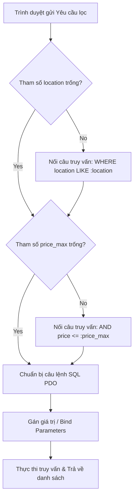

# Buổi 10: Module Tour - Danh sách & Bộ lọc bằng AI Agent

Xin chào các em! 🎉

Hôm nay thầy trò mình sẽ học cách ra lệnh cho AI Agent thiết lập trang hiển thị danh sách Tour du lịch trên giao diện người dùng, đồng thời tích hợp tính năng tìm kiếm và bộ lọc động để người dùng tra cứu tour dễ dàng.

## 🎯 Mục tiêu buổi học

> **Thầy mong muốn sau buổi học này, các em sẽ đạt được:**

1. ✅ Thiết kế luồng truyền tham số lọc (location, price_max) từ trình duyệt lên server.
2. ✅ Thiết lập Prompting điều khiển AI Agent lập trình logic bộ lọc động bằng PHP an toàn.
3. ✅ Thiết kế bộ kiểm thử tự động (Unit Test / Test Cases) để xác minh tính chính xác của bộ lọc.

---

## 📖 Lý thuyết cốt lõi

### 1. Luồng lọc dữ liệu động sử dụng phương thức GET
Để bộ lọc hoạt động mượt mà và cho phép người dùng có thể chia sẻ đường link kết quả (ví dụ gửi link tour đi Phú Quốc giá dưới 5 triệu cho bạn bè), thầy trò mình nên sử dụng phương thức **HTTP GET**:
* Trình duyệt gửi request chứa các tham số truy vấn trên URL: `index.php?location=PhuQuoc&price_max=5000000`.
* PHP Backend đọc các tham số này từ mảng siêu toàn cục `$_GET`, nối câu lệnh SQL tương ứng một cách linh động và thực thi trả dữ liệu về giao diện.

### 📊 Sơ đồ luồng lọc dữ liệu (Flowchart)


### 2. Prompt mẫu ra lệnh cho AI Agent lập trình bộ lọc Tour
Các em hãy chuẩn bị cấu trúc bảng `tours` của nhóm mình, sau đó gửi prompt này cho AI Agent:

```markdown [Prompt tạo bộ lọc Tour]
Tôi đang phát triển Website đặt tour du lịch bằng PHP. Tôi có bảng cơ sở dữ liệu `tours` gồm các cột: `id`, `name`, `location`, `price`, `image`, `active`.
Hãy đóng vai trò là lập trình viên PHP Fullstack, viết mã nguồn cho tính năng hiển thị danh sách Tour kèm theo bộ lọc:
1. Giao diện: Thiết kế form tìm kiếm gồm 1 ô nhập địa điểm (location) và 1 ô nhập/chọn mức giá tối đa (price_max) sử dụng phương thức GET. Thiết kế layout hiển thị danh sách dạng lưới (Grid) 3 cột hiển thị các thông tin: ảnh đại diện, tên tour, địa điểm, giá tiền dạng format VND.
2. Backend: Viết mã nguồn PHP để lấy các tham số lọc từ $_GET, tự động tạo câu truy vấn SQL WHERE động (sử dụng LIKE để tìm kiếm địa điểm gần đúng), gán tham số an toàn bằng PDO bindValue để chống SQL Injection, thực thi truy vấn và trả ra danh sách.
3. Nếu không tìm thấy kết quả phù hợp, hiển thị thông điệp thông báo rõ ràng cho người dùng.
Hãy viết tách biệt phần xử lý logic PHP và phần hiển thị giao diện HTML/CSS.
```

---

## 🧪 Yêu cầu bắt buộc về Kiểm thử (Testing Requirements)

> [!IMPORTANT]
> **Quy tắc viết Unit Test cho bộ lọc:**
> Để chắc chắn bộ lọc trả về đúng kết quả khi thay đổi tham số tìm kiếm, các em bắt buộc phải yêu cầu AI Agent viết các ca kiểm thử tự động (Unit Test / Integration Test) bao quát các trường hợp biên.

Hãy dùng prompt sau để AI Agent thiết lập file kiểm thử cho module lọc Tour:

```markdown [Prompt sinh Test Cases cho bộ lọc]
Hãy đóng vai trò là kỹ sư QA, viết bộ kiểm thử tích hợp bằng PHPUnit để test class xử lý tìm kiếm Tour ở trên:
1. Test case 1 (Mặc định): Kiểm tra xem khi không truyền bộ lọc, hệ thống có trả về toàn bộ danh sách tour không.
2. Test case 2 (Lọc địa điểm): Truyền location = "Hà Nội", kiểm tra xem mảng kết quả trả về chỉ chứa các tour đi Hà Nội không.
3. Test case 3 (Lọc giá): Truyền price_max = 2000000, kiểm tra xem tất cả các tour trả về có giá trị price nhỏ hơn hoặc bằng 2,000,000đ hay không.
4. Test case 4 (Không tìm thấy): Tìm kiếm với địa điểm không có thực, xác nhận xem kết quả trả về có phải là mảng rỗng không.
Hãy viết mã nguồn test và hướng dẫn chạy test.
```

---

## 🛠️ Bài tập thực hành (Lab)
### Yêu cầu: Triển khai bộ lọc Tour du lịch bằng AI Agent
1. Chạy prompt sinh code chức năng lọc và prompt sinh Unit Test tương ứng.
2. Khởi chạy PHPUnit trên terminal và chụp lại kết quả tất cả các test case đều chuyển màu xanh (Passed) để nộp cho thầy nhé!

---

## 🧪 Quiz/Checkpoint

Dưới đây là 5 câu hỏi trắc nghiệm kiểm tra nhanh kiến thức của các em trong buổi học này:

### Câu hỏi 1: Lớp Bootstrap nào dùng để tạo bố cục lưới responsive 3 cột trên máy tính?
A. `flex flex-col`
B. `row-cols-1 row-cols-md-3 g-4`
C. `d-block w-100`
D. `container-fluid`

<details>
<summary><b>👉 Xem Đáp án giải thích</b></summary>

**Đáp án đúng**: `B`
</details>

### Câu hỏi 2: Để tìm kiếm chuỗi tương đối trong SQL (ví dụ tìm tour đi Hà Nội khi gõ chữ "Hà"), ta dùng từ khóa nào?
A. `EQUAL`
B. `BETWEEN`
C. `LIKE`
D. `IN`

<details>
<summary><b>👉 Xem Đáp án giải thích</b></summary>

**Đáp án đúng**: `C`
</details>

### Câu hỏi 3: Tại sao nên sử dụng phương thức GET thay vì POST khi làm tính năng lọc/tìm kiếm sản phẩm?
A. Vì GET bảo mật tốt hơn
B. Để lưu lại được trạng thái tìm kiếm trên URL, giúp người dùng có thể bookmark hoặc share link kết quả tìm kiếm cho người khác
C. Vì GET truyền được dữ liệu kích thước lớn hơn
D. Vì GET chạy nhanh gấp 2 lần POST

<details>
<summary><b>👉 Xem Đáp án giải thích</b></summary>

**Đáp án đúng**: `B`
</details>

### Câu hỏi 4: Cách viết `LIKE %:location%` trực tiếp trong câu prepare là đúng hay sai?
A. Đúng hoàn toàn
B. Sai, vì dấu % phải được gán vào biến parameter lúc gọi hàm execute() để tránh lỗi cú pháp SQL
C. Chỉ đúng với SQLite
D. Chỉ đúng khi viết hoa chữ LIKE

<details>
<summary><b>👉 Xem Đáp án giải thích</b></summary>

**Đáp án đúng**: `B`
</details>

### Câu hỏi 5: Hàm fetchAll(PDO::FETCH_ASSOC) trả về dữ liệu dạng gì?
A. Đối tượng Class duy nhất
B. Mảng tuần tự chứa các mảng liên kết (mỗi dòng dữ liệu là một mảng key-value)
C. Chuỗi định dạng JSON
D. Tệp XML chứa database

<details>
<summary><b>👉 Xem Đáp án giải thích</b></summary>

**Đáp án đúng**: `B`
</details>
