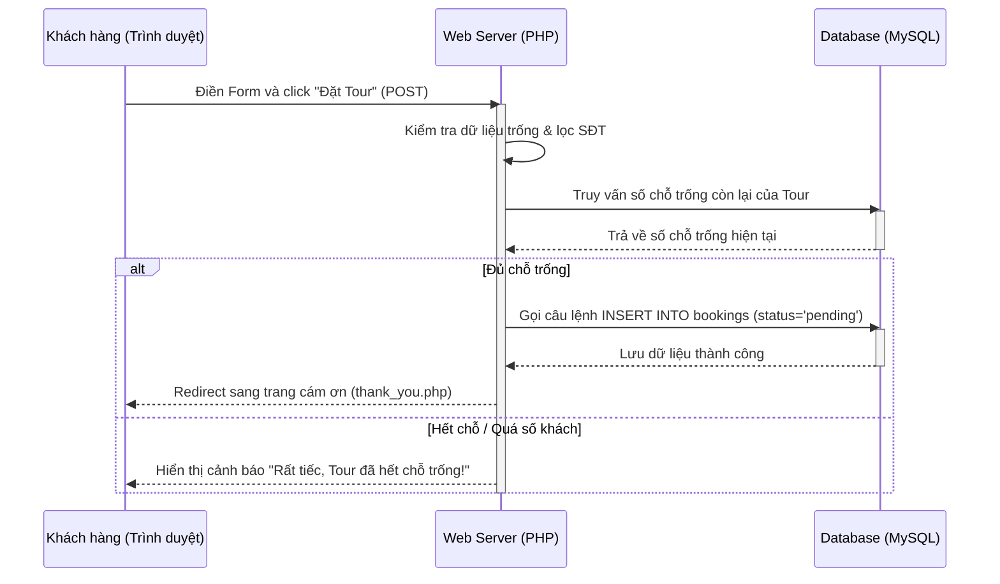

# Buổi 11: Module Đặt Tour - Form Đặt Tour & Lưu DB bằng AI Agent

Xin chào các em! 🎉

Hôm nay thầy trò mình sẽ tìm hiểu cách ra lệnh cho AI Agent xây dựng trang chi tiết lịch trình của một Tour du lịch và tạo Form đặt tour (Booking Form) để lưu thông tin đặt hàng của khách vào database an toàn.

## 🎯 Mục tiêu buổi học

> **Thầy mong muốn sau buổi học này, các em sẽ đạt được:**

1. ✅ Thiết kế luồng đi dữ liệu và quy trình kiểm tra ràng buộc của nghiệp vụ Đặt Tour.
2. ✅ Thiết lập Prompt yêu cầu AI Agent xây dựng form nhập liệu có validation đầy đủ.
3. ✅ Thiết lập bộ Unit Test kiểm tra tính hợp lệ dữ liệu và các ca kiểm thử bảo mật.

---

## 📖 Lý thuyết cốt lõi

### 1. Luồng dữ liệu Đặt Tour & Ràng buộc nghiệp vụ
Lập trình viên chuyên nghiệp không chỉ lưu dữ liệu thô vào DB mà phải xử lý các ràng buộc thực tế:
* **Validate định dạng**: Đảm bảo số điện thoại hợp lệ, số lượng khách đặt lớn hơn 0.
* **Chống tấn công XSS (Cross-Site Scripting)**: Lọc các thẻ mã độc HTML/JS do hacker cố tình nhập vào các trường Text (ví dụ họ nhập `<script>cướp cookie</script>`) trước khi in ra màn hình hiển thị bằng cách dùng hàm `htmlspecialchars()`.

### 📊 Sơ đồ trình tự Đặt Tour (Sequence Diagram)


### 2. Prompt mẫu ra lệnh cho AI Agent tạo Booking Form
Các em hãy sử dụng prompt này để AI Agent lập trình chức năng đặt tour:

```markdown [Prompt tạo Form Đặt Tour]
Hãy đóng vai trò là lập trình viên PHP chuyên nghiệp. Tôi có hai bảng dữ liệu:
- `tours` (id, name, price, max_guests)
- `bookings` (id, tour_id, customer_name, phone, num_guests, departure_date, status)

Hãy giúp tôi xây dựng trang `tour_detail.php?id=...` hiển thị chi tiết tour du lịch và chứa Form đặt tour (gửi POST dữ liệu):
1. Frontend: Tạo form đặt tour gồm các trường: Tên khách hàng, Số điện thoại, Số khách đi cùng, Ngày khởi hành. Sử dụng HTML5 validation để kiểm tra dữ liệu sơ bộ ở phía client.
2. Backend (PHP):
   - Đọc ID tour từ URL và truy xuất thông tin hiển thị lịch trình.
   - Khi submit form, validate dữ liệu đầu vào bằng PHP (tên và SĐT không trống, ngày khởi hành phải từ ngày hôm nay trở đi, số khách > 0).
   - Truy vấn kiểm tra xem số chỗ trống còn lại của tour (max_guests trừ đi tổng số khách đã đặt thành công của tour đó) có đủ đáp ứng số lượng khách đặt mới hay không.
   - Nếu đủ chỗ, gọi câu lệnh INSERT INTO bookings sử dụng PDO Prepared Statement an toàn. Nếu hết chỗ, báo lỗi.
Hãy cung cấp mã nguồn tách biệt, cấu trúc rõ ràng.
```

---

## 🧪 Yêu cầu bắt buộc về Kiểm thử (Testing Requirements)

> [!IMPORTANT]
> **Quy tắc bắt buộc khi đặt hàng:**
> Chức năng ghi nhận thông tin đặt tour rất dễ xảy ra lỗi nếu số lượng khách vượt quá giới hạn của xe/tour. Các em bắt buộc phải viết Unit Test để kiểm chứng nghiệp vụ quan trọng này.

Hãy sử dụng prompt sau để ra lệnh cho AI sinh file kiểm thử:

```markdown [Prompt sinh Unit Test cho Booking]
Hãy viết cho tôi bộ Unit Test bằng PHPUnit để kiểm tra logic xử lý lưu đơn hàng của file `booking_action.php`:
1. Test case 1 (Hợp lệ): Đặt tour thành công khi thông tin đầy đủ và số khách nhỏ hơn số chỗ trống còn lại.
2. Test case 2 (Lỗi thiếu thông tin): Xác nhận hệ thống chặn lại và báo lỗi khi để trống Tên khách hàng hoặc Số điện thoại.
3. Test case 3 (Lỗi hết chỗ): Giả lập tour chỉ còn 2 chỗ trống, nhưng khách đặt số lượng khách đi cùng là 3. Xác nhận hệ thống trả về thông báo lỗi "Tour đã hết chỗ".
4. Test case 4 (Lỗi ngày khởi hành): Khách chọn ngày đi ở quá khứ (ví dụ ngày hôm qua), xác nhận hệ thống báo lỗi không hợp lệ.
```

---

## 🛠️ Bài tập thực hành (Lab)
### Yêu cầu: Triển khai tính năng đặt tour du lịch
1. Sử dụng AI Agent triển khai trang chi tiết, tính năng đặt tour và bộ kiểm thử tự động tương ứng.
2. Thực thi lệnh PHPUnit và đảm bảo tất cả kịch bản kiểm tra logic đặt tour đều chạy thành công.

---

## 🧪 Quiz/Checkpoint

Dưới đây là 5 câu hỏi trắc nghiệm kiểm tra nhanh kiến thức của các em trong buổi học này:

### Câu hỏi 1: Để truyền tham số ID của Tour sang trang chi tiết qua URL (ví dụ tour_detail.php?id=5), ta lấy giá trị ID bằng cách nào trong PHP?
A. `$_POST['id']`
B. `$_GET['id']`
C. `$_REQUEST['id']`
D. `$_SESSION['id']`

<details>
<summary><b>👉 Xem Đáp án giải thích</b></summary>

**Đáp án đúng**: `B`
</details>

### Câu hỏi 2: Tại sao cần lọc dữ liệu đầu vào bằng hàm trim() trước khi validate?
A. Để loại bỏ các khoảng trắng thừa ở hai đầu chuỗi do người dùng vô tình gõ vào
B. Để mã hóa dữ liệu thành MD5
C. Để chuyển chuỗi thành số nguyên
D. Để xóa các thẻ HTML nguy hiểm

<details>
<summary><b>👉 Xem Đáp án giải thích</b></summary>

**Đáp án đúng**: `A`
</details>

### Câu hỏi 3: Biến superglobal nào trong PHP chứa dữ liệu gửi lên từ form có thuộc tính method="POST"?
A. `$_GET`
B. `$_SERVER`
C. `$_POST`
D. `$_FILES`

<details>
<summary><b>👉 Xem Đáp án giải thích</b></summary>

**Đáp án đúng**: `C`
</details>

### Câu hỏi 4: Khi muốn chuyển hướng người dùng sang trang khác sau khi xử lý dữ liệu xong, ta sử dụng hàm nào của PHP?
A. `echo "Redirect"`
B. `header("Location: page.php")`
C. `include("page.php")`
D. `require("page.php")`

<details>
<summary><b>👉 Xem Đáp án giải thích</b></summary>

**Đáp án đúng**: `B`
</details>

### Câu hỏi 5: Khẳng định nào sau đây là ĐÚNG về chức năng của hàm intval()?
A. Chuyển chuỗi thành chữ in hoa
B. Ép kiểu dữ liệu về dạng số nguyên (integer)
C. Tạo mã số ngẫu nhiên
D. Kiểm tra biến có rỗng không

<details>
<summary><b>👉 Xem Đáp án giải thích</b></summary>

**Đáp án đúng**: `B`
</details>
