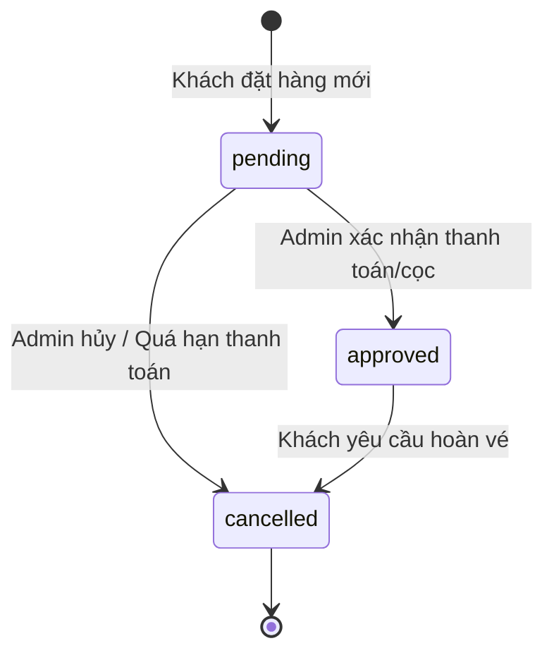

# Buổi 12: Module Admin - Quản lý Trạng thái Booking bằng AI Agent

Xin chào các em! 🎉

Hôm nay thầy trò mình sẽ thiết kế Dashboard dành cho Admin và ra lệnh cho AI Agent xây dựng tính năng cập nhật trạng thái đơn đặt tour (Duyệt/Hủy) theo quy trình nghiệp vụ chuyên nghiệp.

## 🎯 Mục tiêu buổi học

> **Thầy mong muốn sau buổi học này, các em sẽ đạt được:**

1. ✅ Hiểu vòng đời trạng thái (Booking State Lifecycle) của một đơn hàng du lịch.
2. ✅ Thiết lập Prompt yêu cầu AI Agent xây dựng giao diện bảng Dashboard quản lý Booking.
3. ✅ Thiết lập bộ kiểm thử tự động (Unit Test / Mock Test) để xác minh logic cập nhật trạng thái.

---

## 📖 Lý thuyết cốt lõi

### 1. Quản lý trạng thái Booking trong thực tế
Một đơn đặt tour thường đi qua các trạng thái tuần tự để doanh nghiệp kiểm soát dịch vụ và tài chính:
* `pending` (Chờ duyệt): Khách hàng vừa gửi đơn đặt trực tuyến.
* `approved` (Đã duyệt): Khách hàng đã thanh toán cọc thành công, chỗ của khách đã được khóa bảo lưu.
* `cancelled` (Hủy bỏ): Khách hủy tour hoặc quá thời hạn thanh toán giữ chỗ.

### 📊 Sơ đồ chuyển đổi trạng thái (State Diagram)


### 2. Prompt mẫu ra lệnh cho AI Agent tạo trang Dashboard Admin
Các em hãy gửi mô tả bảng `bookings` cho AI Agent và dùng lệnh prompt sau:

```markdown [Prompt tạo Dashboard Admin]
Tôi có bảng cơ sở dữ liệu `bookings` lưu trữ các thông tin đặt tour gồm các trường: `id`, `customer_name`, `phone`, `num_guests`, `departure_date`, `status` (mặc định là 'pending').
Hãy đóng vai trò là lập trình viên PHP chuyên nghiệp, xây dựng trang quản trị `admin/dashboard.php` cho tôi:
1. Giao diện: Hiển thị danh sách tất cả các booking dạng bảng (HTML Table). Thiết kế cột "Trạng thái" hiển thị màu sắc tương ứng (màu vàng cho pending, màu xanh lá cho approved, màu đỏ cho cancelled).
2. Xử lý logic: Thêm các nút "Phê duyệt" và "Hủy bỏ" bên cạnh mỗi dòng booking chờ xử lý. Khi Admin nhấn nút, gửi một yêu cầu HTTP POST lên server để cập nhật giá trị cột `status` trong MySQL của dòng đó tương ứng thành 'approved' hoặc 'cancelled'.
3. Sử dụng PDO để cập nhật dữ liệu an toàn, có điều kiện WHERE id = :id rõ ràng để chống lỗi gộp dữ liệu.
Hãy cung cấp mã nguồn sạch và giải thích cấu trúc.
```

---

## 🧪 Yêu cầu bắt buộc về Kiểm thử (Testing Requirements)

> [!IMPORTANT]
> **Quy tắc viết Unit Test cho cập nhật trạng thái:**
> Việc đổi trạng thái đơn hàng ảnh hưởng trực tiếp đến doanh thu và số chỗ trống. Các em bắt buộc phải có test case kiểm thử tự động để xác nhận quy trình đổi trạng thái chạy đúng.

Các em hãy sao chép và gửi prompt này để AI Agent lập trình file kiểm thử:

```markdown [Prompt sinh Unit Test cập nhật trạng thái]
Hãy đóng vai trò là kỹ sư QA, viết bộ Unit Test sử dụng PHPUnit để kiểm thử file xử lý cập nhật trạng thái `admin/update_booking.php`:
1. Test case 1: Cập nhật thành công từ trạng thái 'pending' sang 'approved'. Kiểm tra xem giá trị status trong DB có thực sự chuyển thành 'approved' không.
2. Test case 2: Cập nhật trạng thái không hợp lệ (ví dụ truyền status = 'hacking_status'). Xác nhận hệ thống chặn lại và không cập nhật vào DB.
3. Test case 3: Cập nhật một đơn hàng không tồn tại (sai ID). Xác nhận hệ thống báo lỗi không tìm thấy đơn hàng.
Hãy viết mã nguồn kiểm thử chi tiết.
```

---

## 🛠️ Bài tập thực hành (Lab)
### Yêu cầu: Lập trình trang quản trị đơn đặt tour bằng AI Agent
1. Ra lệnh cho AI Agent sinh mã nguồn Dashboard Admin và file Unit Test cập nhật trạng thái.
2. Chạy bộ kiểm thử tự động, đảm bảo toàn bộ các kịch bản test trạng thái đều Passed thành công.

---

## 🧪 Quiz/Checkpoint

Dưới đây là 5 câu hỏi trắc nghiệm kiểm tra nhanh kiến thức của các em trong buổi học này:

### Câu hỏi 1: Lệnh SQL nào dùng để chỉnh sửa giá trị dữ liệu hiện có trong bảng?
A. `INSERT INTO`
B. `SELECT`
C. `UPDATE`
D. `DELETE`

<details>
<summary><b>👉 Xem Đáp án giải thích</b></summary>

**Đáp án đúng**: `C`
</details>

### Câu hỏi 2: Hàm in_array() trong PHP dùng để làm gì?
A. Chuyển đổi một đối tượng thành mảng
B. Đếm số lượng phần tử của mảng
C. Kiểm tra xem một giá trị cụ thể có tồn tại trong một mảng hay không
D. Tìm phần tử lớn nhất trong mảng

<details>
<summary><b>👉 Xem Đáp án giải thích</b></summary>

**Đáp án đúng**: `C`
</details>

### Câu hỏi 3: Badge Bootstrap màu nào thích hợp nhất để hiển thị trạng thái "Đã hủy" (cancelled)?
A. `badge bg-success`
B. `badge bg-warning`
C. `badge bg-danger`
D. `badge bg-info`

<details>
<summary><b>👉 Xem Đáp án giải thích</b></summary>

**Đáp án đúng**: `C`
</details>

### Câu hỏi 4: Tại sao các nút thay đổi trạng thái nhạy cảm (như phê duyệt/xóa) bắt buộc phải sử dụng HTTP POST thay vì link GET?
A. Vì GET chạy chậm hơn
B. Để ngăn chặn các cuộc tấn công CSRF hoặc tình trạng trình duyệt tự động crawl click nhầm link làm thay đổi trạng thái cơ sở dữ liệu ngoài ý muốn
C. Vì link GET không truyền được ID số nguyên
D. Vì POST dễ viết mã code hơn

<details>
<summary><b>👉 Xem Đáp án giải thích</b></summary>

**Đáp án đúng**: `B`
</details>

### Câu hỏi 5: Câu lệnh SQL `UPDATE tours SET price = 1000000` thiếu mệnh đề WHERE sẽ dẫn đến hậu quả gì?
A. Hệ thống báo lỗi cú pháp
B. Tất cả các tour trong bảng đều bị cập nhật giá về 1,000,000đ
C. Không có tour nào bị thay đổi giá
D. Chỉ tour đầu tiên bị thay đổi giá

<details>
<summary><b>👉 Xem Đáp án giải thích</b></summary>

**Đáp án đúng**: `B`
</details>
