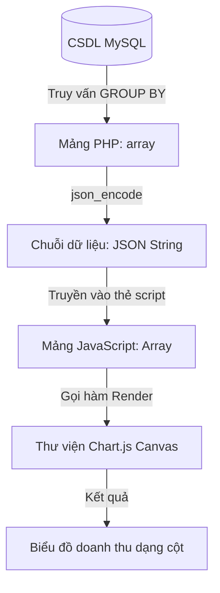

# Buổi 13: Module Admin - Thống kê Báo cáo bằng AI Agent

Xin chào các em! 🎉

Hôm nay thầy trò mình sẽ học cách thiết kế luồng phân tích dữ liệu doanh thu của công ty du lịch và yêu cầu AI Agent xây dựng hệ thống báo cáo kết hợp vẽ biểu đồ Chart.js tự động.

## 🎯 Mục tiêu buổi học

> **Thầy mong muốn sau buổi học này, các em sẽ đạt được:**

1. ✅ Thiết kế luồng truy vấn gom nhóm dữ liệu (GROUP BY) tính toán doanh thu.
2. ✅ Hiểu quy trình truyền cấu trúc dữ liệu từ Backend (PHP Array) sang Frontend (JS/JSON Array).
3. ✅ Thiết lập bộ Unit Test để kiểm thử tính chính xác của dữ liệu thống kê đầu ra.

---

## 📖 Lý thuyết cốt lõi

### 1. Phân tích luồng dữ liệu thống kê báo cáo
Thống kê doanh thu đòi hỏi kết hợp dữ liệu từ nhiều bảng và gộp dữ liệu theo thời gian:
* **Hàm gộp**: Sử dụng `SUM(num_guests * price)` để tính tổng tiền thu được và `COUNT(bookings.id)` để đếm số lượng giao dịch thành công.
* **Gom nhóm (GROUP BY)**: Gom dữ liệu theo tháng khởi hành `MONTH(departure_date)`.
* **Truyền dữ liệu PHP sang JS**: JavaScript chạy trên client không thể đọc trực tiếp mảng dữ liệu PHP trên server. Vì vậy, PHP cần chuyển đổi dữ liệu thành định dạng **JSON** (JavaScript Object Notation) thông qua hàm `json_encode()` để JavaScript có thể đọc và vẽ biểu đồ.

### 📊 Sơ đồ luồng truyền dữ liệu vẽ biểu đồ (Flowchart)


### 2. Prompt mẫu ra lệnh cho AI Agent xây dựng biểu đồ báo cáo
Các em hãy gửi cấu trúc bảng của nhóm mình kèm theo prompt sau:

```markdown [Prompt thiết lập Biểu đồ Báo cáo]
Hãy đóng vai trò là lập trình viên chuyên nghiệp. Tôi có hai bảng cơ sở dữ liệu MySQL:
- `tours` (id, name, price)
- `bookings` (id, tour_id, num_guests, departure_date, status)

Hãy giúp tôi xây dựng trang thống kê doanh thu `admin/revenue_stats.php`:
1. Backend (PHP): Viết câu lệnh truy vấn SQL sử dụng INNER JOIN liên kết hai bảng, tính tổng doanh thu (num_guests * price) và đếm tổng số lượng đơn đặt tour theo từng tháng khởi hành (chỉ tính các booking có status = 'approved'). Gom nhóm dữ liệu theo tháng (GROUP BY MONTH). Sử dụng json_encode để xuất mảng tháng và mảng doanh thu ra biến JavaScript.
2. Frontend: Nhúng thư viện Chart.js qua CDN. Sử dụng thẻ <canvas id="revenueChart"></canvas> để hiển thị biểu đồ cột (Bar Chart) mô tả doanh thu của các tháng lấy từ dữ liệu PHP đã truyền ra.
Hãy cung cấp mã nguồn sạch và hướng dẫn tích hợp chi tiết.
```

---

## 🧪 Yêu cầu bắt buộc về Kiểm thử (Testing Requirements)

> [!IMPORTANT]
> **Quy tắc kiểm thử báo cáo thống kê:**
> Biểu đồ báo cáo doanh thu sẽ bị hiển thị sai lệch nếu thuật toán tính tổng tiền hoặc gom nhóm SQL viết sai. Các em bắt buộc phải viết Unit Test kiểm thử lớp logic lấy dữ liệu thống kê.

Hãy sao chép prompt sau gửi cho AI Agent để tạo file Unit Test:

```markdown [Prompt sinh Unit Test cho doanh thu]
Hãy đóng vai trò là kỹ sư QA, viết bộ Unit Test sử dụng PHPUnit để kiểm tra logic tính toán dữ liệu doanh thu của file `admin/revenue_stats.php`:
1. Giả lập cơ sở dữ liệu (Mock Database) có 2 đơn hàng đã thanh toán (approved) trong Tháng 8, tổng doanh thu là 15,000,000đ.
2. Kiểm tra xem hàm lấy dữ liệu thống kê có trả ra đúng doanh thu của Tháng 8 là 15,000,000đ hay không.
3. Giả lập có 1 đơn hàng trạng thái 'cancelled' trong Tháng 8. Kiểm tra xem doanh thu của đơn này có bị loại bỏ khỏi thống kê đúng thiết kế hay không.
Hãy cung cấp mã nguồn test cụ thể.
```

---

## 🛠️ Bài tập thực hành (Lab)
### Yêu cầu: Triển khai biểu đồ doanh thu Admin bằng AI Agent
1. Chạy prompt sinh code chức năng thống kê và prompt sinh Unit Test tương ứng.
2. Chạy lệnh PHPUnit để xác nhận thuật toán tính tổng doanh thu của nhóm chạy hoàn toàn chính xác.

---

## 🧪 Quiz/Checkpoint

Dưới đây là 5 câu hỏi trắc nghiệm kiểm tra nhanh kiến thức của các em trong buổi học này:

### Câu hỏi 1: Mệnh đề nào trong SQL dùng để gom nhóm các dòng dữ liệu có cùng giá trị phục vụ các hàm tính toán thống kê?
A. `ORDER BY`
B. `GROUP BY`
C. `WHERE`
D. `HAVING`

<details>
<summary><b>👉 Xem Đáp án giải thích</b></summary>

**Đáp án đúng**: `B`
</details>

### Câu hỏi 2: Hàm SQL nào dùng để tính tổng giá trị của một cột số?
A. `COUNT()`
B. `SUM()`
C. `AVG()`
D. `MAX()`

<details>
<summary><b>👉 Xem Đáp án giải thích</b></summary>

**Đáp án đúng**: `B`
</details>

### Câu hỏi 3: Hàm nào trong PHP dùng để chuyển đổi một mảng dữ liệu thành chuỗi định dạng JSON chuẩn?
A. `json_decode()`
B. `json_encode()`
C. `serialize()`
D. `implode()`

<details>
<summary><b>👉 Xem Đáp án giải thích</b></summary>

**Đáp án đúng**: `B`
</details>

### Câu hỏi 4: Thư viện Chart.js hiển thị biểu đồ trên giao diện web sử dụng thẻ HTML5 nào?
A. `<div>`
B. `<svg>`
C. `<canvas>`
D. `<iframe>`

<details>
<summary><b>👉 Xem Đáp án giải thích</b></summary>

**Đáp án đúng**: `C`
</details>

### Câu hỏi 5: Câu lệnh SQL: `SELECT COUNT(*) FROM bookings` trả về kết quả gì?
A. Tổng số tiền của tất cả các booking
B. Danh sách tất cả các cột của bảng bookings
C. Tổng số lượng dòng (số lượt đơn đặt tour) trong bảng bookings
D. Không trả về kết quả nào

<details>
<summary><b>👉 Xem Đáp án giải thích</b></summary>

**Đáp án đúng**: `C`
</details>
