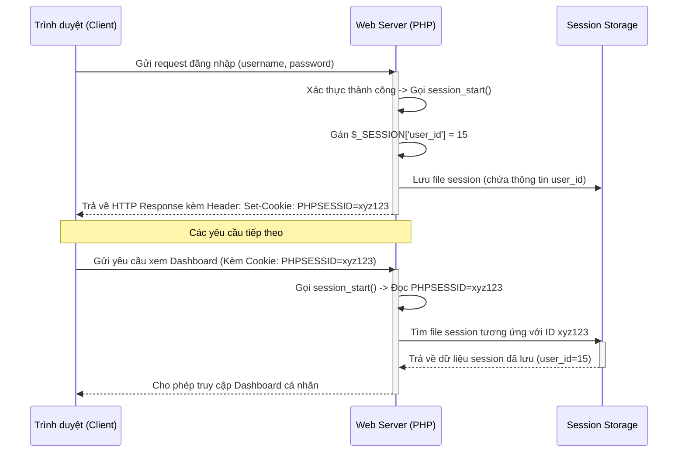

# Buổi 14: Tích hợp Hệ thống & Xử lý Xung đột bằng AI

Xin chào các em! 🎉

Hôm nay thầy trò mình bước sang giai đoạn tích hợp hệ thống. Các em sẽ tìm hiểu nguyên lý hoạt động của cơ chế Session trong PHP để đồng bộ trạng thái người dùng toàn trang, và sử dụng AI để giải quyết các lỗi xung đột tên biến/tên hàm khi ghép bài nhóm.

## 🎯 Mục tiêu buổi học

> **Thầy mong muốn sau buổi học này, các em sẽ đạt được:**

1. ✅ Hiểu sâu cơ chế hoạt động của PHP Session và Cookie để quản lý trạng thái đăng nhập.
2. ✅ Đồng bộ hóa tệp cấu hình trung tâm (App config) dùng chung cho cả nhóm.
3. ✅ Thiết lập bộ kịch bản E2E Test tự động toàn luồng (End-to-End) sau khi tích hợp.

---

## 📖 Lý thuyết cốt lõi

### 1. Cơ chế hoạt động của PHP Session & Cookie
Khi gộp các file code từ nhiều thành viên khác nhau, lỗi phổ biến nhất là không đồng bộ trạng thái đăng nhập. Để lưu trạng thái đăng nhập của người dùng qua nhiều trang web khác nhau:
* **Session ID**: PHP tự động tạo ra một chuỗi định danh ngẫu nhiên duy nhất cho phiên làm việc của người dùng.
* **Session Cookie (PHPSESSID)**: Trình duyệt lưu Session ID này trong cookie và tự động gửi kèm theo mỗi HTTP Request tiếp theo lên server.
* **Session File**: Server đọc Session ID từ cookie gửi lên, tìm file tương ứng để khôi phục mảng biến toàn cục `$_SESSION`.

### 📊 Sơ đồ trình tự hoạt động của Session (Sequence Diagram)


### 2. Sử dụng AI sửa lỗi xung đột (Integration Debugging)
Khi ghép bài, các em thường gặp các lỗi nghiêm trọng khiến server trả về mã lỗi 500 hoặc trang web trắng xóa (như lỗi gọi hàm `session_start()` hai lần, lỗi định nghĩa lại hằng số `Constant already defined`). 
Khi gặp lỗi, hãy bật chức năng hiển thị lỗi của PHP (`ini_set('display_errors', 1)`), copy thông điệp báo lỗi từ trình duyệt và gửi cho AI:

```markdown [Prompt sửa lỗi tích hợp hệ thống]
Tôi đang gộp code dự án PHP và gặp thông báo lỗi sau từ server:
"[Dán thông báo lỗi PHP lỗi 500 hoặc warning tại đây]"

Hãy đóng vai trò là chuyên gia Debugging hệ thống:
1. Giải thích nguyên nhân cốt lõi gây ra lỗi này khi gộp các file code lại với nhau.
2. Hướng dẫn tôi cách chỉnh sửa cấu trúc file hoặc mã nguồn để giải quyết triệt để lỗi này mà không phá vỡ logic cũ.
```

---

## 🧪 Yêu cầu bắt buộc về Kiểm thử (Testing Requirements)

> [!IMPORTANT]
> **Quy tắc bắt buộc sau khi tích hợp:**
> Khi ghép nối các module riêng lẻ thành một hệ thống thống nhất, các em bắt buộc phải chạy kịch bản E2E Test tự động toàn luồng để chắc chắn các chức năng không phá vỡ lẫn nhau.

Hãy sử dụng prompt sau để AI Agent viết kịch bản E2E kiểm tra toàn bộ luồng tích hợp:

```markdown [Prompt sinh E2E Test toàn luồng]
Hãy đóng vai trò là chuyên gia QA Automation, viết cho tôi một bộ kịch bản kiểm thử E2E bằng Playwright kiểm thử luồng đăng nhập và quản lý của Admin:
1. Trình duyệt truy cập trang đăng nhập Admin: `http://localhost/quan_ly_tour/admin/login.php`.
2. Điền thông tin tài khoản Admin và click "Đăng nhập".
3. Xác nhận URL chuyển hướng đến trang Dashboard quản trị thành công và tồn tại Session cookie PHPSESSID.
4. Kiểm tra xem trên trang Dashboard có hiển thị đúng bảng danh sách đơn đặt hàng không.
Hãy cung cấp mã nguồn test Playwright.
```

---

## 🛠️ Bài tập thực hành (Lab)
### Yêu cầu: Gộp bài nhóm và chạy E2E Test kiểm tra hệ thống
1. Thực hiện merge các nhánh thành viên lên nhánh chính `main` của GitHub.
2. Thiết lập tệp tin cấu hình chung và sửa toàn bộ lỗi tích hợp.
3. Thực thi kịch bản E2E Test bằng Playwright để xác thực luồng đăng nhập và quản lý của Admin hoạt động trơn tru.

---

## 🧪 Quiz/Checkpoint

Dưới đây là 5 câu hỏi trắc nghiệm kiểm tra nhanh kiến thức của các em trong buổi học này:

### Câu hỏi 1: Lệnh nào kiểm tra xem Session đã được khởi động hay chưa trong PHP?
A. `isset($_SESSION)`
B. `session_status() == PHP_SESSION_NONE`
C. `session_id() == ""`
D. Cả A và B đều đúng

<details>
<summary><b>👉 Xem Đáp án giải thích</b></summary>

**Đáp án đúng**: `B`
</details>

### Câu hỏi 2: Lỗi trùng định nghĩa hằng số (Constant already defined) xảy ra khi nào khi gộp code?
A. Do import tệp cấu hình chứa lệnh define() nhiều lần trên cùng một luồng chạy
B. Do khai báo hằng số bằng chữ thường
C. Do gán giá trị mới cho hằng số bằng toán tử =
D. Do dùng sai phiên bản PHP

<details>
<summary><b>👉 Xem Đáp án giải thích</b></summary>

**Đáp án đúng**: `A`
</details>

### Câu hỏi 3: Để nạp một tệp PHP và đảm bảo tệp đó chỉ được nạp đúng một lần duy nhất trong toàn bộ luồng chạy của ứng dụng, ta dùng từ khóa nào?
A. `include`
B. `require`
C. `require_once`
D. `import`

<details>
<summary><b>👉 Xem Đáp án giải thích</b></summary>

**Đáp án đúng**: `C`
</details>

### Câu hỏi 4: Thư mục lưu trữ file Session mặc định của PHP nằm ở đâu?
A. Trong cơ sở dữ liệu MySQL
B. Trên thiết bị di động của người dùng
C. Trên thư mục tạm (temp) của máy chủ web (Server-side)
D. Trong LocalStorage của trình duyệt

<details>
<summary><b>👉 Xem Đáp án giải thích</b></summary>

**Đáp án đúng**: `C`
</details>

### Câu hỏi 5: Hằng số BASE_URL tự định nghĩa giúp ích gì khi liên kết các trang trong dự án?
A. Tự động kiểm tra lỗi cú pháp CSS
B. Định vị chính xác đường dẫn tuyệt đối cho các file asset (CSS, JS, hình ảnh) không bị lỗi hiển thị khi chuyển đổi thư mục chạy
C. Tăng tốc độ load ảnh
D. Thay đổi cổng (port) chạy Apache

<details>
<summary><b>👉 Xem Đáp án giải thích</b></summary>

**Đáp án đúng**: `B`
</details>
