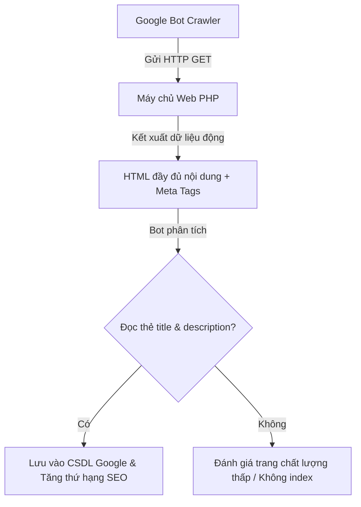

# Buổi 15: Hoàn thiện, Tối ưu SEO & Thuyết trình Dự án

Xin chào các em! 🎉

Hôm nay là buổi học cuối cùng của môn học Dự án 1. Thầy trò mình sẽ tiến hành tối ưu hóa các chi tiết kỹ thuật SEO, dọn dẹp các mã nguồn thử nghiệm (console log, debug) và chuẩn bị slide thuyết trình sản phẩm trước hội đồng phản biện.

## 🎯 Mục tiêu buổi học

> **Thầy mong muốn sau buổi học này, các em sẽ đạt được:**

1. ✅ Tối ưu cấu trúc thẻ Meta Tags chuẩn SEO động cho các trang chi tiết Tour.
2. ✅ Kiểm tra chất lượng và dọn dẹp mã nguồn thử nghiệm (Clean code checklist).
3. ✅ Hoàn thành slide báo cáo và tổng dượt quy trình thuyết trình thuyết phục.

---

## 📖 Lý thuyết cốt lõi

### 1. Cơ chế Bot tìm kiếm (Google Crawlers) và vai trò của SEO Tags
Để trang web du lịch của các em có thứ hạng cao trên trang kết quả tìm kiếm của Google (SERP):
* **Google Bot**: Là robot tự động gửi hàng triệu request GET để cào cấu trúc HTML của website.
* **HTML Parsing**: Robot phân tích thẻ `<title>` và thẻ `<meta name="description">` để hiển thị tiêu đề và tóm tắt hiển thị. Nếu nội dung này rỗng hoặc bị trùng lặp trên mọi trang, Google sẽ đánh giá chất lượng trang web của các em thấp. Do đó, các em cần thiết kế thẻ meta động thay đổi theo từng nội dung của Tour.

### 📊 Sơ đồ Bots thu thập dữ liệu (Flowchart)


### 2. Prompt mẫu ra lệnh cho AI Agent tối ưu cấu trúc SEO & Dọn dẹp mã nguồn
Các em hãy gửi file header và các file views chính cho AI Agent kèm prompt sau:

```markdown [Prompt tối ưu SEO & Dọn dẹp code]
Hãy đóng vai trò là chuyên gia SEO và lập trình viên PHP chuyên nghiệp.
Hãy giúp tôi tối ưu hóa mã nguồn HTML/PHP của file header dưới đây:
1. Thêm cấu trúc thẻ <title> và thẻ <meta name="description"> động. Cho phép nhận tiêu đề và mô tả truyền từ các trang con (ví dụ trang chi tiết Tour sẽ truyền tên Tour và lịch trình tour vào tiêu đề và mô tả). Nếu không có biến truyền sang, tự động hiển thị tiêu đề mặc định của trang web du lịch.
2. Rà soát toàn bộ tệp tin, dọn dẹp các dòng mã debug thừa như print_r(), var_dump(), console.log() của JavaScript.
[Dán mã nguồn file header.php hoặc file views tương ứng vào đây]
```

---

## 🧪 Yêu cầu bắt buộc về Kiểm thử (Testing Requirements)

> [!IMPORTANT]
> **Quy tắc bàn giao dự án:**
> Trước khi đóng gói sản phẩm để báo cáo hội đồng, các em bắt buộc phải chạy lại toàn bộ bộ kiểm thử tự động (gồm cả Unit Test và E2E Test) để đảm bảo độ bao phủ kiểm thử (Test Coverage) đạt yêu cầu, không xảy ra lỗi hồi quy (Regression Bugs).

Hãy sử dụng prompt sau để AI thiết kế báo cáo kiểm thử tự động cuối kỳ:

```markdown [Prompt sinh tổng hợp kiểm thử]
Tôi chuẩn bị nộp dự án môn học Dự án 1. 
Hãy viết cho tôi một file tóm tắt báo cáo kiểm thử (Test Report) chứa:
1. Danh sách các ca kiểm thử tự động (Unit Test, E2E) đã xây dựng kèm theo trạng thái (Passed).
2. Hướng dẫn chi tiết lệnh terminal để chạy toàn bộ các test cases cùng lúc để hội đồng phản biện có thể chạy kiểm chứng ngay lập tức.
```

---

## 🛠️ Bài tập thực hành (Lab)
### Yêu cầu: Chuẩn bị slide báo cáo và kiểm tra chất lượng website cuối kỳ
1. Các nhóm tiến hành tổng duyệt chạy thử ứng dụng để tránh lỗi không mong muốn.
2. Chạy lại toàn bộ hệ thống test tự động, chụp ảnh terminal chạy Passed 100% để nhúng vào slide báo cáo.
3. Thiết kế slide báo cáo gồm: Thành viên & Phân vai ➡️ Thiết kế DB ➡️ Demo tính năng chạy thực tế ➡️ Kết quả chạy Test tự động ➡️ Tổng kết kỹ năng học tập thu hoạch được.

---

## 🧪 Quiz/Checkpoint

Dưới đây là 5 câu hỏi trắc nghiệm kiểm tra nhanh kiến thức của các em trong buổi học này:

### Câu hỏi 1: Thẻ meta nào quy định kích thước hiển thị của trang web tương thích với màn hình thiết bị di động?
A. `<meta charset="UTF-8">`
B. `<meta name="viewport" content="width=device-width, initial-scale=1.0">`
C. `<meta name="description" content="...">`
D. `<meta http-equiv="refresh">`

<details>
<summary><b>👉 Xem Đáp án giải thích</b></summary>

**Đáp án đúng**: `B`
</details>

### Câu hỏi 2: Tại sao cần xóa bỏ các hàm debug như var_dump() hoặc console.log trước khi đưa sản phẩm chạy thực tế?
A. Để tránh lộ cấu trúc biến nội bộ hoặc thông tin dữ liệu nhạy cảm ra ngoài giao diện người dùng
B. Làm trang web tải chậm đi 10 lần
C. Trình duyệt Chrome sẽ chặn không cho hiển thị trang
D. Cả A và C đều đúng

<details>
<summary><b>👉 Xem Đáp án giải thích</b></summary>

**Đáp án đúng**: `A`
</details>

### Câu hỏi 3: Thẻ tiêu đề `<title>` của trang web chuẩn SEO nên dài tối đa khoảng bao nhiêu ký tự?
A. 10 - 20 ký tự
B. 50 - 60 ký tự (Để không bị cắt ngắn trên trang kết quả Google)
C. Không giới hạn ký tự
D. Trên 200 ký tự

<details>
<summary><b>👉 Xem Đáp án giải thích</b></summary>

**Đáp án đúng**: `B`
</details>

### Câu hỏi 4: Thẻ meta description đóng vai trò gì trong trang kết quả tìm kiếm (SERP)?
A. Định dạng font chữ của trang web
B. Chứa nội dung hiển thị phần tóm tắt ngắn mô tả trang web bên dưới thẻ tiêu đề của Google
C. Kết nối file JavaScript
D. Bảo vệ trang khỏi virus

<details>
<summary><b>👉 Xem Đáp án giải thích</b></summary>

**Đáp án đúng**: `B`
</details>

### Câu hỏi 5: Tiêu chí quan trọng nhất để thuyết trình dự án thành công là gì?
A. Nói càng nhanh càng tốt
B. Slide có 1000 dòng chữ
C. Trình bày ngắn gọn, mạch拉克, chạy thử được demo luồng nghiệp vụ không lỗi và trả lời tốt câu hỏi phản biện của hội đồng
D. Chỉ chiếu code nguồn lên màn hình

<details>
<summary><b>👉 Xem Đáp án giải thích</b></summary>

**Đáp án đúng**: `C`
</details>
