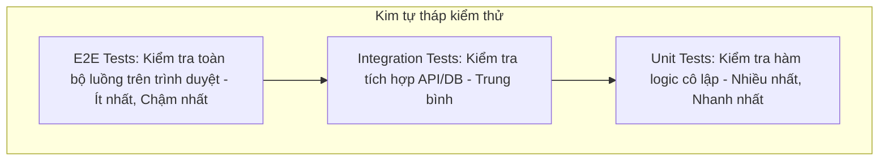
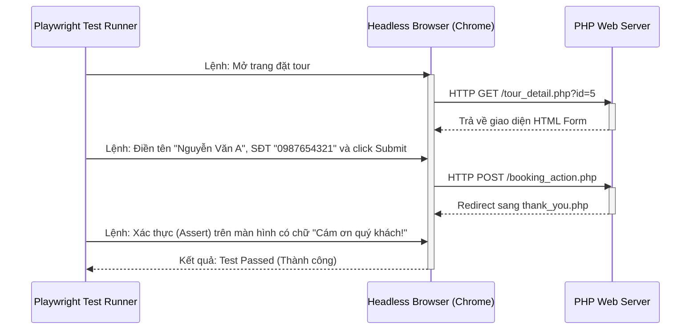

# Buổi 8: Đánh giá Giữa kỳ & Thiết lập Kiểm thử tự động (Unit Test, E2E) cùng AI

Xin chào các em! 🎉

Hôm nay thầy trò mình bước vào buổi Đánh giá Giữa kỳ (Review 1). Bên cạnh việc demo chạy thử sản phẩm, thầy trò mình sẽ học một phần cực kỳ quan trọng trong quy trình làm phần mềm chuyên nghiệp: **Kiểm thử tự động (Automated Testing)** bao gồm **Unit Test** và **E2E Test** với sự hỗ trợ đắc lực của AI Agents.

## 🎯 Mục tiêu buổi học

> **Thầy mong muốn sau buổi học này, các em sẽ đạt được:**

1. ✅ Phân biệt rõ bản chất của Unit Test (Kiểm thử đơn vị) và E2E Test (Kiểm thử đầu cuối).
2. ✅ Thiết lập Prompting điều khiển AI Agent viết bộ Unit Test bằng PHPUnit cho logic PHP.
3. ✅ Thiết lập Prompting điều khiển AI Agent viết kịch bản E2E Test tự động bằng Playwright giả lập trình duyệt đặt tour.

---

## 📖 Lý thuyết cốt lõi

### 1. Phân biệt các loại Kiểm thử (Testing Types)
Trong một dự án lớn, việc kiểm thử thủ công (click chuột bằng tay) rất dễ bỏ sót lỗi khi dự án phình to. Lập trình viên sử dụng các công cụ tự động để kiểm tra chất lượng code:
* **Unit Testing (Kiểm thử đơn vị)**: Kiểm tra các hàm logic nhỏ, cô lập (không kết nối Database hay giao diện). Ví dụ: Kiểm tra hàm validate định dạng số điện thoại Việt Nam, hoặc hàm tính tổng tiền đặt tour sau khi áp mã giảm giá. Công cụ dùng cho PHP: **PHPUnit**.
* **End-to-End Testing (E2E Test - Kiểm thử đầu cuối)**: Giả lập một trình duyệt thật tự động mở trang web, tự click chuột, tự điền form và xác nhận xem giao diện hiển thị đúng kết quả không. Công cụ phổ biến: **Playwright**, **Cypress**.

### 📊 Kim tự tháp kiểm thử & Luồng E2E Playwright (Mermaid Diagrams)




### 2. Prompt mẫu điều khiển AI Agent tạo Unit Test (PHPUnit)
Các em hãy chọn một file chứa hàm logic PHP của nhóm mình (ví dụ hàm tính giá tour) và gửi prompt sau cho AI Agent:

````markdown [Prompt tạo Unit Test]
Tôi đang sử dụng PHPUnit để viết Unit Test cho dự án PHP. Dưới đây là hàm tính giá tour du lịch của tôi:
```php
function calculateTourPrice($base_price, $num_guests, $discount_code = '') {
    $total = $base_price * $num_guests;
    if ($discount_code === 'GIAM10') {
        $total = $total * 0.9;
    }
    return $total;
}
```
Hãy đóng vai trò là chuyên gia Tester, viết file mã nguồn `tests/TourTest.php` sử dụng PHPUnit để test hàm trên với các kịch bản:
1. Đặt tour thông thường không áp mã giảm giá.
2. Đặt tour có áp mã giảm giá hợp lệ 'GIAM10'.
3. Đặt tour với số lượng khách âm hoặc bằng 0 (kỳ vọng trả về lỗi hoặc 0).
Hãy hướng dẫn tôi lệnh terminal để cài đặt PHPUnit qua Composer và chạy kiểm thử này.
````

### 3. Prompt mẫu điều khiển AI Agent tạo E2E Test (Playwright)
Để kiểm thử giao diện tự động bằng Node.js/Playwright, các em hãy gửi prompt này:

```markdown [Prompt tạo E2E Test Playwright]
Hãy đóng vai trò là chuyên gia QA Automation. Hãy viết một tệp kịch bản kiểm thử E2E bằng Playwright (JavaScript) để tự động hóa luồng đặt tour của website:
1. Trình duyệt tự động truy cập vào trang chi tiết tour: `http://localhost/quan_ly_tour/tour_detail.php?id=1`.
2. Kiểm tra xem form đặt tour có hiển thị trên màn hình không.
3. Tự động điền dữ liệu vào form: Tên = "Nguyễn Văn A", Số điện thoại = "0901234567", Số khách = "3", Ngày đi = "2026-08-15".
4. Tự động nhấn nút "Đặt Tour".
5. Đợi trang chuyển hướng và kiểm tra xem URL mới có chứa `thank_you.php` và hiển thị dòng chữ "Cám ơn quý khách đã đặt tour!" hay không.
Hãy cung cấp mã nguồn kiểm thử và câu lệnh để chạy test trên terminal.
```

---

## 🛠️ Bài tập thực hành (Lab)
### Yêu cầu: Thiết lập và chạy thử nghiệm Unit Test/E2E cùng nhóm
1. Yêu cầu AI Agent viết một bộ kiểm thử E2E bằng Playwright hoặc Unit Test bằng PHPUnit cho module của nhóm các em.
2. Chạy lệnh thực thi trên terminal để xem kết quả kiểm thử báo cáo màu xanh (Passed) hay màu đỏ (Failed).
3. Đưa tài liệu kết quả kiểm thử tự động này vào slide báo cáo giữa kỳ nhé!

---

## 🧪 Quiz/Checkpoint

Dưới đây là 5 câu hỏi trắc nghiệm kiểm tra nhanh kiến thức của các em trong buổi học này:

### Câu hỏi 1: Loại kiểm thử nào tập trung kiểm tra các hàm logic nhỏ một cách cô lập không kết nối CSDL?
A. Integration Testing
B. Unit Testing
C. End-to-End Testing
D. System Testing

<details>
<summary><b>👉 Xem Đáp án giải thích</b></summary>

**Đáp án đúng**: `B`
</details>

### Câu hỏi 2: Công cụ nào dùng để viết và chạy kiểm thử E2E tự động giả lập trên trình duyệt Chrome/Firefox phổ biến nhất hiện nay?
A. PHPUnit
B. Playwright
C. Composer
D. phpMyAdmin

<details>
<summary><b>👉 Xem Đáp án giải thích</b></summary>

**Đáp án đúng**: `B`
</details>

### Câu hỏi 3: Khái niệm "Happy Path" trong kiểm thử phần mềm nghĩa là gì?
A. Luồng chạy thử nghiệm khi xảy ra toàn bộ lỗi bảo mật
B. Luồng chạy kiểm thử trong điều kiện lý tưởng, người dùng nhập đúng toàn bộ dữ liệu và hệ thống xử lý thành công không lỗi
C. Chức năng thanh toán hóa đơn
D. Quy trình vẽ biểu đồ cột

<details>
<summary><b>👉 Xem Đáp án giải thích</b></summary>

**Đáp án đúng**: `B`
</details>

### Câu hỏi 4: Thư viện kiểm thử tự động PHPUnit chạy trên môi trường nào?
A. Trực tiếp trên trình duyệt client
B. Chạy qua dòng lệnh (Command Line Interface - CLI) trên máy chủ/local development
C. Chạy trên CSDL MySQL
D. Chạy trên hosting cPanel

<details>
<summary><b>👉 Xem Đáp án giải thích</b></summary>

**Đáp án đúng**: `B`
</details>

### Câu hỏi 5: Trong kiểm thử tự động, từ khóa "Assertion" (Khẳng định) dùng để làm gì?
A. Để kết nối cơ sở dữ liệu
B. Để định nghĩa kiểu dữ liệu của biến
C. So sánh kết quả thực tế nhận được với kết quả mong đợi để quyết định ca kiểm thử đó thành công hay thất bại
D. Để import thư viện CSS

<details>
<summary><b>👉 Xem Đáp án giải thích</b></summary>

**Đáp án đúng**: `C`
</details>
