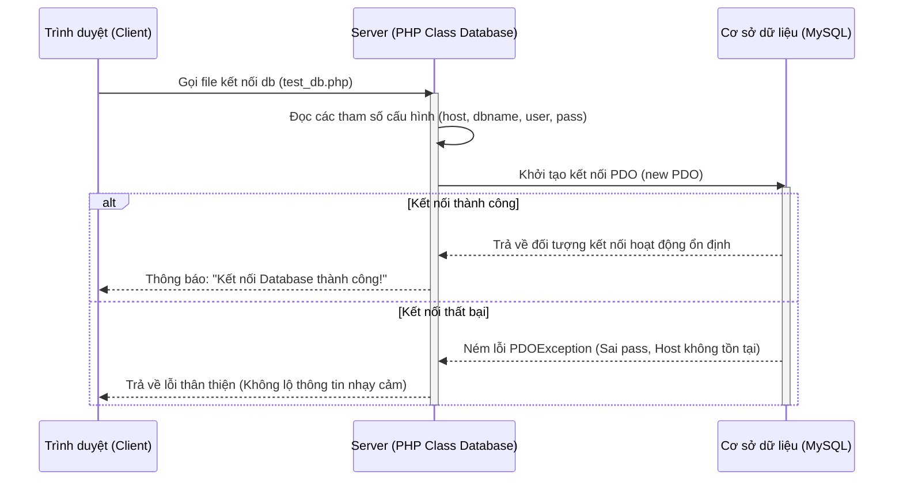

# Buổi 9: Thiết lập Khung Dự án & Cấu trúc Database bằng AI Agent

Xin chào các em! 🎉

Hôm nay thầy trò mình bước vào giai đoạn thực thi lập trình cho dự án **Website Đặt lịch Tour**. Ở môn học này, các em sẽ đóng vai trò là kỹ sư hệ thống điều phối - sử dụng sức mạnh của các trợ lý **AI Agents (như Cursor, Claude, ChatGPT)** để khởi tạo dự án nhanh chóng và chuẩn xác, thay vì phải gõ lại từng dòng code kết nối thủ công.

## 🎯 Mục tiêu buổi học

> **Thầy mong muốn sau buổi học này, các em sẽ đạt được:**

1. ✅ Thiết lập cấu trúc thư mục dự án PHP hướng đối tượng sạch sẽ.
2. ✅ Thiết kế câu lệnh Prompt chuẩn để AI Agent tự viết lớp kết nối Database bằng PDO an toàn.
3. ✅ Thiết lập kịch bản và chạy bộ kiểm thử tự động (Unit Test) cho kết nối Database.

---

## 📖 Lý thuyết cốt lõi

### 1. Vai trò của Kỹ sư điều phối khi dùng AI Agent
Khi lập trình với AI Agent, nhiệm vụ của các em không phải là copy-paste mù quáng mà là:
* **Định hướng kiến trúc**: Yêu cầu AI tổ chức cấu trúc thư mục hợp lý (ví dụ: chia tách rõ thư mục cấu hình `config/`, logic nghiệp vụ `controllers/`, giao diện `views/`).
* **Ràng buộc an toàn dữ liệu**: Yêu cầu AI sử dụng thư viện kết nối PDO (PHP Data Objects) thay vì `mysqli` để chống lỗ hổng bảo mật **SQL Injection** thông qua cơ chế Prepared Statements (biên dịch câu lệnh trước).

### 📊 Bản đồ trình tự hoạt động của Class kết nối (Sequence Diagram)


### 2. Prompt mẫu ra lệnh cho AI Agent tạo cấu trúc Database & Lớp kết nối
Các em hãy mở trợ lý AI (Cursor hoặc Claude) và gửi prompt sau để bắt đầu khởi tạo dự án:

```markdown [Prompt khởi tạo Class Database]
Bạn hãy đóng vai trò là một chuyên gia lập trình PHP Backend hướng đối tượng. 
Hãy giúp tôi khởi tạo cấu trúc thư mục dự án PHP cơ bản và viết file cấu hình Database sử dụng PDO:
1. Tạo cấu trúc thư mục gồm: `config/`, `controllers/`, `views/`.
2. Viết file `config/Database.php` chứa lớp `Database` để kết nối MySQL bằng PDO (sử dụng Host, DB Name, Username, Password dưới dạng thuộc tính).
3. Đảm bảo lớp kết nối sử dụng Prepared Statements để ngăn chặn SQL Injection, thiết lập chế độ báo lỗi PDO::ERRMODE_EXCEPTION và đặt charset=utf8 để hiển thị đúng tiếng Việt có dấu.
4. Viết thêm 1 file `test_db.php` ngắn gọn ở thư mục gốc để tôi gọi thử lớp Database này xem kết nối thành công hay thất bại.
Hãy trả về cấu trúc thư mục và mã nguồn chi tiết cho từng file.
```

---

## 🧪 Yêu cầu bắt buộc về Kiểm thử (Testing Requirements)

> [!IMPORTANT]
> **Quy tắc vàng của môn học:**
> Bất kỳ module nào được AI Agent sinh ra đều bắt buộc phải đi kèm bộ **Unit Test** tự động tương ứng để chứng minh code hoạt động ổn định trước khi tích hợp vào nhánh chính. Không nghiệm thu các module thiếu file test!

Các em hãy gửi tiếp prompt sau cho AI Agent để sinh bộ Unit Test tự động cho lớp Database:

```markdown [Prompt sinh Unit Test kết nối DB]
Hãy viết cho tôi một bộ Unit Test sử dụng PHPUnit để kiểm thử file `config/Database.php` vừa viết:
1. Viết test case xác thực rằng hàm getConnection() trả về một đối tượng PDO hợp lệ khi cấu hình đúng.
2. Viết test case giả lập cấu hình sai (sai password hoặc sai database name) và kiểm tra xem hệ thống có ném ra ngoại lệ PDOException đúng như thiết kế hay không.
3. Hướng dẫn tôi lệnh chạy bộ test này trên terminal.
```

---

## 🛠️ Bài tập thực hành (Lab)
### Yêu cầu: Khởi tạo cấu trúc dự án và chạy kiểm tra kết nối DB
1. Các em hãy chạy prompt khởi tạo và prompt sinh Unit Test để hoàn thiện mã nguồn.
2. Thực thi lệnh chạy PHPUnit trên terminal để đảm bảo bộ test kết nối DB của nhóm báo màu xanh (Passed) nhé!

---

## 🧪 Quiz/Checkpoint

Dưới đây là 5 câu hỏi trắc nghiệm kiểm tra nhanh kiến thức của các em trong buổi học này:

### Câu hỏi 1: Lỗ hổng SQL Injection xảy ra do nguyên nhân chính nào?
A. Do kết nối mạng không ổn định
B. Do ghép chuỗi trực tiếp dữ liệu từ người dùng nhập vào câu truy vấn SQL mà không qua filter
C. Do viết sai tên bảng trong MySQL
D. Do dùng mật khẩu database quá yếu

<details>
<summary><b>👉 Xem Đáp án giải thích</b></summary>

**Đáp án đúng**: `B`
</details>

### Câu hỏi 2: Thư viện PDO hỗ trợ cơ chế nào để ngăn chặn SQL Injection?
A. Mã hóa dữ liệu truyền đi
B. Tự động đổi tên bảng
C. Prepared Statements (Câu lệnh chuẩn bị trước)
D. Hạn chế số lần kết nối

<details>
<summary><b>👉 Xem Đáp án giải thích</b></summary>

**Đáp án đúng**: `C`
</details>

### Câu hỏi 3: Trong PDO, hàm nào dùng để thiết lập chế độ báo lỗi ngoại lệ khi truy vấn gặp lỗi?
A. `PDO::ERRMODE_EXCEPTION`
B. `PDO::ERRMODE_SILENT`
C. `PDO::ERRMODE_WARNING`
D. `PDO::ERROR_HANDLER`

<details>
<summary><b>👉 Xem Đáp án giải thích</b></summary>

**Đáp án đúng**: `A`
</details>

### Câu hỏi 4: Thuộc tính charset=utf8 trong chuỗi kết nối PDO giúp gì?
A. Tăng tốc độ load trang
B. Mã hóa mật khẩu lưu vào DB
C. Đảm bảo dữ liệu tiếng Việt có dấu được lưu và truy xuất không bị lỗi font chữ
D. Tự động kiểm tra cú pháp PHP

<details>
<summary><b>👉 Xem Đáp án giải thích</b></summary>

**Đáp án đúng**: `C`
</details>

### Câu hỏi 5: Lớp Database mẫu sử dụng phương thức nào để thiết lập kết nối PDO?
A. `mysqli_connect()`
B. `new PDO(...)`
C. `mysql_select_db()`
D. `pdo_connect()`

<details>
<summary><b>👉 Xem Đáp án giải thích</b></summary>

**Đáp án đúng**: `B`
</details>
