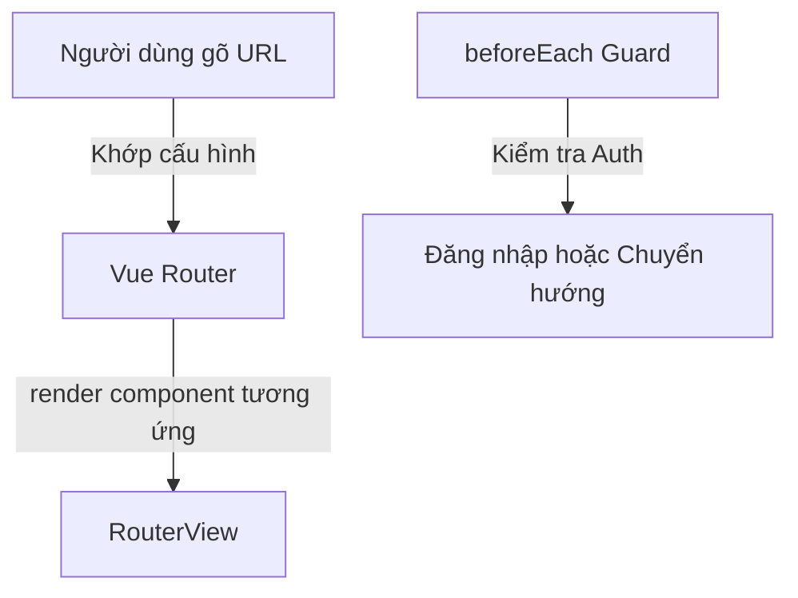

# Buổi 10: Routing với Vue Router

## 🎯 Mục tiêu học tập
- Cài đặt và cấu hình thư viện định tuyến `vue-router` cho ứng dụng Vue 3.
- Khai báo các Routes tĩnh và Routes động với tham số đường dẫn (Route Parameters) kết nối các trang.
- Sử dụng các component điều hướng: `<router-link>` (chuyển trang) và `<router-view>` (nơi hiển thị nội dung trang).
- Điều hướng trang bằng lập trình (Programmatic Navigation) sử dụng `useRouter` và `useRoute`.

---

## 📖 Lý thuyết cốt lõi

### 📊 Sơ đồ minh họa khái niệm:



---

### 1. Cấu hình cơ bản Vue Router
Thư viện `vue-router` quản lý ánh xạ từ các URL trên trình duyệt sang các Component của Vue.

```javascript
// src/router/index.js
import { createRouter, createWebHistory } from 'vue-router'
import HomeView from '../views/HomeView.vue'
import ProductDetailView from '../views/ProductDetailView.vue'

const routes = [
  { path: '/', name: 'home', component: HomeView },
  { path: '/product/:id', name: 'product-detail', component: ProductDetailView }
]

const router = createRouter({
  history: createWebHistory(),
  routes
})

export default router
```

### 2. Router Elements in Template
- `<router-link>`: Thay thế cho thẻ `<a>` truyền thống, giúp chuyển trang không tải lại.
- `<router-view>`: Vùng hiển thị động. Khi URL khớp với route nào, component của route đó sẽ render tại vị trí này.

```vue
<template>
  <nav>
    <router-link to="/">Trang chủ</router-link> |
    <router-link to="/product/1">Sản phẩm 1</router-link>
  </nav>
  <main>
    <router-view />
  </main>
</template>
```

---

## 💻 Ví dụ thực tiễn
```vue
<script setup>
import { useRoute, useRouter } from 'vue-router'
import { ref, onMounted } from 'vue'

const route = useRoute()
const router = useRouter()
const productId = ref(null)

onMounted(() => {
  productId.value = route.params.id // Lấy ID từ URL
})

function goBackHome() {
  router.push('/') // Chuyển trang về trang chủ bằng code
}
</script>

<template>
  <div>
    <h2>Chi tiết sản phẩm ID: {{ productId }}</h2>
    <button @click="goBackHome">Quay về trang chủ</button>
  </div>
</template>
```

---

## 🛠️ Bài tập thực hành (Lab)
### Yêu cầu: Cấu hình định tuyến và kết nối các trang trong Vanguard Store
1. Cài đặt `vue-router` vào dự án: `npm install vue-router`.
2. Tạo các component view trong thư mục `src/views/`:
   - `HomeView.vue`: Chứa nội dung trang chủ (tách từ [index.html](https://letrongdat.vercel.app/vuejs/templates/index.html)).
   - `ProductDetailView.vue`: Chứa nội dung trang chi tiết sản phẩm (tách từ [product-detail.html](https://letrongdat.vercel.app/vuejs/templates/product-detail.html)).
   - `CartView.vue`: Chứa nội dung trang giỏ hàng (tách từ [cart.html](https://letrongdat.vercel.app/vuejs/templates/cart.html)).
3. Định nghĩa các routes trong `src/router/index.js` liên kết 3 trang trên, trong đó trang chi tiết sử dụng route động `:id`.
4. Trong component `Navbar.vue`, thay thế các đường dẫn menu tĩnh (như `href="index.html"`, `href="cart.html"`) thành các thẻ `<router-link to="/">` và `<router-link to="/cart">`.
5. Tại `ProductCard.vue`, thay thế link chi tiết sản phẩm bằng `<router-link :to="'/product/' + product.id">`.
6. Tại trang chi tiết `ProductDetailView.vue`, dùng `useRoute()` lấy ID sản phẩm từ URL và hiển thị ra màn hình thông tin ID tương ứng.

<details class="details custom-block">
  <summary>🔑 Xem gợi ý giải pháp (Code mẫu)</summary>

```javascript
// src/router/index.js
import { createRouter, createWebHistory } from 'vue-router'
import HomeView from '../views/HomeView.vue'
import CartView from '../views/CartView.vue'
import LoginView from '../views/LoginView.vue'

const routes = [
  { path: '/', component: HomeView },
  { path: '/login', component: LoginView },
  { 
    path: '/cart', 
    component: CartView,
    meta: { requiresAuth: true }
  }
]

const router = createRouter({
  history: createWebHistory(),
  routes
})

router.beforeEach((to, from, next) => {
  const isLoggedIn = localStorage.getItem('isLoggedIn') === 'true'
  if (to.meta.requiresAuth && !isLoggedIn) {
    next('/login')
  } else {
    next()
  }
})

export default router
```

</details>

---

## ❓ Trắc nghiệm nhanh
**1. Thẻ nào được sử dụng để hiển thị component tương ứng với route hiện tại trên giao diện?**
- A. `<router-link>`
- B. `<router-view>`
- C. `<router-content>`
- D. `<router-page>`
<details class="details custom-block">
  <summary>Xem giải đáp</summary>

  *Đáp án đúng: **B**.*
</details>

**2. Để khai báo một route động nhận tham số ID sản phẩm, định dạng `path` sẽ như thế nào?**
- A. `path: '/product?id'`
- B. `path: '/product/id'`
- C. `path: '/product/:id'`
- D. `path: '/product/{id}'`
<details class="details custom-block">
  <summary>Xem giải đáp</summary>

  *Đáp án đúng: **C**.*
</details>

**3. Hook nào được sử dụng để lấy thông tin chi tiết của đường dẫn hiện tại (như params, query)?**
- A. `useRouter()`
- B. `useRoute()`
- C. `useParams()`
- D. `useQuery()`
<details class="details custom-block">
  <summary>Xem giải đáp</summary>

  *Đáp án đúng: **B**.*
</details>

---
