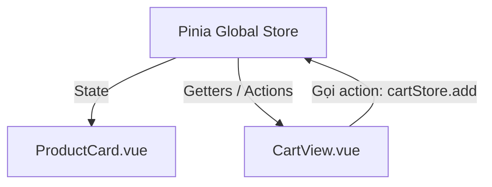

# Buổi 12: Quản lý State với Pinia

## 🎯 Mục tiêu học tập
- Giải thích được tại sao và khi nào cần sử dụng thư viện quản lý trạng thái toàn cục (State Management).
- Trình bày được kiến trúc của Pinia gồm: Store, State, Getters và Actions.
- Khởi tạo và cấu hình thành công Pinia trong ứng dụng Vue 3.
- Xây dựng Store quản lý giỏ hàng E-Commerce toàn cục và liên kết với các component tương tác.

---

## 📖 Lý thuyết cốt lõi

### 📊 Sơ đồ minh họa khái niệm:



---

### 1. Tại sao cần State Management?
- Trong các ứng dụng lớn, dữ liệu cần được chia sẻ giữa các component không có mối quan hệ cha-con trực tiếp (ví dụ: số lượng giỏ hàng hiển thị trên Navbar nhưng nút "Thêm vào giỏ" nằm ở Product Card hay Trang chi tiết).
- **Pinia** cung cấp một kho lưu trữ tập trung (Store) chứa các trạng thái toàn cục mà bất cứ component nào cũng có thể đọc và ghi trực tiếp.

### 2. Cấu trúc Store của Pinia (Cú pháp Setup Store)
- **State**: Tương đương với dữ liệu khai báo qua `ref()` (Nơi lưu trữ data).
- **Getters**: Tương đương với `computed()` (Tính toán dữ liệu dựa trên State).
- **Actions**: Tương đương với `function()` (Hàm thay đổi State hoặc gọi API).

```javascript
// src/stores/counter.js
import { defineStore } from 'pinia'
import { ref, computed } from 'vue'

export const useCounterStore = defineStore('counter', () => {
  const count = ref(0)
  const doubleCount = computed(() => count.value * 2)
  function increment() {
    count.value++
  }
  return { count, doubleCount, increment }
})
```

---

## 💻 Ví dụ thực tiễn
```vue
<script setup>
import { useCounterStore } from '../stores/counter'
const counter = useCounterStore()
</script>

<template>
  <div>
    <p>Số đếm: {{ counter.count }}</p>
    <button @click="counter.increment">Tăng</button>
  </div>
</template>
```

---

## 🛠️ Bài tập thực hành (Lab)
### Yêu cầu: Xây dựng Giỏ hàng toàn cục (Global Shopping Cart) bằng Pinia
1. Cấu hình Pinia vào dự án thực hành.
2. Tạo file `src/stores/cart.js` để định nghĩa `useCartStore`:
   - **State**: mảng `cartItems` (mỗi phần tử gồm `id`, `name`, `price`, `image`, `quantity`).
   - **Getters**: 
     - `totalPrice` (tổng tiền giỏ hàng: cộng dồn `price * quantity` của từng item).
     - `totalCount` (tổng số lượng sản phẩm trong giỏ hàng).
   - **Actions**: 
     - `addToCart(product)`: thêm mới sản phẩm vào giỏ hoặc tự động tăng số lượng lên 1 nếu sản phẩm đã tồn tại.
     - `removeFromCart(productId)`: xóa hẳn sản phẩm ra khỏi mảng `cartItems`.
     - `updateQuantity(productId, type)`: tăng hoặc giảm số lượng của sản phẩm (nếu loại là 'decrease' thì giảm và chặn không cho nhỏ hơn 1).
3. Tại component `ProductCard.vue`, liên kết nút "Thêm vào giỏ" (dòng **145-147** trong [index.html](https://letrongdat.vercel.app/vuejs/templates/index.html)) để gọi action `addToCart`.
4. Tại component `Navbar.vue`, hiển thị số lượng giỏ hàng động trên icon giỏ hàng (dòng **58-60** của [index.html](https://letrongdat.vercel.app/vuejs/templates/index.html)) liên kết trực tiếp với getter `totalCount`.
5. Kết nối các hành động tăng/giảm/xóa ở trang Giỏ hàng `CartView.vue` với các actions của `useCartStore`.

<details class="details custom-block">
  <summary>🔑 Xem gợi ý giải pháp (Code mẫu)</summary>

```javascript
// src/stores/cart.js
import { defineStore } from 'pinia'

export const useCartStore = defineStore('cart', {
  state: () => ({
    items: []
  }),
  getters: {
    totalItems: (state) => state.items.reduce((sum, i) => sum + i.quantity, 0),
    totalPrice: (state) => state.items.reduce((sum, i) => sum + (i.price * i.quantity), 0)
  },
  actions: {
    addToCart(product) {
      const existing = this.items.find(i => i.id === product.id)
      if (existing) {
        existing.quantity++
      } else {
        this.items.push({ ...product, quantity: 1 })
      }
    }
  }
})
```

</details>

---

## ❓ Trắc nghiệm nhanh
**1. Thư viện quản lý state toàn cục chính thức được khuyên dùng cho Vue 3 là gì?**
- A. Vuex
- B. Redux
- C. Pinia
- D. MobX
<details class="details custom-block">
  <summary>Xem giải đáp</summary>

  *Đáp án đúng: **C**.*
</details>

**2. Thành phần nào trong Pinia đóng vai trò tương tự như computed properties trong component?**
- A. State
- B. Getters
- C. Actions
- D. Mutations
<details class="details custom-block">
  <summary>Xem giải đáp</summary>

  *Đáp án đúng: **B**.*
</details>

**3. Để lấy dữ liệu state từ store mà vẫn giữ được tính phản ứng (Reactivity) khi destructure?**
- A. Dùng destructure bình thường: `const { cartItems } = store`.
- B. Sử dụng hàm trợ giúp `storeToRefs(store)`.
- C. Dùng `computed(store)`.
- D. Không thể destructure.
<details class="details custom-block">
  <summary>Xem giải đáp</summary>

  *Đáp án đúng: **B**.*
</details>

---
