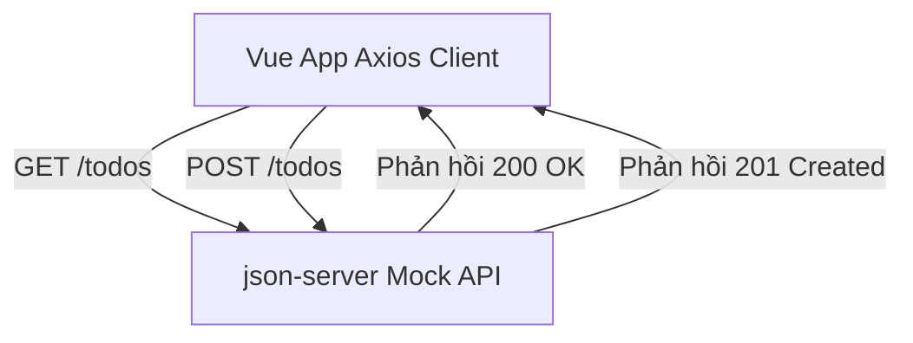

# Buổi 13: Axios & JSON-Server (CRUD)

## 🎯 Mục tiêu học tập
- Cấu hình và chạy thành công JSON-Server để giả lập REST API cho dự án E-Commerce.
- Sử dụng thư viện `axios` để thực hiện các yêu cầu HTTP bất đồng bộ (GET, POST, PUT, DELETE).
- Quản lý trạng thái tải dữ liệu (Loading) và xử lý lỗi (Error handling) khi tương tác với API.
- Xây dựng hoàn chỉnh luồng nghiệp vụ CRUD (Create, Read, Update, Delete) quản trị sản phẩm ở trang Admin.

---

## 📖 Lý thuyết cốt lõi

### 📊 Sơ đồ minh họa khái niệm:




---

### 1. JSON-Server là gì?
- Giả lập REST API chạy trên local từ tệp `db.json` với đầy đủ các phương thức HTTP chuẩn: GET (lấy dữ liệu), POST (thêm mới), PUT/PATCH (cập nhật), DELETE (xóa).

### 2. Sử dụng Axios trong Vue 3
- **GET (Lấy dữ liệu)**:
  ```javascript
  const response = await axios.get('http://localhost:3000/products')
  products.value = response.data
  ```
- **POST (Thêm dữ liệu)**:
  ```javascript
  await axios.post('http://localhost:3000/products', { name: 'Sản phẩm mới', price: 50000 })
  ```
- **DELETE (Xóa dữ liệu)**:
  ```javascript
  await axios.delete(`http://localhost:3000/products/${id}`)
  ```

---

## 💻 Ví dụ thực tiễn
```javascript
import { ref } from 'vue'
import axios from 'axios'

const products = ref([])
const loading = ref(false)

async function fetchProducts() {
  loading.value = true
  try {
    const res = await axios.get('http://localhost:3000/products')
    products.value = res.data
  } catch (err) {
    console.error(err)
  } finally {
    loading.value = false
  }
}
```

---

## 🛠️ Bài tập thực hành (Lab)
### Yêu cầu: Kết nối API lấy danh mục sản phẩm và xây dựng trang quản trị Admin
1. Khởi chạy JSON-Server giám sát file `db.json` chứa danh sách sản phẩm E-Commerce.
2. Tại `HomeView.vue`, thay thế mảng sản phẩm tĩnh bằng việc gọi GET API thông qua Axios để tải danh sách sản phẩm động từ server hiển thị lên trang chủ.
3. Tạo trang quản trị danh sách sản phẩm của Admin `AdminProductListView.vue`. Copy giao diện bảng quản trị từ tệp [admin-product-list.html](https://letrongdat.vercel.app/vuejs/templates/admin-product-list.html) (chú ý bảng danh sách sản phẩm).
4. Thực hiện hiển thị danh sách sản phẩm động lên bảng.
5. Gắn sự kiện click vào nút "Xóa" gọi phương thức DELETE API để xóa sản phẩm khỏi JSON-Server, sau đó lọc cập nhật lại state cục bộ để biến mất khỏi bảng giao diện.
6. (Nâng cao) Tạo trang `AdminProductCreateView.vue` dựa trên [admin-product-create.html](https://letrongdat.vercel.app/vuejs/templates/admin-product-create.html), cho phép điền thông tin và gọi POST API để thêm mới sản phẩm vào database.


<details class="details custom-block">
  <summary>🔑 Xem gợi ý giải pháp (Code mẫu)</summary>


```javascript
// src/services/api.js
import axios from 'axios'

const apiClient = axios.create({
  baseURL: 'http://localhost:3000',
  headers: { 'Content-Type': 'application/json' }
})

export const productService = {
  getAll() {
    return apiClient.get('/products')
  },
  create(product) {
    return apiClient.post('/products', product)
  },
  delete(id) {
    return apiClient.delete(`/products/${id}`)
  }
}
```

</details>

---

## ❓ Trắc nghiệm nhanh
**1. Lệnh nào sau đây dùng để khởi chạy JSON-Server giám sát file `db.json` ở cổng 3000?**
- A. `json-server db.json`
- B. `npx json-server --watch db.json --port 3000`
- C. `npm run json-server`
- D. `node server.js`
<details class="details custom-block">
  <summary>Xem giải đáp</summary>

  *Đáp án đúng: **B**.*
</details>

**2. Đoạn mã giao diện bảng quản trị danh sách sản phẩm nằm trong file nào của thư mục templates?**
- A. `admin-dashboard.html`
- B. `admin-product-list.html`
- C. `admin-product-create.html`
- D. `admin-product-edit.html`
<details class="details custom-block">
  <summary>Xem giải đáp</summary>

  *Đáp án đúng: **B**.*
</details>

**3. Để thêm mới sản phẩm vào database qua REST API, ta gọi phương thức HTTP nào qua Axios?**
- A. GET
- B. POST
- C. PUT
- D. DELETE
<details class="details custom-block">
  <summary>Xem giải đáp</summary>

  *Đáp án đúng: **B**.*
</details>

---

