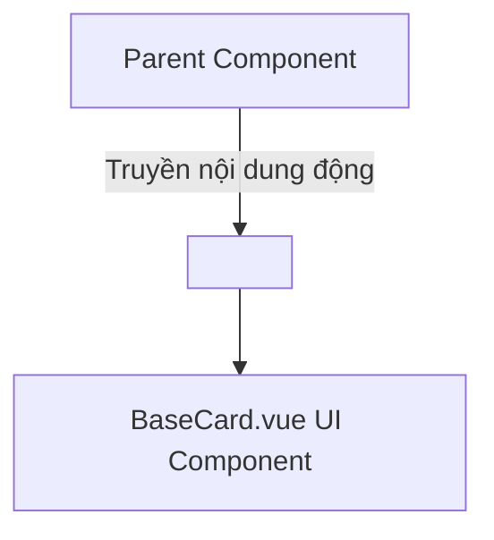

# Buổi 14: Styling, TailwindCSS & Slots

## 🎯 Mục tiêu học tập
- Cấu hình và ứng dụng khung CSS tiện ích **TailwindCSS** vào dự án Vue 3.
- Xây dựng giao diện Responsive chuyên nghiệp cho các trang danh mục E-Commerce.
- Sử dụng tính năng **Slots** (Default Slots, Named Slots) để tạo các component dùng chung (BaseCard, BaseModal) có khả năng tái sử dụng cao.

---

## 📖 Lý thuyết cốt lõi

### 📊 Sơ đồ minh họa khái niệm:




---

### 1. Tích hợp TailwindCSS vào Vue
TailwindCSS là framework CSS kiểu utility-first giúp viết CSS trực tiếp trên class của HTML.

### 2. Vue Slots (Cắm nội dung động vào component con)
Slots cho phép component cha truyền toàn bộ cấu trúc HTML xuống cho component con hiển thị.

- **Default Slot**: Truyền nội dung mặc định.
  ```vue
  <!-- Component con: Card.vue -->
  <div class="card-box">
    <slot></slot>
  </div>
  ```
- **Named Slots (Slot có tên)**: Khi component con có nhiều khu vực nhận nội dung (ví dụ: Header, Body, Footer).
  ```vue
  <!-- Component con: Modal.vue -->
  <div class="modal">
    <header><slot name="header"></slot></header>
    <main><slot></slot></main>
    <footer><slot name="footer"></slot></footer>
  </div>
  ```

---

## 💻 Ví dụ thực tiễn
```vue
<!-- Sử dụng component Modal ở cha với cú pháp #name -->
<Modal :isOpen="showConfirm">
  <template #header>
    <h3>Xác nhận xóa</h3>
  </template>
  <p>Bạn có chắc chắn muốn xóa sản phẩm này khỏi giỏ hàng?</p>
  <template #footer>
    <button @click="confirmDelete">Đồng ý</button>
  </template>
</Modal>
```

---

## 🛠️ Bài tập thực hành (Lab)
### Yêu cầu: Thiết kế Component BaseModal xác nhận xóa sản phẩm
1. Tham khảo giao diện tệp [cart.html](https://letrongdat.vercel.app/vuejs/templates/cart.html) (chú ý thiết kế các phần tử nổi đè).
2. Tạo component con dùng chung `BaseModal.vue` trong thư mục `src/components/common/`.
3. Trong `BaseModal.vue`:
   - Nhận prop `isOpen` (Boolean) để điều khiển ẩn hiện bằng `v-if`.
   - Thiết kế layout modal nổi bằng CSS Tailwind: nền mờ che phủ màn hình (`fixed inset-0 bg-black/50 z-50 flex items-center justify-center`), hộp thoại bo góc trắng ở giữa.
   - Sử dụng **Named Slots**:
     - `<slot name="title">`: Nơi hiển thị tiêu đề modal.
     - `<slot>` (Default slot): Nơi hiển thị nội dung thông điệp cảnh báo.
     - `<slot name="actions">`: Nơi chứa các nút bấm (Xác nhận, Hủy).
4. Tại trang giỏ hàng `CartView.vue`, thay thế hộp thoại confirm mặc định của trình duyệt (`window.confirm`) bằng cách mở component `BaseModal.vue` tự thiết kế khi nhấn nút xóa sản phẩm.
5. Truyền nội dung động (Tiêu đề "Xóa sản phẩm", Nội dung cảnh báo và các nút bấm TailwindCSS đẹp mắt) vào các slot tương ứng của `BaseModal`.


<details class="details custom-block">
  <summary>🔑 Xem gợi ý giải pháp (Code mẫu)</summary>


```vue
<!-- components/BaseModal.vue -->
<template>
  <div class="modal-overlay fixed inset-0 bg-black bg-opacity-50 flex items-center justify-center">
    <div class="modal-content bg-white p-6 rounded shadow-lg max-w-md w-full">
      <header class="border-b pb-2 mb-4">
        <slot name="header">Tiêu đề mặc định</slot>
      </header>
      <main class="mb-4">
        <slot>Nội dung mặc định</slot>
      </main>
      <footer class="flex justify-end gap-2">
        <slot name="footer"></slot>
      </footer>
    </div>
  </div>
</template>
```

</details>

---

## ❓ Trắc nghiệm nhanh
**1. Để chỉ định một template HTML cụ thể sẽ render vào một Named Slot có tên là `title`, cú pháp viết tắt trên template của component cha là gì?**
- A. `<template v-slot="title">`
- B. `<template #title>`
- C. `<template slot="title">`
- D. `<template @title>`
<details class="details custom-block">
  <summary>Xem giải đáp</summary>

  *Đáp án đúng: **B**.*
</details>

**2. Slot mặc định (không đặt tên) trong Vue component con được đại diện bằng thẻ nào?**
- A. `<slot name="default">` hoặc chỉ đơn giản là `<slot>`
- B. `<default-slot>`
- C. `<slot-view>`
- D. `<inner-html>`
<details class="details custom-block">
  <summary>Xem giải đáp</summary>

  *Đáp án đúng: **A**.*
</details>

---

