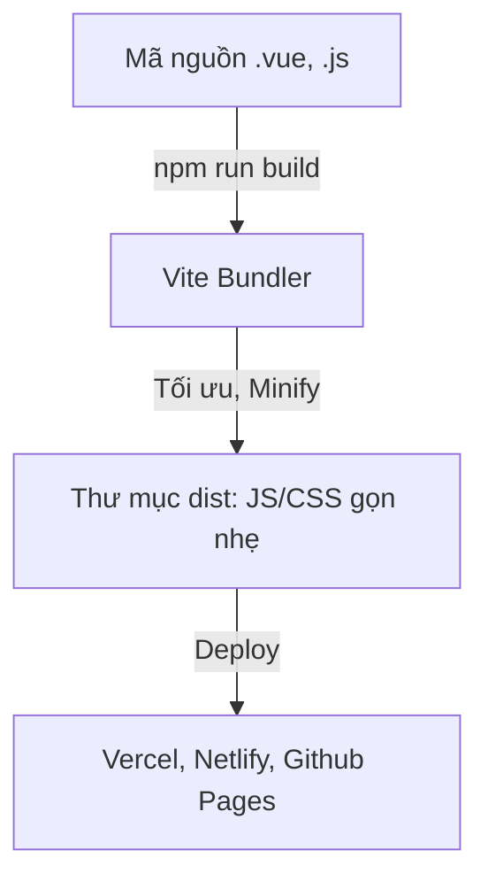

# Buổi 15: Dự án cuối khóa & Presentation

## 🎯 Mục tiêu học tập
- Tối ưu hóa mã nguồn Vanguard Store trước khi đóng gói sản phẩm (Lazy Loading Routes, tối ưu imports).
- Thực hiện chạy build đóng gói ứng dụng bằng Vite (`npm run build`).
- Trình bày (Presentation) dự án cuối khóa Vanguard Store trước lớp: Giới thiệu tính năng, cấu trúc code, các khó khăn và cách giải quyết.
- Tổng kết khóa học và nhận đánh giá phản hồi từ giảng viên.

---

## 📖 Lý thuyết cốt lõi

### 📊 Sơ đồ minh họa khái niệm:




---

### 1. Tối ưu hóa hiệu năng Vue App trước khi phát hành
- **Lazy Loading Routes (Định tuyến tải chậm)**:
  - Thay vì import tất cả các View ngay khi khởi động trang web (khiến file bundle ban đầu rất nặng), ta sử dụng Dynamic Import để chỉ tải file js của trang đó khi người dùng click truy cập.
  - Cú pháp trong router:
    ```javascript
    const routes = [
      {
        path: '/admin',
        name: 'admin',
        component: () => import('../views/AdminView.vue')
      }
    ]
    ```
- **Xử lý biến môi trường (.env)**:
  - Tách các cấu hình như URL API của Backend sang tệp `.env.development` và `.env.production` để dễ dàng cấu hình deploy.
  - Sử dụng biến: `import.meta.env.VITE_API_URL`.

### 2. Build & Deploy ứng dụng
- **Lệnh đóng gói**:
  ```bash
  npm run build
  ```
  Lệnh này sẽ biên dịch toàn bộ tệp `.vue`, `.js`, `.css` thành các tệp HTML, JS, CSS tĩnh chuẩn được tối ưu hóa dung lượng (Minified) nằm trong thư mục `/dist`.

---

## 💻 Cấu trúc bài thuyết trình dự án cuối khóa (Gợi ý)
Mỗi nhóm hoặc cá nhân sẽ có 10-15 phút để thuyết trình dự án **Website Cửa Hàng Vanguard Store E-Commerce**. Cấu trúc bài nói gồm:

1. **Slide 1: Giới thiệu thành viên & Vai trò**: Tên nhóm, đề tài và phân chia công việc cụ thể.
2. **Slide 2: Demo sản phẩm (Live Demo)**: Chạy thử toàn bộ các luồng chức năng quan trọng nhất:
   - Đăng nhập/Đăng ký tài khoản.
   - Tìm kiếm sản phẩm, lọc theo danh mục, thêm vào giỏ hàng.
   - Trang Giỏ hàng tăng giảm số lượng, xóa và thanh toán đơn hàng.
   - Trang Admin: CRUD sản phẩm (đọc, tạo mới, sửa, xóa).
3. **Slide 3: Sơ đồ kiến trúc & Cấu trúc mã nguồn**: Giải thích sơ đồ tổ chức thư mục, các Store của Pinia quản lý giỏ hàng và định tuyến Router.
4. **Slide 4: Những khó khăn gặp phải & Cách giải quyết**: Ví dụ về lỗi xử lý bất đồng bộ, lỗi trùng lịch đặt phòng hoặc lỗi mất reactivity và giải pháp khắc phục.
5. **Slide 5: Q&A**: Trả lời câu hỏi phản biện từ giảng viên.

---

## 🛠️ Bài tập thực hành (Lab)
### Yêu cầu: Đóng gói sản phẩm dự án Vanguard Store
1. Áp dụng lazy loading cho toàn bộ các trang chính (HomeView, ProductDetailView, CartView, LoginView, RegisterView, các trang Admin).
2. Chạy thử lệnh đóng gói dự án trong thư mục code của bạn:
   ```bash
   npm run build
   ```
3. Kiểm tra thư mục `/dist` vừa được tạo ra. Đảm bảo cấu trúc chứa file `index.html` và các thư mục assets chứa js/css được mã hóa nén.
4. Chuẩn bị slide báo cáo, đẩy toàn bộ mã nguồn lên GitHub repository cá nhân và nộp liên kết dự án hoàn chỉnh.


<details class="details custom-block">
  <summary>🔑 Xem gợi ý giải pháp (Code mẫu)</summary>


```bash
# Bước 1: Build ứng dụng cho môi trường Production
npm run build

# Bước 2: Chạy thử bản build ở local
npm run preview

# Bước 3: Deploy lên Vercel bằng CLI
npm install -g vercel
vercel login
vercel --prod
```

</details>

---

## ❓ Trắc nghiệm nhanh
**1. Lệnh nào được sử dụng để Vite đóng gói ứng dụng thành file tĩnh phân phối cho môi trường Production?**
- A. `npm run dev`
- B. `npm run build`
- C. `npm run test`
- D. `npm start`
<details class="details custom-block">
  <summary>Xem giải đáp</summary>

  *Đáp án đúng: **B**.*
</details>

**2. Để thực hiện kỹ thuật Lazy Loading cho các component View trong Vue Router, ta sử dụng cú pháp import nào?**
- A. `import ViewName from 'path'`
- B. `const ViewName = () => import('path')`
- C. `require('path')`
- D. `loadComponent('path')`
<details class="details custom-block">
  <summary>Xem giải đáp</summary>

  *Đáp án đúng: **B**.*
</details>

---

