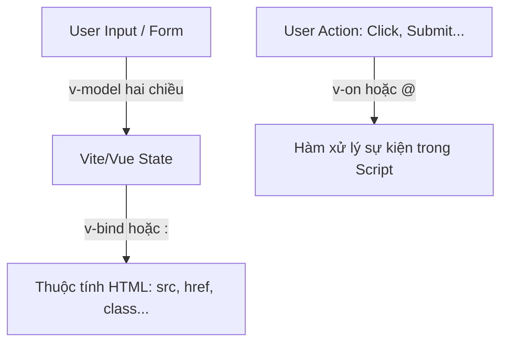

# Buổi 2: Template Syntax & Directives

## 🎯 Mục tiêu học tập
- Sử dụng thành thạo cú pháp nội suy văn bản Mustache (`{{ }}`) và thẻ `v-html`.
- Áp dụng directive `v-bind` để liên kết thuộc tính động (Attributes binding) gồm cả Class & Style binding.
- Sử dụng `v-model` để thực hiện liên kết dữ liệu hai chiều (Two-way data binding) trên các form nhập liệu.
- Sử dụng `v-on` (hoặc `@`) để bắt các sự kiện và xử lý.

---

## 📖 Lý thuyết cốt lõi

### 📊 Sơ đồ minh họa khái niệm:




---

### 1. Interpolation (Nội suy)
- **Text**: Sử dụng cặp dấu ngoặc nhọn kép `{{ message }}`.
- **Raw HTML**: Mặc định Vue chuyển đổi HTML thành text để chống tấn công XSS. Để hiển thị HTML thực tế, dùng `v-html`.
  ```vue
  <p v-html="rawHtmlContent"></p>
  ```

### 2. Attribute Binding (`v-bind` hoặc `:`)
Dùng để ràng buộc một thuộc tính HTML với một biến trong script.
```vue
<!-- Đầy đủ -->
<a v-bind:href="url">Link</a>
<!-- Rút gọn -->
<a :href="url">Link</a>
```
- **Class & Style binding**: Có thể truyền đối tượng hoặc mảng vào `:class` và `:style`.
  ```vue
  <div :class="{ active: isActive, 'text-danger': hasError }"></div>
  ```

### 3. Two-way Data Binding (`v-model`)
- Ràng buộc hai chiều giữa State và phần tử nhập liệu của Form (input, select). Khi người dùng nhập, state tự cập nhật, và ngược lại.
  ```vue
  <input v-model="email" placeholder="Nhập email" />
  ```

### 4. Event Handling (`v-on` hoặc `@`)
Lắng nghe các sự kiện DOM và kích hoạt hàm xử lý.
```vue
<button @click="sayHello">Click Me</button>
```
- **Event Modifiers**: `stop` (stopPropagation), `prevent` (preventDefault).
  ```vue
  <form @submit.prevent="onSubmit">...</form>
  ```

---

## 💻 Ví dụ thực tiễn
```vue
<script setup>
import { ref } from 'vue'

const email = ref('')
const isAgreed = ref(false)
const themeColor = ref('blue')
const activeClass = ref('bold-text')

function handleSubmit() {
  alert(`Đăng ký thành công email: ${email.value}`);
}
</script>

<template>
  <div class="form-container">
    <h2>Đăng Ký Nhận Bản Tin</h2>
    
    <!-- Bind class và style động -->
    <p :style="{ color: themeColor }" :class="activeClass">
      Điền thông tin của bạn bên dưới:
    </p>

    <!-- Two-way Binding với v-model -->
    <div class="field">
      <label>Email: </label>
      <input type="email" v-model="email" placeholder="example@gmail.com" />
    </div>

    <div class="field">
      <label>
        <input type="checkbox" v-model="isAgreed" /> Tôi đồng ý với điều khoản
      </label>
    </div>

    <!-- Event Handling với v-on và modifier prevent -->
    <form @submit.prevent="handleSubmit">
      <button type="submit" :disabled="!isAgreed">Gửi Đăng Ký</button>
    </form>
  </div>
</template>

<style scoped>
.form-container {
  max-width: 400px;
  margin: 20px auto;
  padding: 15px;
  border: 1px solid #ccc;
  border-radius: 6px;
}
.field {
  margin-bottom: 15px;
}
.bold-text {
  font-weight: bold;
}
button {
  padding: 8px 16px;
  cursor: pointer;
}
button:disabled {
  background-color: #ddd;
  cursor: not-allowed;
}
</style>
```

---

## 🛠️ Bài tập thực hành (Lab)
### Yêu cầu: Đổ dữ liệu động và xử lý tương tác trên Giao diện trang chủ Vanguard Store
1. Hãy mở tệp HTML trang chủ [index.html](https://letrongdat.vercel.app/vuejs/templates/index.html) (đặc biệt chú ý vùng sản phẩm từ dòng **122 đến 150**).
2. Tạo component Vue `App.vue` mới trong dự án `vanguard-store` của bạn.
3. Trong script setup, khai báo các biến ref mô tả thông tin sản phẩm đầu tiên:
   - `productName` (ref string, ví dụ: "Tai Nghe Vanguard Studio Wireless")
   - `productPrice` (ref number, ví dụ: 3500000)
   - `productCategory` (ref string, ví dụ: "Âm thanh")
   - `productImage` (ref string, ví dụ: "https://images.unsplash.com/photo-1505740420928-5e560c06d30e?w=500&auto=format&fit=crop&q=60")
   - `isHovered` (ref boolean, mặc định false)
4. Trên template của `App.vue`, copy đoạn HTML của **PRODUCT CARD 1** (dòng **122-150** trong [index.html](https://letrongdat.vercel.app/vuejs/templates/index.html)).
5. Thực hiện:
   - Dùng `v-bind` (`:src` và `:alt`) để binding ảnh sản phẩm từ `productImage`.
   - Dùng interpolation `{{ }}` để hiển thị tên sản phẩm, danh mục, và giá bán.
   - Sử dụng sự kiện mouseover và mouseleave (`@mouseover`, `@mouseleave`) để cập nhật trạng thái `isHovered`. Nếu `isHovered` bằng true, hãy thêm class CSS `shadow-2xl` và `border-indigo-300` thông qua class binding động (`:class`).


<details class="details custom-block">
  <summary>🔑 Xem gợi ý giải pháp (Code mẫu)</summary>


```vue
<script setup>
import { ref } from 'vue'

const message = ref('Chào mừng tới Vanguard Store!')
const isHovered = ref(false)
const productImage = ref('https://images.unsplash.com/photo-1542291026-7eec264c27ff?w=500&auto=format&fit=crop&q=60')
</script>

<template>
  <div class="container mx-auto p-6">
    <div 
      class="max-w-sm rounded overflow-hidden shadow-lg border p-4 transition-all duration-300"
      :class="{ 'shadow-2xl border-indigo-400': isHovered }"
      @mouseover="isHovered = true"
      @mouseleave="isHovered = false"
    >
      
      <div class="py-4">
        <h3 class="font-bold text-xl mb-2">{{ message }}</h3>
        <p class="text-gray-700 text-base">Sản phẩm cao cấp chất lượng hàng đầu.</p>
      </div>
    </div>
  </div>
</template>
```

</details>

---

## ❓ Trắc nghiệm nhanh
**1. Đâu là cú pháp rút gọn của directive `v-bind:class`?**
- A. `@class`
- B. `#class`
- C. `:class`
- D. `&class`
<details class="details custom-block">
  <summary>Xem giải đáp</summary>

  *Đáp án đúng: **C**.*
</details>

**2. Modifier nào được dùng để ngăn chặn hành động tải lại trang mặc định của Form?**
- A. `.stop`
- B. `.prevent`
- C. `.capture`
- D. `.self`
<details class="details custom-block">
  <summary>Xem giải đáp</summary>

  *Đáp án đúng: **B**.*
</details>

**3. Sự khác biệt giữa `v-model` và `v-bind` là gì?**
- A. `v-bind` là hai chiều, `v-model` là một chiều.
- B. `v-bind` chỉ dùng cho class, `v-model` dùng cho style.
- C. `v-bind` ràng buộc dữ liệu một chiều (từ script ra template), `v-model` ràng buộc hai chiều.
- D. Không có sự khác biệt.
<details class="details custom-block">
  <summary>Xem giải đáp</summary>

  *Đáp án đúng: **C**.*
</details>

**4. Khi bind đường dẫn ảnh sản phẩm `:src="productImage"`, chúng ta đang sử dụng directive nào?**
- A. `v-on`
- B. `v-model`
- C. `v-bind`
- D. `v-text`
<details class="details custom-block">
  <summary>Xem giải đáp</summary>

  *Đáp án đúng: **C**.*
</details>

**5. Lắng nghe sự kiện di chuột rời khỏi thẻ dùng sự kiện nào?**
- A. `@click`
- B. `@mouseover`
- C. `@mouseleave`
- D. `@keydown`
<details class="details custom-block">
  <summary>Xem giải đáp</summary>

  *Đáp án đúng: **C**.*
</details>

---

