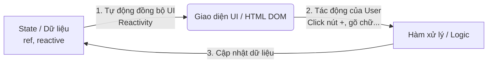
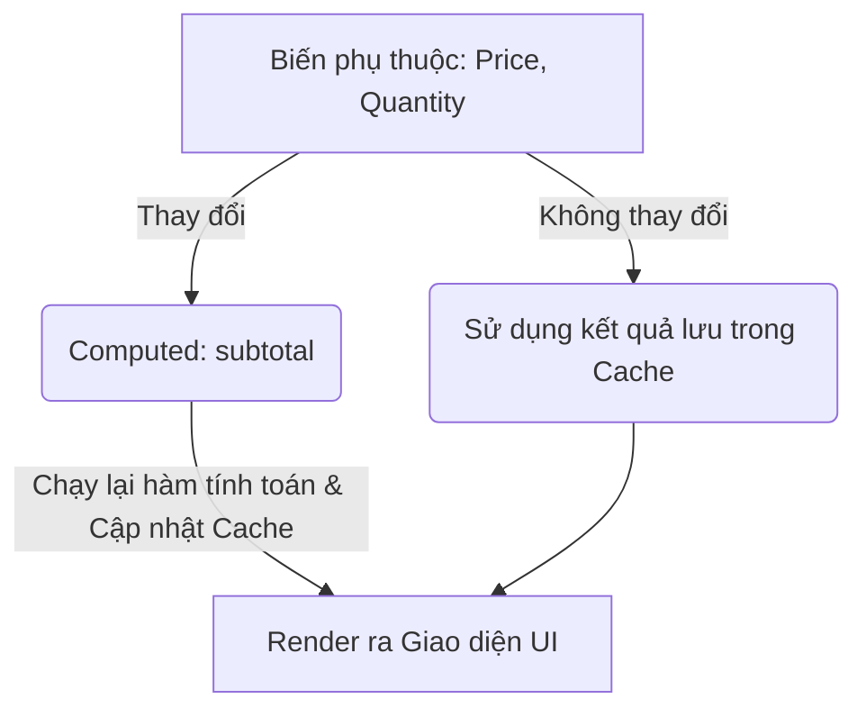
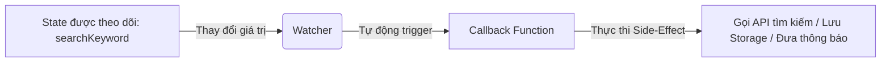

# Buổi 3: Reactivity cơ bản (ref, reactive, computed, watch)

## 🎯 Mục tiêu học tập
- Giải thích và phân biệt được cơ chế hoạt động của `ref` và `reactive`.
- Sử dụng thuộc tính toán `computed` để tính toán tổng giá trị đơn hàng động.
- Áp dụng bộ theo dõi `watch` để bắt các sự kiện thay đổi giỏ hàng.
- Hiểu được cách Vue 3 theo dõi thay đổi trạng thái.

---

## 📖 Lý thuyết cốt lõi

### 1. State (Trạng thái) là gì?

Trong phát triển ứng dụng web hiện đại (đặc biệt với các framework như Vue, React, Angular), **State (Trạng thái)** là toàn bộ dữ liệu quyết định giao diện hiển thị của ứng dụng tại một thời điểm cụ thể.

* **Tư duy cũ (JavaScript thuần)**: Khi dữ liệu thay đổi, ta phải chủ động truy xuất DOM và cập nhật thủ công (Ví dụ: `document.getElementById('total').textContent = newPrice`). Cách này cực kỳ dễ sót và khó bảo trì khi ứng dụng lớn.
* **Tư duy mới (State-driven UI)**: Ta chỉ cần quản lý và thay đổi dữ liệu (**State**). Trình duyệt sẽ tự động lắng nghe sự thay đổi của State để cập nhật lại phần giao diện tương ứng mà lập trình viên không cần đụng vào DOM. Cơ chế tự động này được gọi là **Reactivity (Tính phản xạ)**.

#### 📊 Sơ đồ luồng hoạt động của State & Reactivity trong Vue:



---

### 2. Cách khai báo State: `ref` vs `reactive`
Để Vue có thể theo dõi và tự động cập nhật giao diện khi dữ liệu thay đổi, dữ liệu đó phải được khai báo dưới dạng các biến reactive (reactive state). Vue 3 cung cấp hai hàm chính:

- **`ref()`**:
  - Dùng cho mọi kiểu dữ liệu (String, Number, Boolean, hoặc Object/Array).
  - Trả về đối tượng có thuộc tính `.value`. Khi viết trong `<template>`, ta không cần ghi `.value` mà Vue sẽ tự động unwrap.
  - Ví dụ: `const count = ref(0)`. Truy cập bằng `count.value` trong script.
- **`reactive()`**:
  - Chỉ nhận kiểu dữ liệu phức hợp (Object, Array, Map, Set).
  - Trả về một Proxy trực tiếp của object gốc. Không cần dùng `.value`.
  - Ví dụ: `const state = reactive({ name: 'Dat', age: 30 })`.

---

### 3. Computed Properties (`computed`)
- Là các thuộc tính được tính toán tự động dựa trên các trạng thái reactive khác (dependencies).
- **Cơ chế Caching (Bộ nhớ đệm)**: Computed chỉ tính toán lại khi biến phụ thuộc thay đổi. Nếu các biến phụ thuộc không đổi, computed trả về ngay kết quả đã lưu trong bộ nhớ đệm mà không cần chạy lại hàm, giúp tối ưu hiệu năng.
- **Mục đích**: Dùng để tính toán dữ liệu phái sinh hiển thị ra giao diện (như tổng tiền giỏ hàng, số lượng sản phẩm...).

#### 📊 Sơ đồ hoạt động của Computed (Có Cache):



---

### 4. Watchers (`watch`)
- Theo dõi một hoặc nhiều biến cụ thể. Chỉ chạy callback khi giá trị biến thay đổi. Cho phép lấy giá trị mới (`newValue`) và giá trị cũ (`oldValue`).
- **Mục đích**: Dùng để thực thi các hành động tùy biến ngoài luồng (Side-Effects) như: gọi API tải lại dữ liệu, ghi log, lưu LocalStorage, hiển thị cảnh báo alert...

#### 📊 Sơ đồ hoạt động của Watcher (Lắng nghe sự kiện):



---

## 💻 Ví dụ thực tiễn
```vue
<script setup>
import { ref, reactive, computed, watch } from 'vue'

const searchKeyword = ref('')
const cart = reactive({
  items: [
    { id: 1, name: 'Điện thoại', price: 10000000, quantity: 1 },
    { id: 2, name: 'Tai nghe', price: 1500000, quantity: 2 }
  ]
})

const totalCartPrice = computed(() => {
  return cart.items.reduce((sum, item) => sum + (item.price * item.quantity), 0)
})

watch(searchKeyword, (newValue, oldValue) => {
  console.log(`Từ khóa đổi từ "${oldValue}" sang "${newValue}"`)
})

function increaseQuantity(index) {
  cart.items[index].quantity++
}
</script>

<template>
  <div class="cart-box">
    <h2>Giỏ Hàng Của Bạn</h2>
    <input v-model="searchKeyword" placeholder="Tìm kiếm sản phẩm..." />
    
    <ul>
      <li v-for="(item, index) in cart.items" :key="item.id">
        {{ item.name }} - {{ item.price }}đ 
        (Số lượng: {{ item.quantity }})
        <button @click="increaseQuantity(index)">+</button>
      </li>
    </ul>

    <p><strong>Tổng tiền:</strong> {{ totalCartPrice }}đ</p>
  </div>
</template>
```

---

## 🛠️ Bài tập thực hành (Lab)

### Yêu cầu: Tăng giảm số lượng, áp mã giảm giá và tính toán hóa đơn Giỏ hàng

Trong bài tập này, chúng ta sẽ xây dựng một trình quản lý sản phẩm đơn lẻ nâng cao trong giỏ hàng, ứng dụng cả `computed` và `watch` để xử lý các logic thực tế của một trang E-Commerce.

1. **Tạo Component**: Tạo component Vue `CartManager.vue` trong dự án của bạn và sao chép cấu trúc giao diện tương tự trang giỏ hàng mẫu tại [cart.html](https://letrongdat.vercel.app/vuejs/templates/cart.html).
2. **Khai báo State**:
   - Sử dụng `reactive` khai báo một sản phẩm trong giỏ:
     ```javascript
     const product = reactive({
       name: "Tai Nghe Vanguard Studio Wireless",
       price: 3500000,
       quantity: 1,
       stock: 5 // Giới hạn kho hàng
     })
     ```
   - Sử dụng `ref` khai báo ô nhập mã giảm giá và số tiền được giảm:
     ```javascript
     const couponCode = ref('')
     const discountPercent = ref(0) // Phần trăm giảm giá (0% -> 100%)
     ```
3. **Liên kết Sự Kiện Tăng/Giảm Số Lượng**:
   - Nút `-`: Gọi hàm giảm số lượng (ngăn không cho số lượng nhỏ hơn 1).
   - Nút `+`: Gọi hàm tăng số lượng.
   - **Áp dụng `watch`**: Theo dõi biến số lượng `product.quantity`. Nếu người dùng tăng vượt quá giới hạn kho hàng (`product.stock`), hãy tự động gán số lượng về bằng giá trị giới hạn kho và hiển thị thông báo alert: *"Không thể mua vượt quá số lượng trong kho!"*.
4. **Tính toán Hóa Đơn (Áp dụng `computed`)**:
   - Viết computed `subtotal` tính số tiền tạm tính: `product.price * product.quantity`.
   - Viết computed `discountAmount` tính số tiền được giảm: `subtotal.value * (discountPercent.value / 100)`.
   - Viết computed `total` tính tổng số tiền thực tế phải thanh toán sau khi giảm giá: `subtotal.value - discountAmount.value`.
   - Hiển thị các giá trị này ra đúng các vùng hiển thị tương ứng ở cột **Tóm tắt đơn hàng** trên giao diện.
5. **Kiểm tra Mã Giảm Giá (Áp dụng `watch`)**:
   - Sử dụng `watch` để theo dõi biến `couponCode`.
   - Nếu người dùng nhập đúng mã `"VANGUARD10"`, hãy cập nhật `discountPercent.value = 10` (giảm 10%).
   - Nếu người dùng nhập đúng mã `"VANGUARD20"`, hãy cập nhật `discountPercent.value = 20` (giảm 20%).
   - Với mọi mã khác, hãy gán `discountPercent.value = 0`.

<details class="details custom-block">
  <summary>🔑 Xem gợi ý giải pháp (Code mẫu)</summary>

```vue
<script setup>
import { ref, reactive, computed, watch } from 'vue'

// 1. Khai báo trạng thái sản phẩm
const product = reactive({
  name: "Tai Nghe Vanguard Studio Wireless",
  price: 3500000,
  quantity: 1,
  stock: 5
})

// 2. Khai báo mã giảm giá
const couponCode = ref('')
const discountPercent = ref(0)

// 3. Hàm tăng/giảm số lượng
function tangSoLuong() {
  product.quantity++
}

function giamSoLuong() {
  if (product.quantity > 1) {
    product.quantity--
  }
}

// 4. Watcher kiểm tra giới hạn kho (stock)
watch(() => product.quantity, (newQty) => {
  if (newQty > product.stock) {
    alert("Không thể mua vượt quá số lượng trong kho!")
    product.quantity = product.stock
  }
})

// 5. Watcher lắng nghe mã giảm giá để áp phần trăm tương ứng
watch(couponCode, (newCode) => {
  const code = newCode.trim().toUpperCase()
  if (code === 'VANGUARD10') {
    discountPercent.value = 10
  } else if (code === 'VANGUARD20') {
    discountPercent.value = 20
  } else {
    discountPercent.value = 0
  }
})

// 6. Computed tính toán chi phí hóa đơn
const subtotal = computed(() => {
  return product.price * product.quantity
})

const discountAmount = computed(() => {
  return subtotal.value * (discountPercent.value / 100)
})

const total = computed(() => {
  return subtotal.value - discountAmount.value
})
</script>

<template>
  <div class="cart-container">
    <div class="product-card">
      <h3>{{ product.name }}</h3>
      <p>Đơn giá: {{ product.price.toLocaleString() }}đ</p>
      
      <!-- Nút tăng giảm -->
      <div class="quantity-controller">
        <button @click="giamSoLuong">-</button>
        <span>{{ product.quantity }}</span>
        <button @click="tangSoLuong">+</button>
      </div>
    </div>

    <!-- Nhập mã giảm giá -->
    <div class="coupon-box">
      <label>Mã giảm giá (VANGUARD10 hoặc VANGUARD20):</label>
      <input type="text" v-model="couponCode" placeholder="Nhập mã coupon..." />
      <p v-if="discountPercent > 0" class="success-msg">
        Áp mã thành công! Đã giảm {{ discountPercent }}%
      </p>
    </div>

    <!-- Tóm tắt thanh toán -->
    <div class="summary-box">
      <p>Tạm tính: {{ subtotal.toLocaleString() }}đ</p>
      <p>Số tiền được giảm: -{{ discountAmount.toLocaleString() }}đ</p>
      <p><strong>Tổng thanh toán:</strong> {{ total.toLocaleString() }}đ</p>
    </div>
  </div>
</template>
```

</details>

---

## ❓ Trắc nghiệm nhanh
**1. Tại sao dùng computed lại tốt hơn gọi phương thức (methods) thông thường?**
- A. Computed không cần viết hàm.
- B. Computed có cơ chế cache kết quả và chỉ chạy lại khi dependency thay đổi.
- C. Computed chạy nhanh hơn vì chạy trên luồng phụ.
- D. Không có sự khác biệt.
<details class="details custom-block">
  <summary>Xem giải đáp</summary>

  *Đáp án đúng: **B**.*
</details>

**2. Để tăng giá trị của biến số lượng được khai báo bằng `const quantity = ref(1)`, trong script ta viết thế nào?**
- A. `quantity++`
- B. `quantity.value++`
- C. `quantity.set(quantity + 1)`
- D. `this.quantity++`
<details class="details custom-block">
  <summary>Xem giải đáp</summary>

  *Đáp án đúng: **B**.*
</details>

**3. Khai báo dữ liệu giỏ hàng gồm mảng các item thì nên sử dụng hàm nào?**
- A. `reactive` hoặc `ref`
- B. `computed`
- C. `watch`
- D. `provide`
<details class="details custom-block">
  <summary>Xem giải đáp</summary>

  *Đáp án đúng: **A**.*
</details>

**4. Điểm khác biệt lớn nhất giữa `watch` và `computed` là gì?**
- A. Watch có cơ chế cache, computed thì không.
- B. Computed dùng để tính toán và trả về một giá trị mới (không gây ra side-effect), còn Watch dùng để lắng nghe và thực thi các hành động tùy biến (side-effects) khi giá trị thay đổi.
- C. Watch chỉ chạy một lần duy nhất khi render.
- D. Không có sự khác biệt.
<details class="details custom-block">
  <summary>Xem giải đáp</summary>

  *Đáp án đúng: **B**.*
</details>

**5. Hàm computed có thể trực tiếp làm thay đổi giá trị của state gốc được không?**
- A. Được.
- B. Không được, computed chỉ được đọc và trả về giá trị mới (Read-only by default).
- C. Tùy thuộc vào trình duyệt.
- D. Chỉ dùng được với biến ref.
<details class="details custom-block">
  <summary>Xem giải đáp</summary>

  *Đáp án đúng: **B**.*
</details>

---

