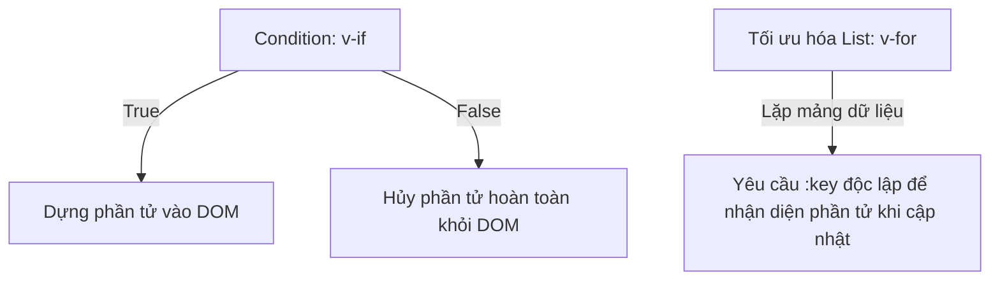

# Buổi 4: Conditional & List Rendering

## 🎯 Mục tiêu học tập
- Phân biệt rõ sự khác nhau về cơ chế hoạt động và trường hợp sử dụng của `v-if` và `v-show`.
- Sử dụng directive duyệt mảng `v-for` để kết xuất danh sách sản phẩm E-Commerce.
- Giải thích được tại sao bắt buộc phải sử dụng thuộc tính `:key` khi dùng `v-for`.
- Kết hợp `computed` để lọc danh sách sản phẩm theo danh mục.

---

## 📖 Lý thuyết cốt lõi

### 📊 Sơ đồ minh họa khái niệm:



---

### 1. Conditional Rendering (`v-if` vs `v-show`)
- **`v-if`**: Bổ sung hoặc gỡ bỏ phần tử hoàn toàn khỏi cây DOM thật dựa trên điều kiện.
- **`v-show`**: Luôn render và giữ phần tử trong DOM, chỉ thay đổi thuộc tính CSS `display: none` để ẩn/hiện.

### 2. List Rendering (`v-for`)
Dùng để duyệt qua một mảng để hiển thị danh sách giao diện.
```vue
<li v-for="item in items" :key="item.id">
  {{ item.name }}
</li>
```
- **Tầm quan trọng của `:key`**: Giúp thuật toán Diffing của Virtual DOM nhận diện chính xác từng phần tử trong danh sách để tái sử dụng tối ưu, tránh render lại toàn bộ khi có thay đổi.

---

## 💻 Ví dụ thực tiễn
```vue
<script setup>
import { ref } from 'vue'

const isVisible = ref(true)
const products = ref([
  { id: 101, name: 'Laptop Asus Rog', price: 25000000, inStock: true },
  { id: 102, name: 'Chuột Logitech G102', price: 400000, inStock: false }
])
</script>

<template>
  <div>
    <button @click="isVisible = !isVisible">Ẩn/Hiện</button>
    <p v-show="isVisible">Đang hiển thị</p>

    <h3>Sản phẩm</h3>
    <ul>
      <li v-for="product in products" :key="product.id">
        {{ product.name }} - {{ product.price }}đ
        <span v-if="product.inStock">(Còn hàng)</span>
        <span v-else>(Hết hàng)</span>
      </li>
    </ul>
  </div>
</template>
```

---

## 🛠️ Bài tập thực hành (Lab)
### Yêu cầu: Hiển thị danh sách sản phẩm nổi bật có bộ lọc theo danh mục
1. Xem cấu trúc HTML của phần danh sách sản phẩm nổi bật tại [index.html](https://letrongdat.vercel.app/vuejs/templates/index.html) (chú ý đoạn Grid sản phẩm từ dòng **115 đến 245**).
2. Tạo component Vue `ProductList.vue`.
3. Trong script setup, định nghĩa mảng sản phẩm gồm 4 sản phẩm tương ứng trong file HTML mẫu:
   ```javascript
   const products = ref([
     { id: 1, name: 'Tai Nghe Vanguard Studio Wireless', price: 3500000, category: 'Âm thanh', image: 'https://images.unsplash.com/photo-1505740420928-5e560c06d30e?w=500&auto=format&fit=crop&q=60' },
     { id: 2, name: 'Giày Thể Thao Vanguard Pro Run', price: 1890000, category: 'Thời trang', image: 'https://images.unsplash.com/photo-1542291026-7eec264c27ff?w=500&auto=format&fit=crop&q=60' },
     { id: 3, name: 'Đồng Hồ Thông Minh Vanguard Watch X', price: 4200000, category: 'Công nghệ', image: 'https://images.unsplash.com/photo-1523275335684-37898b6baf30?w=500&auto=format&fit=crop&q=60' },
     { id: 4, name: 'Ví Da Nam Tối Giản Vanguard Leather', price: 6500000, category: 'Phụ kiện', image: 'https://images.unsplash.com/photo-1627124765138-b6b77e815b3c?w=500&auto=format&fit=crop&q=60' }
   ])
   const selectedCategory = ref('Tất cả')
   ```
4. Trên template, copy cấu trúc của **vùng Grid sản phẩm nổi bật** (dòng **115-245**).
5. Sử dụng `v-for` duyệt qua mảng sản phẩm để tạo các Product Card động thay vì code HTML trùng lặp. Đặt `:key="product.id"`.
6. Sử dụng `computed` để tạo danh sách `filteredProducts` chỉ hiển thị các sản phẩm thuộc danh mục `selectedCategory` (nếu khác 'Tất cả').
7. Tạo các tab lựa chọn danh mục (Tất cả, Âm thanh, Thời trang, Công nghệ, Phụ kiện), khi click sẽ thay đổi `selectedCategory` và xem giao diện thay đổi tự động.

<details class="details custom-block">
  <summary>🔑 Xem gợi ý giải pháp (Code mẫu)</summary>

```vue
<script setup>
import { ref, computed } from 'vue'

const currentCategory = ref('all')
const products = ref([
  { id: 1, name: 'Tai nghe Wireless S1', price: 1500000, category: 'audio' },
  { id: 2, name: 'Bàn phím cơ K2', price: 2500000, category: 'keyboard' },
  { id: 3, name: 'Chuột Gaming G3', price: 900000, category: 'mouse' },
  { id: 4, name: 'Loa Bluetooth B4', price: 3200000, category: 'audio' }
])

const filteredProducts = computed(() => {
  if (currentCategory.value === 'all') return products.value
  return products.value.filter(p => p.category === currentCategory.value)
})
</script>

<template>
  <div class="p-6">
    <div class="filters flex gap-4 mb-6">
      <button @click="currentCategory = 'all'" :class="{ 'font-bold': currentCategory === 'all' }">Tất cả</button>
      <button @click="currentCategory = 'audio'" :class="{ 'font-bold': currentCategory === 'audio' }">Âm thanh</button>
      <button @click="currentCategory = 'keyboard'" :class="{ 'font-bold': currentCategory === 'keyboard' }">Bàn phím</button>
    </div>

    <ul v-if="filteredProducts.length > 0">
      <li v-for="product in filteredProducts" :key="product.id" class="p-2 border-b">
        {{ product.name }} - {{ product.price.toLocaleString() }}đ
      </li>
    </ul>
    <p v-else class="text-gray-500">Không có sản phẩm nào thuộc nhóm này.</p>
  </div>
</template>
```

</details>

---

## ❓ Trắc nghiệm nhanh
**1. Trường hợp nào nên sử dụng `v-show` thay vì `v-if`?**
- A. Khi phần tử chứa nhiều logic nặng và chỉ render 1 lần.
- B. Khi cần ẩn hiện phần tử liên tục và tần suất cao.
- C. Khi muốn bảo mật thông tin nhạy cảm của người dùng.
- D. Khi dùng với danh sách `v-for`.
<details class="details custom-block">
  <summary>Xem giải đáp</summary>

  *Đáp án đúng: **B**.*
</details>

**2. Điểm đặc trưng nhất của `v-for` trong Vue là gì?**
- A. Tự động sắp xếp mảng.
- B. Phải đi kèm với thuộc tính `:key` duy nhất để tối ưu hóa việc quản lý DOM của Vue.
- C. Chỉ hoạt động với thẻ `<li>`.
- D. Không thể đi kèm điều kiện `v-if` trên cùng 1 thẻ.
<details class="details custom-block">
  <summary>Xem giải đáp</summary>

  *Đáp án đúng: **B**.*
</details>

**3. Khẳng định nào sau đây là ĐÚNG về sự khác biệt giữa `v-if` và `v-show`?**
- A. `v-if` chỉ ẩn phần tử bằng CSS display: none.
- B. `v-if` gỡ bỏ hoàn toàn phần tử khỏi DOM, còn `v-show` chỉ dùng CSS để ẩn/hiện.
- C. Cả hai đều gỡ bỏ phần tử khỏi DOM.
- D. Không có sự khác biệt về hiệu năng.
<details class="details custom-block">
  <summary>Xem giải đáp</summary>

  *Đáp án đúng: **B**.*
</details>

---
