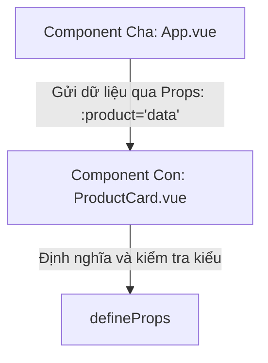

# Buổi 5: Component & Props (Truyền dữ liệu cha -> con)

## 🎯 Mục tiêu học tập
- Giải thích được tư duy Component-based trong phát triển giao diện web hiện đại.
- Tạo và import thành công các component con vào component cha.
- Sử dụng thuộc tính `props` để truyền dữ liệu từ component cha xuống component con.
- Định nghĩa kiểu dữ liệu và thực hiện validation cho `props` (type, required, default value).

---

## 📖 Lý thuyết cốt lõi

### 📊 Sơ đồ minh họa khái niệm:




---

### 1. Kiến trúc Component-based
- Một ứng dụng Vue là một cây gồm các component lồng nhau.
- Mỗi component đại diện cho một phần giao diện độc lập, khép kín (self-contained) bao gồm cả giao diện, logic xử lý và phong cách thiết kế riêng biệt.

### 2. Khai báo Props trong Vue 3 Composition API
- Dữ liệu trong Vue di chuyển theo cơ chế một chiều từ cha xuống con. Component con không được phép trực tiếp sửa đổi `props` nhận được từ cha.
- Để nhận dữ liệu từ cha, con khai báo bằng cách sử dụng compiler macro `defineProps()`.

```vue
<!-- Component con: UserProfile.vue -->
<script setup>
const props = defineProps({
  username: {
    type: String,
    required: true
  },
  age: {
    type: Number,
    default: 18
  }
})
</script>

<template>
  <div class="profile-card">
    <h3>Tên: {{ username }}</h3>
    <p>Tuổi: {{ age }}</p>
  </div>
</template>
```

---

## 💻 Ví dụ thực tiễn
```vue
<!-- Component cha: App.vue -->
<script setup>
import { ref } from 'vue'
import UserProfile from './components/UserProfile.vue'

const currentAge = ref(25)
</script>

<template>
  <!-- Truyền giá trị động (Dynamic Props) dùng v-bind hoặc dấu hai chấm -->
  <UserProfile :username="'Trần Thị B'" :age="currentAge" />
</template>
```

---

## 🛠️ Bài tập thực hành (Lab)
### Yêu cầu: Tách component ProductCard.vue từ template trang chủ Vanguard Store
1. Hãy mở tệp HTML trang chủ [index.html](https://letrongdat.vercel.app/vuejs/templates/index.html) và copy phần giao diện của **PRODUCT CARD 1** (nằm ở dòng **122 đến 150**).
2. Tạo component Vue con mới tên là `ProductCard.vue` tại thư mục `/src/components/`.
3. Trong `ProductCard.vue`, sử dụng `defineProps()` để khai báo các thuộc tính cần nhận:
   - `product`: Object chứa `id`, `name`, `price`, `category`, `image`. Định rõ kiểu dữ liệu `Object` và thuộc tính `required: true`.
4. Thay thế các thông tin tĩnh trong mã HTML vừa copy bằng dữ liệu từ prop `product` (sử dụng `:src`, `:alt` và `{{ }}`).
5. Tại component cha `App.vue`, import component `ProductCard.vue`.
6. Sử dụng `v-for` lặp qua mảng sản phẩm hiện có và truyền từng object sản phẩm vào prop `:product` của component `ProductCard` tương ứng:
   ```vue
   <ProductCard v-for="prod in products" :key="prod.id" :product="prod" />
   ```


<details class="details custom-block">
  <summary>🔑 Xem gợi ý giải pháp (Code mẫu)</summary>


```vue
<!-- components/ProductCard.vue -->
<script setup>
defineProps({
  product: {
    type: Object,
    required: true
  }
})
</script>

<template>
  <div class="border p-4 rounded shadow">
    
    <h3 class="font-bold mt-2">{{ product.name }}</h3>
    <p class="text-indigo-600">{{ product.price.toLocaleString() }}đ</p>
  </div>
</template>
```

</details>

---

## ❓ Trắc nghiệm nhanh
**1. Tại sao luồng dữ liệu của Props là một chiều (One-way data flow)?**
- A. Để tăng dung lượng bộ nhớ đệm của trình duyệt.
- B. Để ngăn các component con vô tình thay đổi trạng thái của component cha, gây khó khăn cho việc gỡ lỗi (debug).
- C. Do Vue không hỗ trợ binding hai chiều.
- D. Do cú pháp template bắt buộc như vậy.
<details class="details custom-block">
  <summary>Xem giải đáp</summary>

  *Đáp án đúng: **B**.*
</details>

**2. Đoạn mã HTML cần tách thành component ProductCard nằm ở khoảng dòng nào trong index.html?**
- A. Dòng 35 đến 64.
- B. Dòng 122 đến 150.
- C. Dòng 73 đến 99.
- D. Dòng 253 đến 292.
<details class="details custom-block">
  <summary>Xem giải đáp</summary>

  *Đáp án đúng: **B**.*
</details>

**3. Để nhận dữ liệu từ cha truyền xuống, component con sử dụng hàm compiler macro nào?**
- A. `getProps()`
- B. `receiveProps()`
- C. `defineProps()`
- D. `props()`
<details class="details custom-block">
  <summary>Xem giải đáp</summary>

  *Đáp án đúng: **C**.*
</details>

---

