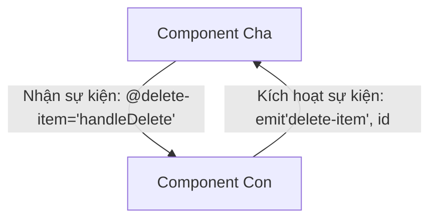

# Buổi 6: Custom Events & Provide/Inject

## 🎯 Mục tiêu học tập
- Giải thích được cách truyền thông tin ngược từ component con lên component cha bằng Custom Events.
- Sử dụng thành thạo compiler macro `defineEmits` để khai báo các sự kiện của component con.
- Sử dụng cặp tính năng `provide` và `inject` để truyền dữ liệu xuyên qua nhiều tầng component (Dependency Injection) mà không bị "prop-drilling".

---

## 📖 Lý thuyết cốt lõi

### 📊 Sơ đồ minh họa khái niệm:




---

### 1. Custom Events (Truyền thông tin con lên cha)
- Để giao tiếp ngược lên cha, component con phát ra (emit) một sự kiện kèm theo dữ liệu payload (nếu có).
- Trong `<script setup>`, dùng macro `defineEmits()` để định nghĩa các event mà component có thể phát ra.

```vue
<!-- Component con: DeleteButton.vue -->
<script setup>
const emit = defineEmits(['delete-item'])

function confirmAndDelete() {
  if (confirm('Bạn chắc chắn muốn xóa chứ?')) {
    emit('delete-item', 5)
  }
}
</script>

<template>
  <button @click="confirmAndDelete">Xóa mục này</button>
</template>
```

### 2. Provide / Inject (Truyền dữ liệu đa tầng)
- Khi ứng dụng có nhiều tầng lồng nhau sâu, việc truyền props qua từng tầng rất phức tạp.
- **`provide`**: Cung cấp dữ liệu từ component tổ tiên cho toàn bộ con cháu.
- **`inject`**: Component con ở bất kỳ cấp độ nào bên dưới cũng có thể lấy trực tiếp dữ liệu này mà không cần qua trung gian.

---

## 💻 Ví dụ thực tiễn
```javascript
// Tại Component Cha
import { provide, ref } from 'vue'
const theme = ref('dark')
provide('globalTheme', theme)

// Tại Component Con/Cháu bất kỳ
import { inject } from 'vue'
const currentTheme = inject('globalTheme')
```

---

## 🛠️ Bài tập thực hành (Lab)
### Yêu cầu: Phát sự kiện Xóa sản phẩm khỏi giỏ hàng từ Component con
1. Tham khảo cấu trúc trang giỏ hàng tại [cart.html](https://letrongdat.vercel.app/vuejs/templates/cart.html) (chú ý phần hiển thị từng item trong giỏ hàng ở dòng **73 đến 100**).
2. Tạo component con `CartItem.vue` đại diện cho một sản phẩm trong giỏ hàng.
3. Trong `CartItem.vue`:
   - Nhận prop `item` mô tả sản phẩm.
   - Định nghĩa sự kiện sẽ phát ra bằng `defineEmits`:
     ```javascript
     const emit = defineEmits(['remove-item'])
     ```
   - Tại nút "Xóa" (dòng **94-97** của [cart.html](https://letrongdat.vercel.app/vuejs/templates/cart.html)), gắn sự kiện click gọi hàm:
     ```javascript
     function handleRemove() {
       emit('remove-item', props.item.id)
     }
     ```
4. Tại component cha `CartManager.vue`:
   - Import và render danh sách `<CartItem v-for="prod in cartList" :key="prod.id" :item="prod" @remove-item="removeItemFromList" />`.
   - Viết hàm `removeItemFromList(id)` để lọc bỏ phần tử có ID tương ứng ra khỏi giỏ hàng thực tế.


<details class="details custom-block">
  <summary>🔑 Xem gợi ý giải pháp (Code mẫu)</summary>


```vue
<!-- components/CartItem.vue -->
<script setup>
defineProps({
  item: Object
})
const emit = defineEmits(['delete-item'])
</script>

<template>
  <div class="flex justify-between items-center p-4 border-b">
    <span>{{ item.name }}</span>
    <button @click="emit('delete-item', item.id)" class="text-red-500">Xóa</button>
  </div>
</template>
```

</details>

---

## ❓ Trắc nghiệm nhanh
**1. Khai báo sự kiện mà component con có thể phát ra sử dụng hàm macro nào?**
- A. `defineEvents()`
- B. `defineEmits()`
- C. `defineProps()`
- D. `fireEvents()`
<details class="details custom-block">
  <summary>Xem giải đáp</summary>

  *Đáp án đúng: **B**.*
</details>

**2. Đoạn mã HTML nút Xóa sản phẩm nằm ở khoảng dòng nào trong cart.html?**
- A. Dòng 35 đến 45.
- B. Dòng 88 đến 92.
- C. Dòng 94 đến 97.
- D. Dòng 137 đến 165.
<details class="details custom-block">
  <summary>Xem giải đáp</summary>

  *Đáp án đúng: **C**.*
</details>

**3. Để bắt sự kiện click và truyền ID sản phẩm lên cha, component con sử dụng cú pháp nào?**
- A. `emit('remove-item', id)`
- B. `this.$emit('remove-item')`
- C. `send('remove-item')`
- D. `dispatch('remove-item')`
<details class="details custom-block">
  <summary>Xem giải đáp</summary>

  *Đáp án đúng: **A**.*
</details>

---

