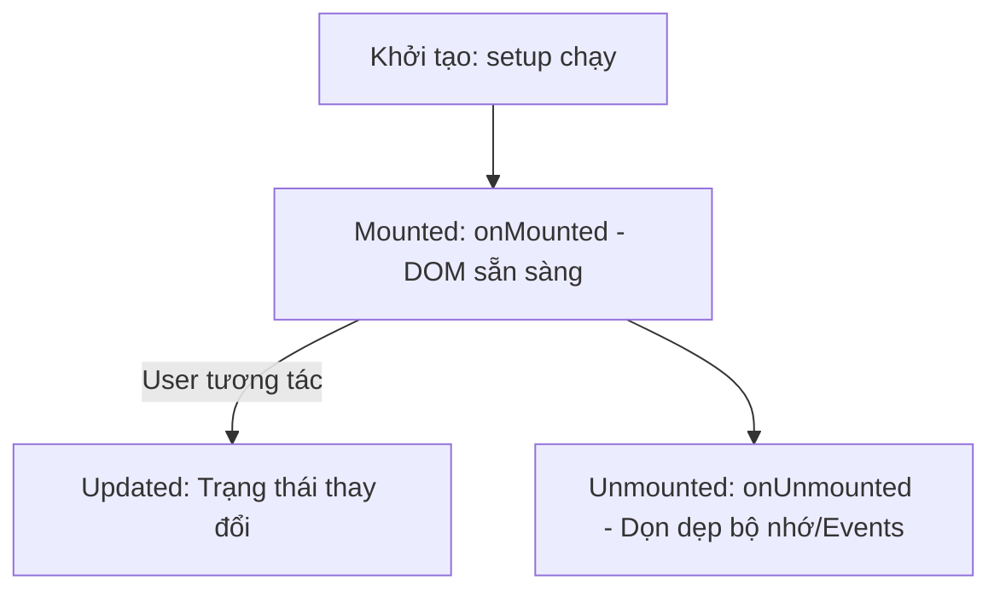

# Buổi 8: Lifecycle Hooks & Template Refs

## 🎯 Mục tiêu học tập
- Giải thích được các giai đoạn chính trong vòng đời của một component (Creation, Mounting, Updating, Destruction).
- Sử dụng các hook vòng đời thông dụng: `onMounted`, `onUnmounted` trong Composition API.
- Áp dụng Template Refs để tự động focus vào các trường nhập liệu của form.
- Khởi tạo thành công các thư viện giao diện bên thứ ba (như Lucide Icons) khi component được mounted.

---

## 📖 Lý thuyết cốt lõi

### 📊 Sơ đồ minh họa khái niệm:



---

### 1. Vòng đời của Component (Lifecycle Hooks)
- **`onMounted()`**: Chạy ngay sau khi component được chèn vào DOM thật. Đây là nơi tốt nhất để gọi API, tương tác DOM hoặc khởi tạo thư viện icons, slide.
- **`onUnmounted()`**: Chạy sau khi component bị gỡ bỏ khỏi DOM. Dùng để dọn dẹp các timer, sự kiện chạy ngầm.

### 2. Template Refs (Truy cập DOM trực tiếp)
- Dùng để liên kết một biến ref trong script với một phần tử HTML trên template để trực tiếp gọi các phương thức DOM gốc.
  ```vue
  <script setup>
  import { ref, onMounted } from 'vue'
  const emailInput = ref(null)
  
  onMounted(() => {
    emailInput.value.focus() // Tự động focus ô nhập
  })
  </script>
  <template>
    <input ref="emailInput" type="email" />
  </template>
  ```

---

## 💻 Ví dụ thực tiễn
Khởi tạo icon Lucide khi trang web mount vào DOM:
```vue
<script setup>
import { onMounted } from 'vue'

onMounted(() => {
  // Giả lập khởi chạy các icon trên giao diện mẫu
  if (typeof lucide !== 'undefined') {
    lucide.createIcons()
  }
})
</script>

<template>
  <button class="flex items-center space-x-2">
    <i data-lucide="shopping-cart" class="w-5 h-5"></i>
    <span>Thêm vào giỏ</span>
  </button>
</template>
```

---

## 🛠️ Bài tập thực hành (Lab)
### Yêu cầu: Tự động focus ô nhập liệu Form đăng nhập & Khởi chạy Lucide Icons
1. Xem giao diện trang đăng nhập tại [login.html](https://letrongdat.vercel.app/vuejs/templates/login.html).
2. Tạo component Vue `LoginView.vue` trong dự án của các em. Copy toàn bộ giao diện HTML trong thẻ `<main>` của [login.html](https://letrongdat.vercel.app/vuejs/templates/login.html) vào template.
3. Trong script setup:
   - Sử dụng `onMounted()` để gọi hàm `lucide.createIcons()` giúp hiển thị các biểu tượng đẹp mắt trên form đăng nhập ngay khi tải trang.
   - Tạo một biến ref `const emailField = ref(null)`.
   - Trên template, gắn thuộc tính `ref="emailField"` vào ô nhập liệu Email đăng nhập.
   - Trong `onMounted()`, gọi `emailField.value.focus()` để tự động kích hoạt con trỏ chuột vào ô nhập email giúp nâng cao trải nghiệm người dùng (UX).

<details class="details custom-block">
  <summary>🔑 Xem gợi ý giải pháp (Code mẫu)</summary>

```vue
<script setup>
import { ref, onMounted, onUnmounted } from 'vue'

const inputRef = ref(null)

onMounted(() => {
  if (inputRef.value) {
    inputRef.value.focus()
  }
  console.log("Component đã được gắn kết!")
})

onUnmounted(() => {
  console.log("Component dọn dẹp trước khi hủy!")
})
</script>

<template>
  <div class="p-6">
    <input ref="inputRef" type="text" placeholder="Tự động focus khi vào trang..." class="border p-2" />
  </div>
</template>
```

</details>

---

## ❓ Trắc nghiệm nhanh
**1. Hook nào được gọi ngay sau khi component đã kết xuất giao diện và chèn vào DOM thật?**
- A. `onCreated()`
- B. `onMounted()`
- C. `onUpdated()`
- D. `onRendered()`
<details class="details custom-block">
  <summary>Xem giải đáp</summary>

  *Đáp án đúng: **B**.*
</details>

**2. Để liên kết biến ref trong script setup với thẻ `<input ref="passwordField">` ta làm thế nào?**
- A. `const passwordField = ref(null)`
- B. `const ref = passwordField`
- C. `const myInput = ref('passwordField')`
- D. `document.querySelector('input')`
<details class="details custom-block">
  <summary>Xem giải đáp</summary>

  *Đáp án đúng: **A**.*
</details>

**3. Tại thời điểm nào thì thuộc tính `.value` của một Template Ref sẽ khác `null`?**
- A. Ngay khi khai báo biến.
- B. Khi component đã hoàn thành Mounted (`onMounted`).
- C. Khi người dùng click chuột.
- D. Khi component bị Unmounted.
<details class="details custom-block">
  <summary>Xem giải đáp</summary>

  *Đáp án đúng: **B**.*
</details>

---
