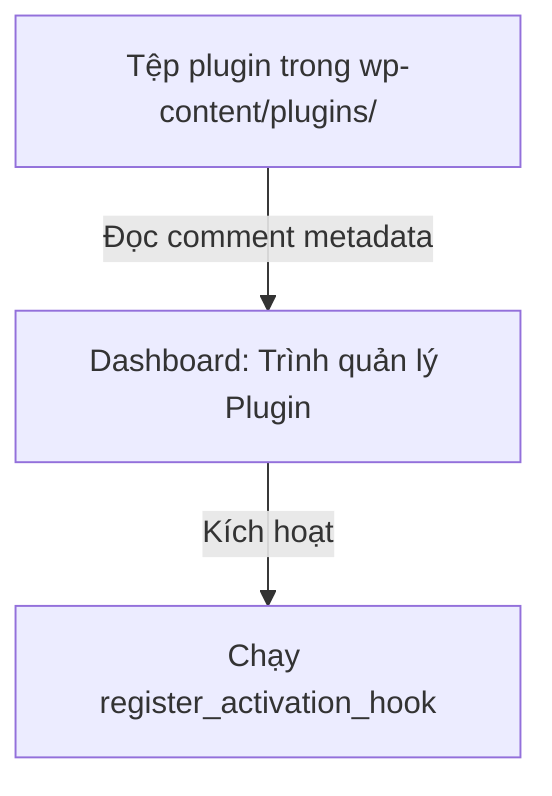

# Buổi 1: Kiến trúc hệ thống WordPress, Cấu trúc thư mục & Vòng đời của một Plugin
**Dự án**: ZenTask Plugin Development  

---

## 🎯 Mục tiêu học tập
- Khởi tạo tệp tin khai báo plugin và kích hoạt thành công trong hệ thống WordPress.

---

## 📖 Lý thuyết cốt lõi

### 📊 Sơ đồ vòng đời hoạt động của Plugin:


---

## 🛠️ Bài tập thực hành (Lab)
Tạo file plugin khai báo đầy đủ thông tin metadata ở đầu tệp và kích hoạt từ Dashboard.

<details class="details custom-block">
  <summary>🔑 Xem gợi ý giải pháp (Code mẫu)</summary>

Tạo tệp `wp-content/plugins/zentask-plugin/zentask-plugin.php`:
```php
<?php
/*
Plugin Name: ZenTask Core Features
Description: Các tính năng cốt lõi bổ sung cho website.
Version: 1.0
Author: Instructor
*/
```
</details>

---

## ❓ Trắc nghiệm nhanh
**1. Plugin WordPress bắt buộc phải nằm ở thư mục con nào?**
- A. `wp-includes`
- B. `wp-content/plugins`
- C. `wp-admin/plugins`
- D. `wp-content/themes`
<details class="details custom-block">
  <summary>Xem giải đáp</summary>

  *Đáp án đúng: **B**.*
</details>
