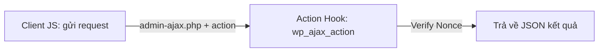

# Buổi 10: Tích hợp các cổng tương tác AJAX Requests an toàn trong Plugin
**Dự án**: ZenTask Plugin Development  

---

## 🎯 Mục tiêu học tập
- Gửi dữ liệu an toàn lên backend không tải lại trang bằng WordPress AJAX và Nonces.

---

## 📖 Lý thuyết cốt lõi

### 📊 Sơ đồ AJAX trong WordPress:


---

## 🛠️ Bài tập thực hành (Lab)
Xử lý một yêu cầu AJAX đếm lượt thích bài viết an toàn có kèm nonce verification.

<details class="details custom-block">
  <summary>🔑 Xem gợi ý giải pháp (Code mẫu)</summary>

Trong PHP:
```php
add_action( 'wp_ajax_like_post', 'handle_ajax_like_post' );
add_action( 'wp_ajax_nopriv_like_post', 'handle_ajax_like_post' );

function handle_ajax_like_post() {
    check_ajax_referer( 'ajax_like_nonce_action', 'security' );
    
    // Xử lý tăng like...
    wp_send_json_success( array( 'message' => 'Đã thích bài viết!' ) );
}
```
</details>

---

## ❓ Trắc nghiệm nhanh
**1. Hàm nào dùng để kiểm tra bảo mật Nonce cho các yêu cầu gửi bằng AJAX?**
- A. `check_admin_referer()`
- B. `check_ajax_referer()`
- C. `verify_nonce()`
- D. `is_valid_ajax()`
<details class="details custom-block">
  <summary>Xem giải đáp</summary>

  *Đáp án đúng: **B**.*
</details>
