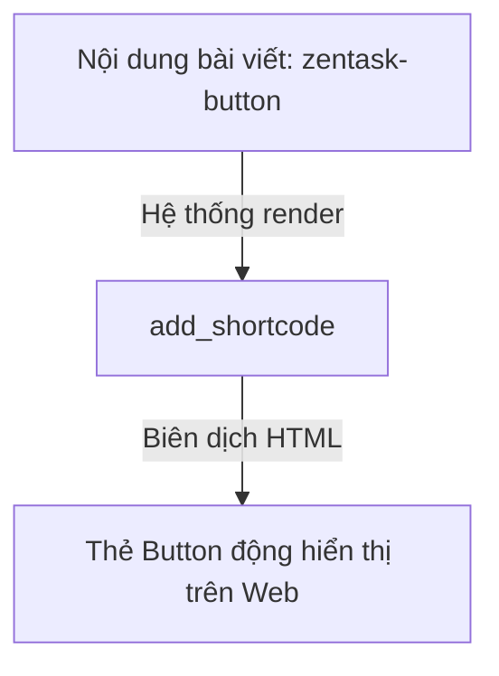

# Buổi 11: Lập trình tạo Shortcodes & Custom Widgets trong Plugin
**Dự án**: ZenTask Plugin Development  

---

## 🎯 Mục tiêu học tập
- Đăng ký và hiển thị Shortcode để người dùng chèn nhanh chức năng động vào nội dung bài viết.

---

## 📖 Lý thuyết cốt lõi

### 📊 Sơ đồ biên dịch Shortcode:


---

## 🛠️ Bài tập thực hành (Lab)
Viết Shortcode `[zentask_button]` để tự động sinh ra một thẻ Button có CSS màu xanh.

<details class="details custom-block">
  <summary>🔑 Xem gợi ý giải pháp (Code mẫu)</summary>

```php
function zentask_custom_button_shortcode( $atts ) {
    $args = shortcode_atts( array(
        'text' => 'Click ngay',
    ), $atts );
    
    return '<button class="blue-btn">' . esc_html( $args['text'] ) . '</button>';
}
add_shortcode( 'zentask_button', 'zentask_custom_button_shortcode' );
```
</details>

---

## ❓ Trắc nghiệm nhanh
**1. Hàm nào dùng để đăng ký một shortcode mới?**
- A. `register_shortcode()`
- B. `add_shortcode()`
- C. `create_shortcode()`
- D. `hook_shortcode()`
<details class="details custom-block">
  <summary>Xem giải đáp</summary>

  *Đáp án đúng: **B**.*
</details>
