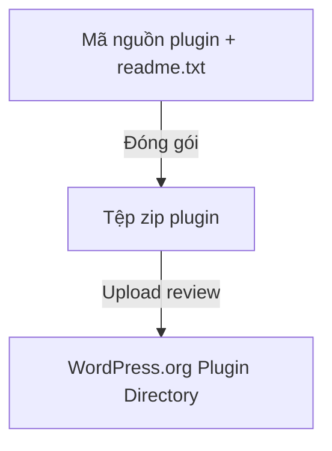

# Buổi 12: Đóng gói, Viết hướng dẫn sử dụng và Quy trình phát hành Plugin lên WordPress.org

**Loại buổi**: Thực hành  
**Thời lượng**: 120 phút  
**Dự án**: ZenTask Plugin Development  

---

## 🎯 Mục tiêu học tập
- Cấu hình file README.txt và đóng gói plugin chuẩn để tải lên thư viện WordPress chính thức.

---

## 📖 Lý thuyết cốt lõi

### 📊 Sơ đồ xuất bản Plugin:


---

## 🛠️ Bài tập thực hành (Lab)
Tạo file `readme.txt` chứa mô tả tóm tắt plugin theo định dạng chuẩn của WordPress.org.

<details class="details custom-block">
  <summary>🔑 Xem gợi ý giải pháp (Code mẫu)</summary>

Tạo tệp `readme.txt` ở thư mục gốc của plugin:
```text
=== ZenTask View Counter ===
Contributors: instructor_dat
Tags: views, analytics
Stable tag: 1.0.0
License: GPLv2 or later

== Description ==
Plugin đếm lượt xem bài viết chi tiết an toàn và hiệu suất cao.
```
</details>

---

## ❓ Trắc nghiệm nhanh
**1. Định dạng file hướng dẫn cài đặt/metadata bắt buộc khi đưa plugin lên kho của WordPress.org là gì?**
- A. `readme.md`
- B. `readme.txt`
- C. `install.html`
- D. `setup.json`
<details class="details custom-block">
  <summary>Xem giải đáp</summary>

  *Đáp án đúng: **B**.*
</details>

