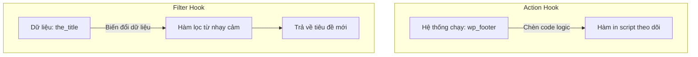

# Buổi 2: Làm chủ Action Hooks và Filter Hooks

**Loại buổi**: Thực hành  
**Thời lượng**: 120 phút  
**Dự án**: ZenTask Plugin Development  

---

## 🎯 Mục tiêu học tập
- Phân biệt và ứng dụng Action Hooks và Filter Hooks trong lập trình plugin.

---

## 📖 Lý thuyết cốt lõi

### 📊 Sơ đồ luồng nạp Hook:


---

## 🛠️ Bài tập thực hành (Lab)
Viết bộ lọc `the_content` tự động chèn thêm chữ ký liên hệ ở cuối mỗi bài viết.

<details class="details custom-block">
  <summary>🔑 Xem gợi ý giải pháp (Code mẫu)</summary>

```php
function add_my_signature( $content ) {
    if ( is_single() ) {
        $signature = '<p class="sig">Cảm ơn bạn đã đọc bài viết!</p>';
        return $content . $signature;
    }
    return $content;
}
add_filter( 'the_content', 'add_my_signature' );
```
</details>

---

## ❓ Trắc nghiệm nhanh
**1. Loại hook nào cho phép nhận dữ liệu vào, chỉnh sửa và bắt buộc phải trả về giá trị (return)?**
- A. Action Hook
- B. Filter Hook
- C. Option Hook
- D. Transient Hook
<details class="details custom-block">
  <summary>Xem giải đáp</summary>

  *Đáp án đúng: **B**.*
</details>

