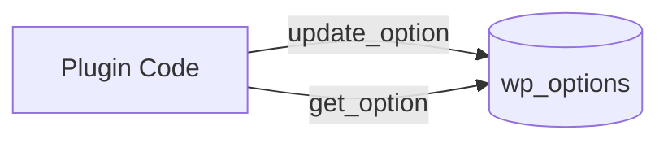

# Buổi 3: Quản lý cấu hình với Options API & Caching nâng cao với Transients API

**Loại buổi**: Lý thuyết  
**Thời lượng**: 120 phút  
**Dự án**: ZenTask Plugin Development  

---

## 🎯 Mục tiêu học tập
- Lưu trữ cấu hình plugin bằng Options API và tạo bộ nhớ đệm bằng Transients API.

---

## 📖 Lý thuyết cốt lõi

### 📊 Sơ đồ lưu và lấy Option:


---

## 🛠️ Bài tập thực hành (Lab)
Lưu cấu hình bật/tắt một tính năng của plugin vào database.

<details class="details custom-block">
  <summary>🔑 Xem gợi ý giải pháp (Code mẫu)</summary>

```php
// Lưu cấu hình
update_option( 'zentask_feature_enabled', '1' );

// Lấy cấu hình hiển thị
$is_enabled = get_option( 'zentask_feature_enabled', '0' );
```
</details>

---

## ❓ Trắc nghiệm nhanh
**1. Hàm nào dùng để lưu trữ hoặc cập nhật dữ liệu cấu hình vào bảng `wp_options`?**
- A. `save_option()`
- B. `update_option()`
- C. `set_option()`
- D. `insert_option()`
<details class="details custom-block">
  <summary>Xem giải đáp</summary>

  *Đáp án đúng: **B**.*
</details>

