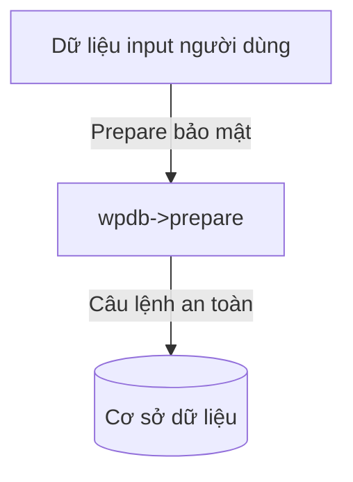

# Buổi 4: Tương tác cơ sở dữ liệu tùy biến (Lớp $wpdb & Prepared Statements)
**Dự án**: ZenTask Plugin Development  

---

## 🎯 Mục tiêu học tập
- Kết nối SQL trực tiếp và an toàn, phòng chống SQL Injection bằng `$wpdb->prepare()`.

---

## 📖 Lý thuyết cốt lõi

### 📊 Sơ đồ chuẩn hóa truy vấn an toàn:


---

## 🛠️ Bài tập thực hành (Lab)
Tìm nạp các bản ghi từ bảng posts theo ID truyền vào an toàn.

<details class="details custom-block">
  <summary>🔑 Xem gợi ý giải pháp (Code mẫu)</summary>

```php
global $wpdb;
$post_id = intval( $_GET['id'] );

$query = $wpdb->prepare(
    "SELECT * FROM {$wpdb->posts} WHERE ID = %d",
    $post_id
);
$result = $wpdb->get_row( $query );
```
</details>

---

## ❓ Trắc nghiệm nhanh
**1. Hàm nào của đối tượng `$wpdb` dùng để chống lỗ hổng SQL Injection?**
- A. `query()`
- B. `escape()`
- C. `prepare()`
- D. `protect()`
<details class="details custom-block">
  <summary>Xem giải đáp</summary>

  *Đáp án đúng: **C**.*
</details>
