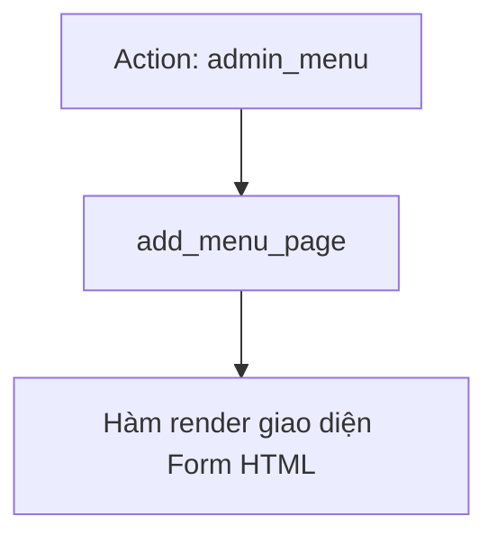

# Buổi 5: Lập trình trang cấu trị Admin Settings Page & Settings API của WordPress
**Dự án**: ZenTask Plugin Development  

---

## 🎯 Mục tiêu học tập
- Đăng ký và hiển thị trang cài đặt tùy chỉnh cho plugin trong Admin Dashboard.

---

## 📖 Lý thuyết cốt lõi

### 📊 Sơ đồ đăng ký Admin Page:


---

## 🛠️ Bài tập thực hành (Lab)
Tạo trang cài đặt riêng cho Plugin trong Dashboard Admin.

<details class="details custom-block">
  <summary>🔑 Xem gợi ý giải pháp (Code mẫu)</summary>

```php
function my_plugin_menu() {
    add_menu_page(
        'Cài đặt ZenTask',
        'ZenTask',
        'manage_options',
        'zentask-admin-slug',
        'zentask_admin_page_html'
    );
}
add_action( 'admin_menu', 'my_plugin_menu' );

function zentask_admin_page_html() {
    echo '<div class="wrap"><h1>Cấu hình Plugin ZenTask</h1></div>';
}
```
</details>

---

## ❓ Trắc nghiệm nhanh
**1. Quyền hạn (capability) tối thiểu thường dùng để cho phép Admin truy cập trang cài đặt là gì?**
- A. `read`
- B. `edit_posts`
- C. `manage_options`
- D. `administrator`
<details class="details custom-block">
  <summary>Xem giải đáp</summary>

  *Đáp án đúng: **C**.*
</details>
