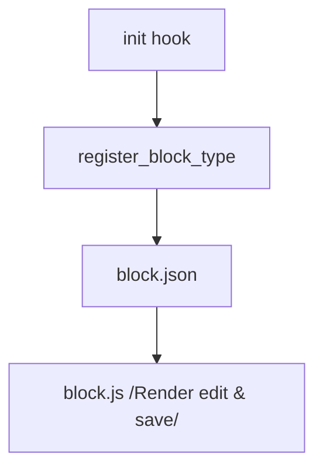

# Buổi 6: Gutenberg Block Development - Khởi đầu với Custom Blocks

**Loại buổi**: Thực hành  
**Thời lượng**: 120 phút  
**Dự án**: ZenTask Plugin Development  

---

## 🎯 Mục tiêu học tập
- Tạo và khai báo thành công một block tùy biến tĩnh cho trình soạn thảo Gutenberg Block Editor.

---

## 📖 Lý thuyết cốt lõi

### 📊 Sơ đồ đăng ký Gutenberg Block:


---

## 🛠️ Bài tập thực hành (Lab)
Khai báo và đăng ký một Block hiển thị thông báo liên hệ tĩnh.

<details class="details custom-block">
  <summary>🔑 Xem gợi ý giải pháp (Code mẫu)</summary>

Trong `block.json`:
```json
{
  "apiVersion": 3,
  "name": "myplugin/contact-block",
  "title": "Contact Block",
  "category": "widgets",
  "editorScript": "file:./block.js"
}
```

Đăng ký block trong PHP:
```php
register_block_type( __DIR__ . '/blocks/contact-block' );
```
</details>

---

## ❓ Trắc nghiệm nhanh
**1. Gutenberg Block hiển thị thông tin soạn thảo thông qua tệp cấu hình nào?**
- A. `config.xml`
- B. `block.json`
- C. `setup.php`
- D. `package.json`
<details class="details custom-block">
  <summary>Xem giải đáp</summary>

  *Đáp án đúng: **B**.*
</details>

