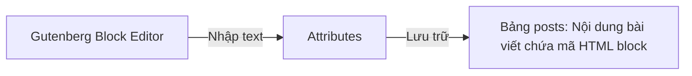

# Buổi 7: Block Attributes, Block States & Sử dụng React/JS trong Editor
**Dự án**: ZenTask Plugin Development  

---

## 🎯 Mục tiêu học tập
- Quản lý các thuộc tính động và lưu nội dung block động do người dùng nhập từ Editor.

---

## 📖 Lý thuyết cốt lõi

### 📊 Sơ đồ quản lý thuộc tính (Attributes):


---

## 🛠️ Bài tập thực hành (Lab)
Sử dụng component `RichText` của Gutenberg để cho phép sửa đổi tiêu đề block động.

<details class="details custom-block">
  <summary>🔑 Xem gợi ý giải pháp (Code mẫu)</summary>

```javascript
// block.js (Gutenberg RichText)
registerBlockType( 'myplugin/text-block', {
    attributes: {
        content: { type: 'string', source: 'html', selector: 'p' }
    },
    edit: function( props ) {
        return el( RichText, {
            tagName: 'p',
            value: props.attributes.content,
            onChange: function( newContent ) { props.setAttributes( { content: newContent } ); }
        } );
    },
    save: function( props ) {
        return el( RichText.Content, { tagName: 'p', value: props.attributes.content } );
    }
} );
```
</details>

---

## ❓ Trắc nghiệm nhanh
**1. Component nào dùng để cho phép soạn thảo văn bản giàu (rich text) trong Gutenberg block?**
- A. `TextControl`
- B. `RichText`
- C. `InputArea`
- D. `TextAreaControl`
<details class="details custom-block">
  <summary>Xem giải đáp</summary>

  *Đáp án đúng: **B**.*
</details>
