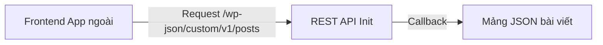

# Buổi 8: Đăng ký Custom REST API Endpoints trong Plugin
**Dự án**: ZenTask Plugin Development  

---

## 🎯 Mục tiêu học tập
- Đăng ký REST API Route tùy biến để trả về dữ liệu chuẩn JSON cho Vue/React App.

---

## 📖 Lý thuyết cốt lõi

### 📊 Sơ đồ API Endpoint:


---

## 🛠️ Bài tập thực hành (Lab)
Đăng ký route `/wp-json/zentask/v1/posts` trả về danh sách ID và Tiêu đề bài viết.

<details class="details custom-block">
  <summary>🔑 Xem gợi ý giải pháp (Code mẫu)</summary>

```php
add_action( 'rest_api_init', function () {
    register_rest_route( 'zentask/v1', '/posts', array(
        'methods' => 'GET',
        'callback' => 'my_api_callback',
        'permission_callback' => '__return_true'
    ) );
} );

function my_api_callback() {
    $posts = get_posts( array( 'posts_per_page' => 5 ) );
    return rest_ensure_response( $posts );
}
```
</details>

---

## ❓ Trắc nghiệm nhanh
**1. Hook nào dùng để đăng ký các REST API routes?**
- A. `init`
- B. `wp_loaded`
- C. `rest_api_init`
- D. `admin_init`
<details class="details custom-block">
  <summary>Xem giải đáp</summary>

  *Đáp án đúng: **C**.*
</details>
