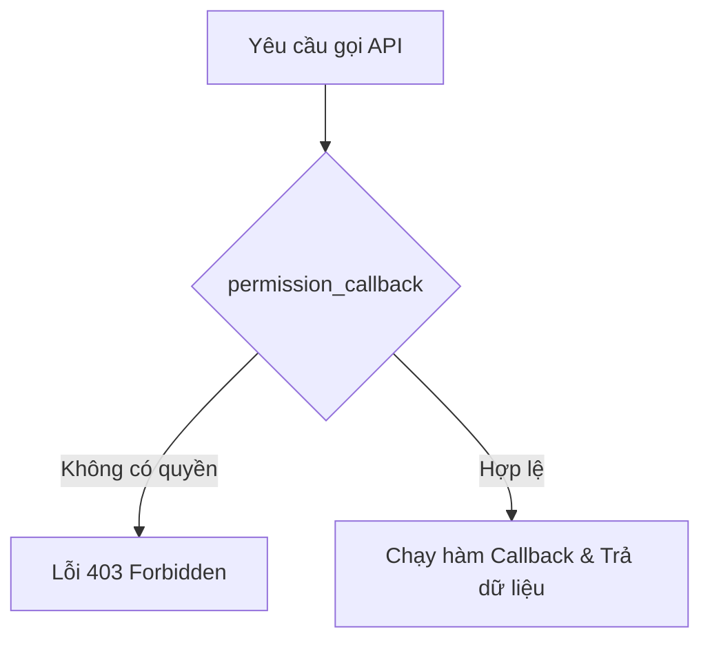

# Buổi 9: Bảo mật API (Permission Callbacks, Nonce verification cho REST requests)

**Loại buổi**: Lý thuyết  
**Thời lượng**: 120 phút  
**Dự án**: ZenTask Plugin Development  

---

## 🎯 Mục tiêu học tập
- Bảo vệ Endpoint của REST API bằng cách kiểm tra quyền hạn (Permission Callback).

---

## 📖 Lý thuyết cốt lõi

### 📊 Sơ đồ bảo mật REST API:


---

## 🛠️ Bài tập thực hành (Lab)
Cấu hình giới hạn chỉ cho phép người dùng có quyền quản trị cài đặt (`manage_options`) được truy xuất dữ liệu API.

<details class="details custom-block">
  <summary>🔑 Xem gợi ý giải pháp (Code mẫu)</summary>

```php
register_rest_route( 'zentask/v1', '/secure-data', array(
    'methods' => 'GET',
    'callback' => 'my_secure_callback',
    'permission_callback' => function() {
        return current_user_can( 'manage_options' );
    }
) );
```
</details>

---

## ❓ Trắc nghiệm nhanh
**1. Tham số nào trong mảng khai báo route quy định hàm kiểm tra phân quyền bảo mật của API?**
- A. `'auth_callback'`
- B. `'permission_callback'`
- C. `'check_permissions'`
- D. `'security_callback'`
<details class="details custom-block">
  <summary>Xem giải đáp</summary>

  *Đáp án đúng: **B**.*
</details>

