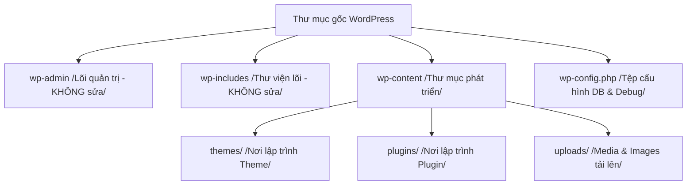

# Bài 1: Thiết lập môi trường phát triển local

**Loại buổi**: Lý thuyết  
**Thời lượng**: 120 phút  
**Dự án**: ZenTask WooCommerce Theme Development  

---

## 🎯 Mục tiêu học tập
- Cài đặt thành công LocalWP để khởi tạo website WordPress cục bộ trên máy tính cá nhân.
- Nắm rõ vai trò của các thư mục và tệp tin cốt lõi trong WordPress (`wp-admin`, `wp-includes`, `wp-content`).
- Cấu hình tệp `wp-config.php` để bật chế độ gỡ lỗi `WP_DEBUG` phục vụ phát triển.

---

## 📖 Lý thuyết cốt lõi

### 1. Tại sao cần môi trường phát triển cục bộ (Local)?
Khi phát triển giao diện (Theme) hoặc tính năng (Plugin) cho WordPress, chúng ta tuyệt đối **không** code trực tiếp trên hosting/server đang chạy thực tế (Production). Thay vào đó, chúng ta phát triển trên máy cá nhân để:
- Tránh làm sập website đang hoạt động khi gặp lỗi cú pháp PHP.
- Không phụ thuộc vào tốc độ đường truyền Internet khi tải file.
- Dễ dàng kiểm tra, gỡ lỗi (debug) mà không hiển thị thông tin nhạy cảm cho người dùng ngoài.

### 2. Cấu trúc thư mục của một dự án WordPress
Sau khi cài đặt xong WordPress, cấu trúc thư mục mặc định bao gồm các thành phần quan trọng sau:
- **`wp-admin/`**: Chứa toàn bộ mã nguồn của trang quản trị Dashboard. Không được phép chỉnh sửa mã trong thư mục này.
- **`wp-includes/`**: Chứa tất cả các thư viện, lớp, hàm lõi (core) hỗ trợ hệ thống WordPress hoạt động. Không được chỉnh sửa.
- **`wp-content/`**: Đây là vùng đất dành cho lập trình viên. Thư mục này chứa:
  - `themes/`: Nơi lưu trữ tất cả các giao diện của trang web. Bạn sẽ code theme của mình trong này.
  - `plugins/`: Nơi cài đặt và lập trình các plugin mở rộng tính năng.
  - `uploads/`: Chứa hình ảnh, media do người dùng tải lên từ Dashboard.
- **`wp-config.php`**: File cấu hình quan trọng nhất ở thư mục gốc, lưu trữ thông số kết nối Database (DB_NAME, DB_USER, DB_PASSWORD, DB_HOST) và các hằng số bảo mật.

### 📊 Sơ đồ cấu trúc thư mục WordPress:


### 3. Cấu hình gỡ lỗi (Debugging) trong `wp-config.php`
Mặc định WordPress sẽ ẩn tất cả các lỗi PHP để đảm bảo giao diện hiển thị sạch sẽ. Tuy nhiên, khi lập trình, ta cần bật debug hiển thị lỗi chi tiết để tìm nguyên nhân và khắc phục.
Mở file `wp-config.php` ở thư mục gốc và tìm đến dòng `define('WP_DEBUG', false);`, thay thế bằng đoạn mã sau:

```php
// Bật chế độ ghi nhận lỗi PHP
define( 'WP_DEBUG', true );

// Ghi lỗi vào file log ẩn tại wp-content/debug.log
define( 'WP_DEBUG_LOG', true );

// Hiển thị trực tiếp lỗi lên màn hình trình duyệt để theo dõi nhanh
define( 'WP_DEBUG_DISPLAY', true );
@ini_set( 'display_errors', 1 );
```

---

## 💻 Ví dụ thực tiễn
Dưới đây là một đoạn trích trong tệp `wp-config.php` chuẩn đã cấu hình thông số kết nối Database và bật gỡ lỗi:

```php
<?php
// ** Thiết lập MySQL ** //
define( 'DB_NAME', 'local_wp_db' );
define( 'DB_USER', 'root' );
define( 'DB_PASSWORD', 'root' );
define( 'DB_HOST', 'localhost' );
define( 'DB_CHARSET', 'utf8' );

// Bật chế độ Debug phục vụ phát triển Theme
define( 'WP_DEBUG', true );
define( 'WP_DEBUG_LOG', true );
define( 'WP_DEBUG_DISPLAY', true );
```

---

## 🛠️ Bài tập thực hành (Lab)
1. Tải và cài đặt phần mềm **LocalWP** từ trang chủ.
2. Khởi tạo một trang web WordPress local mới có tên miền nội bộ `customshop.local`.
3. Truy cập thư mục cài đặt dự án, mở file `wp-config.php` bằng VS Code và bật chế độ Debug hiển thị lỗi lên màn hình.

<details class="details custom-block">
  <summary>🔑 Xem gợi ý giải pháp (Code mẫu)</summary>

Khi mở file `wp-config.php` tại thư mục cài đặt gốc của LocalWP, hãy tìm đoạn code:
```php
define( 'WP_DEBUG', false );
```
Thay thế nó bằng:
```php
define( 'WP_DEBUG', true );
define( 'WP_DEBUG_LOG', true );
define( 'WP_DEBUG_DISPLAY', true );
```
Sau đó lưu lại và tải lại trang Dashboard. Nếu có lỗi PHP xảy ra, hệ thống sẽ in trực tiếp lên màn hình thay vì hiển thị trang trắng.
</details>

---

## ❓ Trắc nghiệm nhanh
**1. Tại sao chúng ta KHÔNG được tự ý chỉnh sửa code trong thư mục `wp-admin` và `wp-includes`?**
- A. Do WordPress sẽ bị khóa không cho truy cập.
- B. Do code trong đó đã được mã hóa không thể sửa.
- C. Do khi cập nhật (update) phiên bản WordPress mới, toàn bộ các file trong hai thư mục này sẽ bị ghi đè và mất hết code tự sửa.
- D. Do làm website load chậm đi.
<details class="details custom-block">
  <summary>Xem giải đáp</summary>

  *Đáp án đúng: **C**. Mọi tùy biến phải được viết trong `wp-content/themes/` hoặc `wp-content/plugins/`.*
</details>

