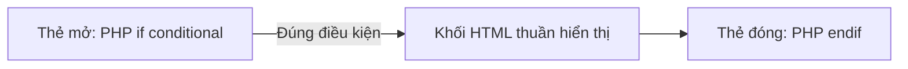

# Bài 2: Nền tảng PHP trong WordPress
**Dự án**: ZenTask WooCommerce Theme Development  

---

## 🎯 Mục tiêu học tập
- Nhúng và viết các câu lệnh điều kiện `if/else`, vòng lặp `foreach` lồng ghép trực tiếp vào giao diện HTML.
- Nắm rõ cách ngắt thẻ PHP (`<?php ?>`) để viết mã HTML sạch sẽ, chuẩn SEO.

---

## 📖 Lý thuyết cốt lõi

### 1. Cú pháp PHP lồng HTML (Alternative Syntax)
Khi phát triển Theme WordPress, thầy trò mình phải in ra giao diện HTML rất nhiều. Việc viết chuỗi HTML bên trong lệnh `echo` của PHP rất dễ gây lỗi nháy kép `"` hoặc nháy đơn `'` và làm code rối rắm.
WordPress khuyến khích sử dụng cú pháp thay thế (Alternative Syntax) để lồng ghép HTML:
- Sử dụng dấu hai chấm `:` thay cho dấu mở ngoặc nhọn `{`.
- Sử dụng `endif;`, `endforeach;`, `endwhile;` thay cho dấu đóng ngoặc nhọn `}`.

**Ví dụ viết theo cách thông thường (Rối rắm):**
```php
<?php
if ($user_logged_in) {
    echo '<div class="profile-card"><p>Xin chào, Thành viên!</p></div>';
}
?>
```

**Ví dụ viết theo cú pháp thay thế (Sạch sẽ, dễ bảo trì):**
```php
<?php if ( $user_logged_in ) : ?>
    <div class="profile-card">
        <p>Xin chào, Thành viên!</p>
    </div>
<?php endif; ?>
```

### 📊 Sơ đồ luồng nạp mã PHP lồng HTML:


---

## 💻 Ví dụ thực tiễn
Dưới đây là ví dụ về cách duyệt mảng thông tin sản phẩm và in ra cấu trúc thẻ HTML Grid của trang bán hàng:

```php
<?php
// Mảng sản phẩm tĩnh để test giao diện
$products = [
    [
        'title' => 'Giày Nike Air Max',
        'price' => 3500000,
        'in_stock' => true
    ],
    [
        'title' => 'Áo Khoác Adidas',
        'price' => 1200000,
        'in_stock' => false
    ]
];
?>

<div class="product-grid">
    <?php foreach ( $products as $product ) : ?>
        <div class="product-item">
            <h3><?php echo esc_html( $product['title'] ); ?></h3>
            <p>Giá: <?php echo number_format( $product['price'] ); ?>đ</p>
            
            <?php if ( $product['in_stock'] ) : ?>
                <span class="badge badge-success">Còn hàng</span>
            <?php else : ?>
                <span class="badge badge-danger">Hết hàng</span>
            <?php endif; ?>
        </div>
    <?php endforeach; ?>
</div>
```

---

## 🛠️ Bài tập thực hành (Lab)
Khai báo một mảng chứa thông tin các danh mục sản phẩm (gồm tên danh mục và link). Dùng vòng lặp `foreach` viết theo cú pháp thay thế (Alternative Syntax) để render danh sách menu dạng `<ul>` và `<li>` ra ngoài màn hình.

<details class="details custom-block">
  <summary>🔑 Xem gợi ý giải pháp (Code mẫu)</summary>

```php
<?php
$categories = [
    ['name' => 'Thời trang nam', 'url' => '/nam'],
    ['name' => 'Thời trang nữ', 'url' => '/nu'],
    ['name' => 'Phụ kiện thể thao', 'url' => '/the-thao']
];
?>

<ul class="category-menu">
    <?php foreach ( $categories as $cat ) : ?>
        <li class="menu-item">
            <a href="<?php echo esc_url( $cat['url'] ); ?>">
                <?php echo esc_html( $cat['name'] ); ?>
            </a>
        </li>
    <?php endforeach; ?>
</ul>
```
</details>

---

## ❓ Trắc nghiệm nhanh
**1. Khai báo điều kiện lồng HTML nào sau đây đúng chuẩn cú pháp thay thế của WordPress?**
- A. `<?php if(cond) { ?> <p>text</p> <?php } ?>`
- B. `<?php if(cond) ?> <p>text</p> <?php endif; ?>`
- C. `<?php if(cond): ?> <p>text</p> <?php endif; ?>`
- D. `<?php if(cond) then ?> <p>text</p> <?php endif; ?>`
<details class="details custom-block">
  <summary>Xem giải đáp</summary>

  *Đáp án đúng: **C**. Phải sử dụng dấu hai chấm `:` sau điều kiện và kết thúc bằng `endif;`.*
</details>
