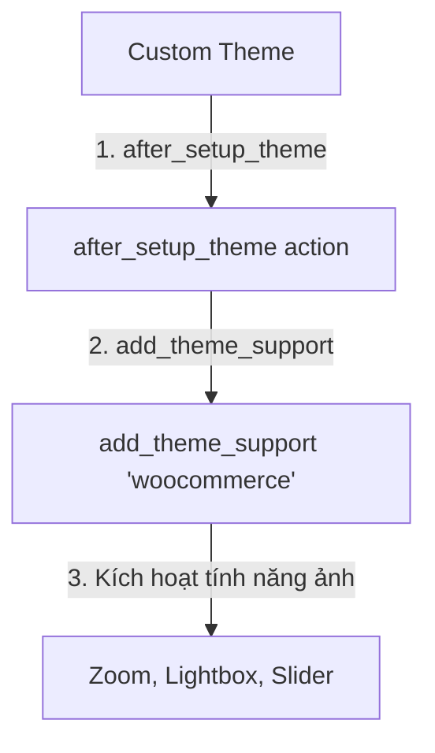

# Bài 21: Thiết lập WooCommerce & Theme Support
**Dự án**: ZenTask WooCommerce Theme Development  

---

## 🎯 Mục tiêu học tập
- Cài đặt plugin WooCommerce và khai báo hỗ trợ WooCommerce (`add_theme_support`) trong functions.php.
- Nắm rõ cách tùy biến kích thước và các thông số hiển thị mặc định của thư viện ảnh sản phẩm WooCommerce.

---

## 📖 Lý thuyết cốt lõi

### 1. Tại sao phải khai báo hỗ trợ WooCommerce?
Mặc định, khi các em cài đặt plugin WooCommerce lên một theme tự viết, WooCommerce sẽ sử dụng các tệp tin CSS và cấu trúc trang mặc định của nó. Điều này thường dẫn đến vỡ layout trang cửa hàng hoặc trang chi tiết sản phẩm.
Khai báo hỗ trợ theme bằng hàm `add_theme_support( 'woocommerce' )` sẽ báo cho WooCommerce biết rằng theme của các em đã sẵn sàng tiếp quản cấu trúc layout và tự style CSS lại.

### 2. Cú pháp khai báo add_theme_support
Ta cần khai báo hàm này trong action hook `after_setup_theme`:
```php
function custom_theme_woocommerce_support() {
    add_theme_support( 'woocommerce', array(
        'thumbnail_image_width' => 300,
        'single_image_width'    => 600,
        'product_grid'          => array(
            'default_rows'    => 3,
            'min_rows'        => 1,
            'max_rows'        => 6,
            'default_columns' => 4,
            'min_columns'     => 1,
            'max_columns'     => 6,
        ),
    ) );
}
add_action( 'after_setup_theme', 'custom_theme_woocommerce_support' );
```

### 3. Hỗ trợ các tính năng ảnh sản phẩm (Gallery Features)
Thầy trò mình có thể kích hoạt các tính năng xem ảnh cao cấp của WooCommerce mà không cần cài thêm plugin:
- `wc-product-gallery-zoom`: Di chuột vào ảnh để phóng to.
- `wc-product-gallery-lightbox`: Click vào ảnh để phóng to toàn màn hình.
- `wc-product-gallery-slider`: Tạo thanh trượt slide cho album ảnh phụ.

### 📊 Sơ đồ liên kết WooCommerce vào Theme:


---

## 💻 Ví dụ thực tiễn
Cấu hình hoàn chỉnh trong file `functions.php` của theme để tích hợp trơn tru với WooCommerce và kích hoạt tính năng zoom ảnh sản phẩm:

```php
<?php
// functions.php

function my_custom_shop_setup() {
    // 1. Khai báo hỗ trợ WooCommerce cơ bản
    add_theme_support( 'woocommerce' );
    
    // 2. Kích hoạt tính năng phóng to ảnh sản phẩm
    add_theme_support( 'wc-product-gallery-zoom' );
    
    // 3. Kích hoạt tính năng hiển thị lightbox ảnh album
    add_theme_support( 'wc-product-gallery-lightbox' );
    
    // 4. Kích hoạt slider chuyển ảnh album
    add_theme_support( 'wc-product-gallery-slider' );
}
add_action( 'after_setup_theme', 'my_custom_shop_setup' );
```

---

## 🛠️ Bài tập thực hành (Lab)
1. Các em các em hãy cài đặt plugin **WooCommerce** vào trang web local từ thư viện plugin.
2. Thêm đoạn mã khai báo hỗ trợ WooCommerce và kích hoạt 3 tính năng gallery ảnh sản phẩm (zoom, lightbox, slider) vào file `functions.php` của theme của các em.

<details class="details custom-block">
  <summary>🔑 Xem gợi ý giải pháp (Code mẫu)</summary>

Mở file `functions.php` trong thư mục theme và viết đoạn mã sau:
```php
<?php
function register_woocommerce_theme_support() {
    // Đăng ký tương thích WooCommerce
    add_theme_support( 'woocommerce' );
    
    // Đăng ký hiệu ứng xem ảnh chuyên nghiệp
    add_theme_support( 'wc-product-gallery-zoom' );
    add_theme_support( 'wc-product-gallery-lightbox' );
    add_theme_support( 'wc-product-gallery-slider' );
}
add_action( 'after_setup_theme', 'register_woocommerce_theme_support' );
```
Lưu lại, sau đó truy cập trang quản trị Admin WooCommerce > Status. Cảnh báo "Theme của các em không hỗ trợ WooCommerce" sẽ biến mất.
</details>

---

## ❓ Trắc nghiệm nhanh
**1. Tại sao cần gọi hàm `add_theme_support('woocommerce')` trong file `functions.php`?**
- A. Để cài đặt tự động WooCommerce từ xa.
- B. Để thông báo cho WooCommerce biết theme tự code sẽ tự chịu trách nhiệm cấu trúc layout và tắt các CSS ép buộc mặc định của WooCommerce.
- C. Để tự động import sản phẩm mẫu.
- D. Không có tác dụng gì.
<details class="details custom-block">
  <summary>Xem giải đáp</summary>

  *Đáp án đúng: **B**. Giúp lập trình viên kiểm soát hoàn toàn layout hiển thị của cửa hàng.*
</details>
