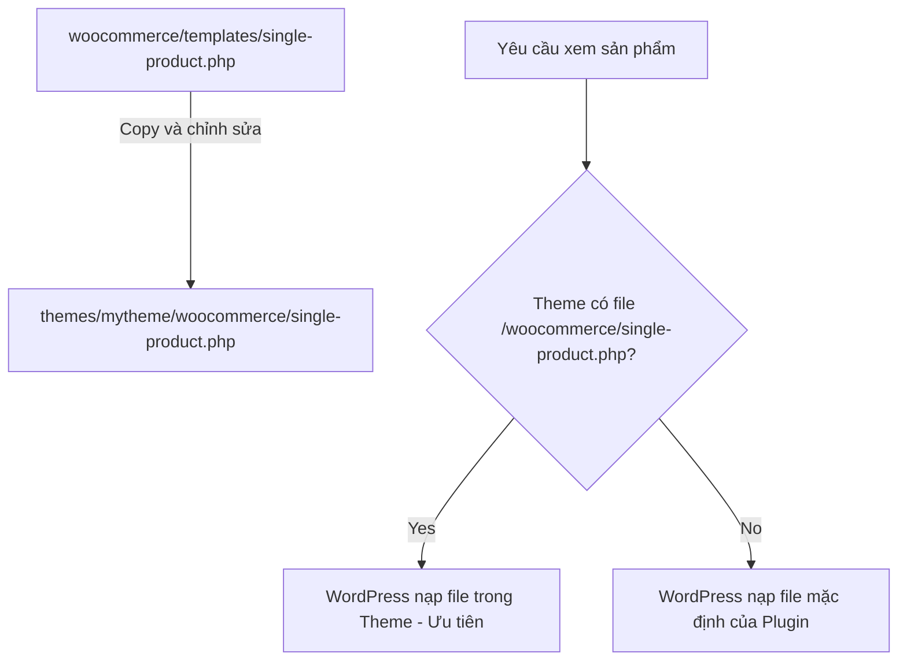

# Bài 22: Cơ chế WooCommerce Template Overrides
**Dự án**: ZenTask WooCommerce Theme Development  

---

## 🎯 Mục tiêu học tập
- Hiểu sâu sắc cơ chế đè giao diện (Template Overrides) của WooCommerce.
- Tổ chức cấu trúc thư mục theme để ghi đè thành công các tệp tin template của WooCommerce một cách an toàn.

---

## 📖 Lý thuyết cốt lõi

### 1. Cơ chế hoạt động của Template Overrides
WooCommerce chứa hàng chục tệp tin giao diện thành phần (như khung hiển thị giá, mô tả sản phẩm, giỏ hàng) nằm trong thư mục `wp-content/plugins/woocommerce/templates/`.
Khi render giao diện, WooCommerce sẽ tự động tìm kiếm trong thư mục theme của các em xem có tồn tại thư mục tên là `woocommerce/` chứa file trùng tên hay không:
- Nếu **CÓ**: Nó nạp file trong thư mục theme của các em (ưu tiên cao nhất).
- Nếu **KHÔNG**: Nó nạp file mặc định của plugin.

### 2. Nguyên tắc quan trọng khi đè template
- **Không bao giờ sửa trực tiếp file trong plugin WooCommerce**. Lỗi sẽ bị mất hoàn toàn khi plugin cập nhật.
- Chỉ sao chép đúng file các em cần chỉnh sửa sang thư mục theme. Ví dụ: Để sửa trang chi tiết sản phẩm, copy file từ:
  `plugins/woocommerce/templates/single-product.php` 
  sang 
  `themes/mytheme/woocommerce/single-product.php`.

### 📊 Sơ đồ cấu trúc đè template (Override):


---

## 💻 Ví dụ thực tiễn
Dưới đây là sơ đồ so sánh cấu trúc thư mục của plugin gốc và thư mục theme sau khi đã copy đè file sản phẩm thành công:

```
Vị trí file gốc trong Plugin:
wp-content/plugins/woocommerce/templates/
├── archive-product.php
├── single-product.php
└── loop/
    └── price.php

Vị trí file ghi đè trong Theme của các em:
wp-content/themes/mytheme/
├── functions.php
├── index.php
└── woocommerce/
    ├── archive-product.php
    ├── single-product.php
    └── loop/
        └── price.php
```

---

## 🛠️ Bài tập thực hành (Lab)
Các em các em hãy thực hiện sao chép file cấu trúc hiển thị sản phẩm trong vòng lặp `content-product.php` từ plugin WooCommerce vào thư mục theme của các em và tiến hành chỉnh sửa thử HTML bên trong.

<details class="details custom-block">
  <summary>🔑 Xem gợi ý giải pháp (Code mẫu)</summary>

1. Tạo thư mục tên là `woocommerce` trực tiếp trong thư mục theme `wp-content/themes/customshop/`.
2. Truy cập thư mục `wp-content/plugins/woocommerce/templates/`.
3. Tìm và sao chép tệp `content-product.php`.
4. Dán tệp vào thư mục `wp-content/themes/customshop/woocommerce/`.
5. Mở tệp tin `woocommerce/content-product.php` vừa dán lên và thay đổi class CSS hoặc chèn thêm thẻ HTML tùy biến để kiểm tra hiển thị ngoài trang Shop.
</details>

---

## ❓ Trắc nghiệm nhanh
**1. Khi muốn đè tệp tin `templates/cart/cart.php` của WooCommerce, thầy trò mình phải đặt tệp đó ở đường dẫn nào trong theme?**
- A. `themes/mytheme/templates/cart.php`
- B. `themes/mytheme/woocommerce/cart/cart.php`
- C. `themes/mytheme/woocommerce/cart.php`
- D. `themes/mytheme/cart/cart.php`
<details class="details custom-block">
  <summary>Xem giải đáp</summary>

  *Đáp án đúng: **B**. Cấu trúc thư mục con bên trong `woocommerce/` của theme phải giống hệt cấu trúc thư mục con bên trong `templates/` của plugin gốc.*
</details>
