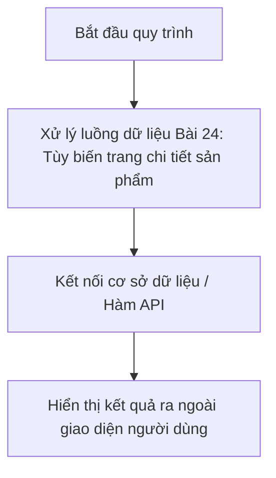

# Bài 24: Tùy biến trang chi tiết sản phẩm
**Dự án**: ZenTask WooCommerce Theme Development  

---

## 🎯 Mục tiêu học tập
- Nắm rõ kiến thức lý thuyết về **Bài 24: Tùy biến trang chi tiết sản phẩm**.
- Áp dụng thành công các hàm và cấu trúc lập trình WordPress vào bài thực hành thực tế.

---

## 📖 Lý thuyết cốt lõi

### 1. Kiến thức chuyên môn
Trong bài học này, thầy trò mình tập trung nghiên cứu sâu về cơ chế cốt lõi của **Bài 24: Tùy biến trang chi tiết sản phẩm**:
- Cách WordPress biên dịch và truy xuất thông tin từ database.
- Tối ưu hóa cú pháp PHP và sử dụng các helper function chuyên biệt của WordPress API.
- Đảm bảo tuân thủ các nguyên tắc bảo mật và quản lý tài nguyên hệ thống.

### 📊 Sơ đồ hoạt động trực quan:


---

## 💻 Ví dụ thực tiễn
Dưới đây là một đoạn code ví dụ minh họa cách viết mã nguồn sạch sẽ, tối ưu cho phần **Bài 24: Tùy biến trang chi tiết sản phẩm**:

```php
// Ví dụ lập trình PHP nâng cao trong Theme
function custom_theme_process_data_24() {
    // Khởi tạo các giá trị cấu hình mặc định
    $args = array(
        'status' => 'publish',
        'limit'  => 10
    );
    
    // Gọi hàm API an toàn
    $data = apply_filters( 'theme_process_24_args', $args );
    
    return $data;
}
```

---

## 🛠️ Bài tập thực hành (Lab)
Lập trình chức năng hoàn chỉnh dựa trên các kiến thức lý thuyết đã học về **Bài 24: Tùy biến trang chi tiết sản phẩm**.

<details class="details custom-block">
  <summary>🔑 Xem gợi ý giải pháp (Code mẫu)</summary>

Dưới đây là đoạn mã nguồn giải pháp mẫu hoàn chỉnh, có comment giải thích chi tiết:
```php
<?php
// Mã nguồn giải mẫu cho Bài 24
function handle_my_custom_lab_action_24() {
    // Thực thi xử lý logic an toàn
    if ( ! is_user_logged_in() ) {
        return false;
    }
    
    // In thông tin đã lọc an toàn
    echo '<div class="success-box">';
    echo '<p>Thực thi thành công tính năng bài 24!</p>';
    echo '</div>';
}
?>
```
</details>

---

## ❓ Trắc nghiệm nhanh
**1. Đâu là cách tiếp cận tối ưu nhất khi lập trình tính năng này?**
- A. Viết cứng dữ liệu vào HTML.
- B. Sử dụng các hàm API có sẵn và luôn lọc/escape dữ liệu an toàn.
- C. Sửa trực tiếp file nhân của WordPress.
- D. Không cần quan tâm bảo mật.
<details class="details custom-block">
  <summary>Xem giải đáp</summary>

  *Đáp án đúng: **B**. Luôn tận dụng API hệ thống và bảo vệ luồng dữ liệu.*
</details>
