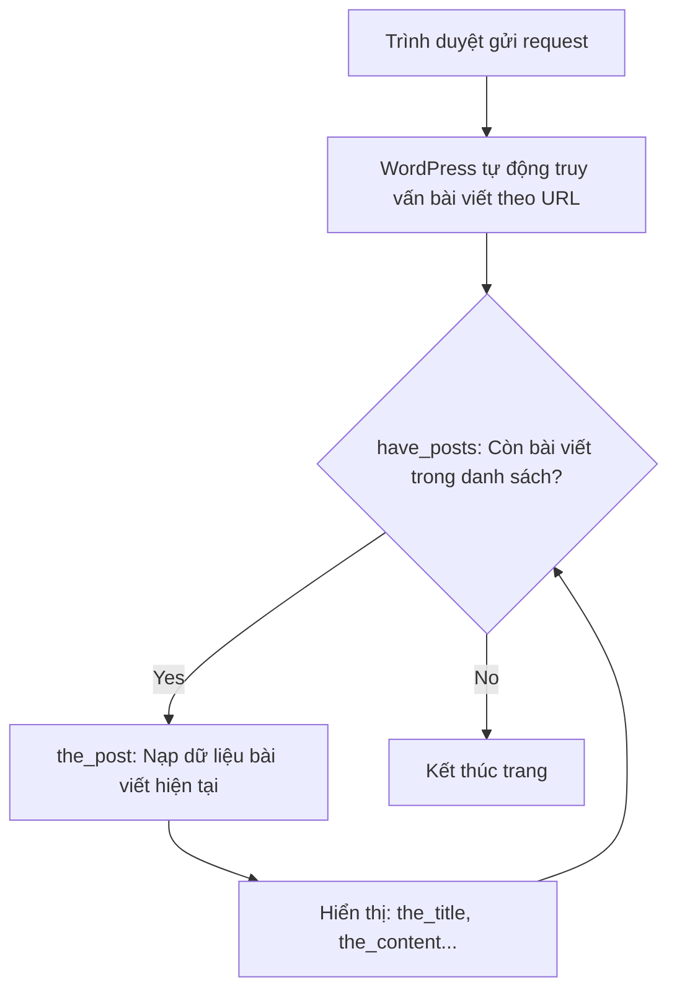

# Bài 3: Vòng lặp Loop mặc định (The Loop)
**Dự án**: ZenTask WooCommerce Theme Development  

---

## 🎯 Mục tiêu học tập
- Giải thích cơ chế hoạt động của Vòng lặp mặc định (The Loop) trong WordPress.
- Sử dụng các hàm hiển thị thông tin bài viết (`the_title`, `the_permalink`, `the_content`, `the_excerpt`) trong Loop.

---

## 📖 Lý thuyết cốt lõi

### 1. The Loop là gì?
The Loop là vòng lặp xương sống của WordPress. Khi người dùng truy cập một đường link URL (ví dụ: trang chủ, trang tin tức, hoặc trang chi tiết bài viết), hệ thống lõi của WordPress sẽ tự động truy vấn cơ sở dữ liệu để tìm các bài viết phù hợp và nạp vào vòng lặp này.

### 2. Các hàm bổ trợ bên trong The Loop
Khi vòng lặp chạy, WordPress thiết lập trạng thái của bài viết hiện tại. Lập trình viên có thể sử dụng các hàm hiển thị tiện ích mà không cần truyền ID:
- `the_title()`: In ra tiêu đề bài viết.
- `the_permalink()`: In ra đường dẫn liên kết chi tiết bài viết.
- `the_content()`: In ra toàn bộ nội dung của bài viết.
- `the_excerpt()`: In ra đoạn tóm tắt ngắn của bài viết.
- `the_ID()`: In ra ID của bài viết hiện tại.

### 📊 Sơ đồ hoạt động của The Loop:


---

## 💻 Ví dụ thực tiễn
Cú pháp chuẩn chỉnh của Vòng lặp mặc định (The Loop) trong WordPress để hiển thị danh sách bài viết ngoài trang chủ:

```php
<main class="site-main">
    <?php if ( have_posts() ) : ?>
        <div class="posts-wrapper">
            <?php while ( have_posts() ) : the_post(); ?>
                <article id="post-<?php the_ID(); ?>" class="post-item">
                    <h2 class="post-title">
                        <a href="<?php the_permalink(); ?>"><?php the_title(); ?></a>
                    </h2>
                    <div class="post-summary">
                        <?php the_excerpt(); ?>
                    </div>
                </article>
            <?php endwhile; ?>
        </div>
    <?php else : ?>
        <div class="no-posts">
            <p>Xin lỗi, không có bài viết nào được đăng tải!</p>
        </div>
    <?php endif; ?>
</main>
```

---

## 🛠️ Bài tập thực hành (Lab)
Các em các em hãy viết cấu trúc The Loop lồng trong cấu trúc bảng HTML (`<table>` và các hàng `<tr>`), hiển thị danh sách bài viết gồm cột ID bài viết, cột Tiêu đề (có gắn link chi tiết), và cột Ngày đăng bài.

<details class="details custom-block">
  <summary>🔑 Xem gợi ý giải pháp (Code mẫu)</summary>

```php
<table class="posts-table">
    <thead>
        <tr>
            <th>ID</th>
            <th>Tiêu đề bài viết</th>
            <th>Ngày đăng</th>
        </tr>
    </thead>
    <tbody>
        <?php if ( have_posts() ) : ?>
            <?php while ( have_posts() ) : the_post(); ?>
                <tr>
                    <td><?php the_ID(); ?></td>
                    <td>
                        <a href="<?php the_permalink(); ?>">
                            <?php the_title(); ?>
                        </a>
                    </td>
                    <td><?php the_time('d/m/Y'); ?></td>
                </tr>
            <?php endwhile; ?>
        <?php else : ?>
            <tr>
                <td colspan="3">Không tìm thấy bài viết nào!</td>
            </tr>
        <?php endif; ?>
    </tbody>
</table>
```
</details>

---

## ❓ Trắc nghiệm nhanh
**1. Vai trò quan trọng nhất của hàm `the_post()` trong vòng lặp `while (have_posts())` là gì?**
- A. In trực tiếp nội dung bài viết ra màn hình.
- B. Di chuyển con trỏ danh sách sang bài viết tiếp theo và thiết lập các biến toàn cục cho các hàm như `the_title()` gọi đúng dữ liệu.
- C. Đếm tổng số bài viết trong Database.
- D. Xóa bộ nhớ cache.
<details class="details custom-block">
  <summary>Xem giải đáp</summary>

  *Đáp án đúng: **B**. Nếu thiếu `the_post()`, vòng lặp sẽ bị vô hạn vì con trỏ dữ liệu không được dịch chuyển sang bài viết tiếp theo.*
</details>
